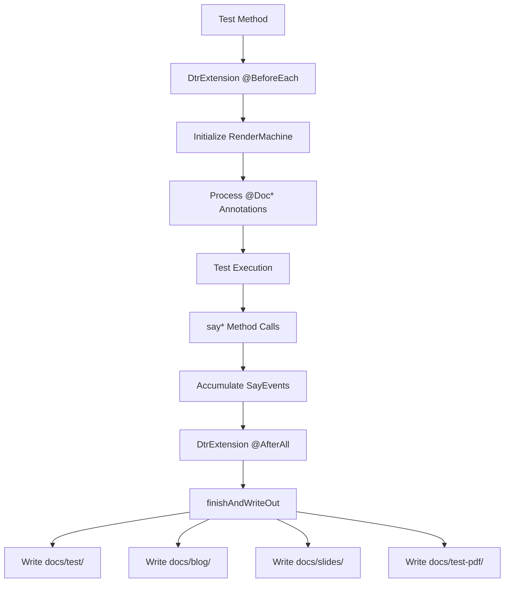
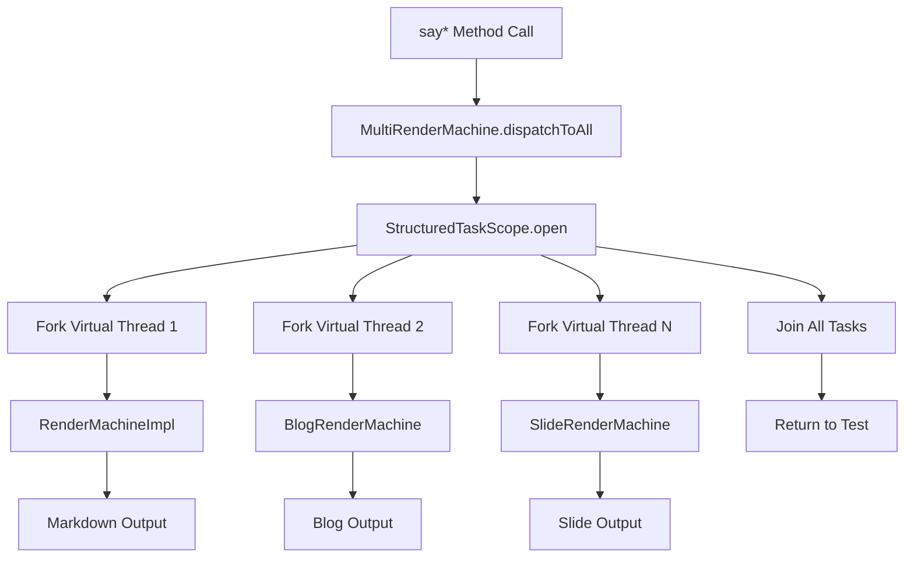
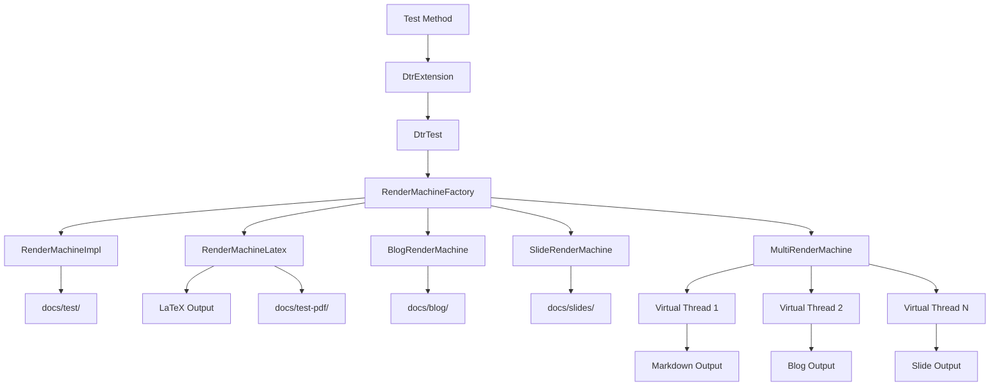

# DTR Architecture

## Overview

DTR (Documentation Testing Runtime) is a Java framework that transforms executable tests into comprehensive documentation. The architecture follows a **test-driven documentation** pattern: tests execute real code, capture results, and generate multiple output formats simultaneously.

**Core Design Principles:**

- **Tests are the contract** — Documentation is generated from executable tests, not separate documentation files
- **Single source of truth** — Code and documentation stay synchronized because documentation IS the test
- **Multi-format output** — One test execution produces Markdown, LaTeX/PDF, blog posts, and slides in parallel
- **Type safety** — Sealed event hierarchies and exhaustive pattern matching ensure completeness at compile time
- **Java 26 showcase** — Virtual threads, structured concurrency, record classes, and pattern matching throughout

## Core Components

### DtrTest (Base Class)

**Location:** `/dtr-core/src/main/java/io/github/seanchatmangpt/dtr/DtrTest.java`

Abstract base class that bridges test execution and documentation generation. Provides 50+ `say*` methods for documenting test behavior.

**Key Responsibilities:**

- Manages `RenderMachine` lifecycle (one instance per test class)
- Processes `@DocSection`, `@DocDescription`, `@DocNote`, `@DocWarning`, `@DocCode` annotations
- Delegates all `say*` calls to the active `RenderMachine`
- Provides assertion + documentation combo methods (`sayAndAssertThat`)

**Lifecycle Hooks:**

```java
@BeforeEach
public void setupForTestCaseMethod(TestInfo testInfo) {
    // Initialize render machine if null
    // Capture class name and test method
    // Process doc annotations on test method
}

@AfterAll
public static void finishDocTest() {
    // Flush documentation to disk
    // Reset render machine for next test class
}
```

**Key Methods:**

- `say(String text)` — Render a paragraph (supports markdown)
- `sayCode(String code, String language)` — Fenced code block with syntax highlighting
- `sayTable(String[][] data)` — 2D array → table
- `sayCodeModel(Class<?> clazz)` — Reflective class introspection
- `sayBenchmark(String label, Runnable task)` — Real nanoTime measurements
- `sayAndAssertThat(String label, T actual, Matcher<? super T> matcher)` — Assert + document

### DtrExtension (JUnit 5 Integration)

**Location:** `/dtr-core/src/main/java/io/github/seanchatmangpt/dtr/junit5/DtrExtension.java`

JUnit 5 extension that manages `RenderMachine` lifecycle and processes annotations. Replaces JUnit 4 `@Rule` approach with JUnit 5's extension model.

**Lifecycle Management:**

- `beforeEach` — Initialize or retrieve shared `RenderMachine` for test class
- `afterAll` — Call `finishAndWriteOut()` to flush documentation

**Annotation Processing:**

```java
@DocSection("User API")
@DocDescription({"Documents the user API endpoints."})
@DocNote({"Authentication required"})
@DocWarning({"Rate limited to 100 req/min"})
@DocCode(value = {"GET /api/users"}, language = "http")
void testUserApi() { ... }
```

All annotations are processed in fixed order regardless of source order: Section → Description → Note → Warning → Code.

### DtrContext (Injected Context)

**Location:** Not a separate class — `DtrTest` implements `RenderMachineCommands`

Test methods receive documentation context through inheritance. When extending `DtrTest`, all `say*` methods are available directly:

```java
@ExtendWith(DtrExtension.class)
class MyDocTest extends DtrTest {
    @Test
    void testFeature(DtrContext context) {
        context.say("Feature documentation");  // Via DtrTest inheritance
    }
}
```

**Note:** The architecture uses inheritance (`DtrTest` base class) rather than method injection for simplicity and type safety.

### RenderMachine (Output Abstraction)

**Location:** `/dtr-core/src/main/java/io/github/seanchatmangpt/dtr/rendermachine/RenderMachine.java`

Abstract base class defining the output format contract. All documentation flows through `RenderMachine` implementations.

**Design Pattern:** Template Method with Strategy pattern for output formats.

**Key Implementations:**

- `RenderMachineImpl` — Markdown output (default)
- `RenderMachineLatex` — LaTeX/PDF with academic templates
- `BlogRenderMachine` — Social media platforms (Dev.to, Medium, LinkedIn, Substack, Hashnode)
- `SlideRenderMachine` — Reveal.js HTML5 presentations
- `MultiRenderMachine` — Parallel dispatch to multiple formats

**Output Lifecycle:**

```java
renderMachine.setFileName("com.example.MyDocTest");
// ... test execution, say* calls accumulate ...
renderMachine.finishAndWriteOut();  // Flush to docs/test/, docs/blog/, etc.
```

## Data Flow

### Test Execution → Documentation Generation



**Step-by-Step:**

1. **Test Setup** — `DtrExtension.beforeEach()` creates or retrieves `RenderMachine` for test class
2. **Annotation Processing** — `@DocSection`, `@DocDescription`, etc. converted to `SayEvents`
3. **Test Execution** — Test code runs, calling `say*` methods via `DtrTest`
4. **Event Accumulation** — Each `say*` call creates a `SayEvent` record
5. **Output Generation** — `finishAndWriteOut()` renders events to target format(s)
6. **File Writing** — Documentation written to `docs/` subdirectories

### Multi-Format Parallel Dispatch



**Java 26 Structured Concurrency (JEP 492):**

- Uses `StructuredTaskScope` for parallel dispatch
- Each renderer runs on a virtual thread (Project Loom)
- Wall-clock time = slowest renderer, not sum of all
- Automatic error propagation and cleanup

## Output Formats

### Markdown (Default)

**Implementation:** `RenderMachineImpl`

**Output Directory:** `docs/test/`

**Features:**

- GitHub-flavored markdown
- Syntax-highlighted code blocks
- Tables, lists, callouts
- Mermaid diagrams
- Cross-references with auto-numbering

### LaTeX/PDF

**Implementation:** `RenderMachineLatex`

**Output Directory:** `docs/test-pdf/`

**Templates:**

- `ArXivTemplate` — arXiv pre-prints (default)
- `UsPatentTemplate` — USPTO patent exhibits
- `IEEETemplate` — IEEE journal articles
- `ACMTemplate` — ACM conference proceedings
- `NatureTemplate` — Nature scientific reports

**Configuration:** `-Ddtr.output=latex -Ddtr.latex.format=patent`

### Blog Posts

**Implementation:** `BlogRenderMachine` with platform-specific templates

**Output Directory:** `docs/blog/`

**Platforms:**

- Dev.to (`DevToTemplate`)
- Medium (`MediumTemplate`)
- LinkedIn (`LinkedInTemplate`)
- Substack (`SubstackTemplate`)
- Hashnode (`HashnodeTemplate`)

**Features:**

- Platform-specific frontmatter
- TL;DR summaries
- Hero images
- Social media metadata
- Call-to-action links

### Presentation Slides

**Implementation:** `SlideRenderMachine` with `RevealJsTemplate`

**Output Directory:** `docs/slides/`

**Features:**

- Reveal.js HTML5 presentations
- Speaker notes
- Slide-specific content (`saySlideOnly`)
- Progressive disclosure
- Keyboard navigation

**Slide vs Doc Content:**

```java
say("This appears in both slides and docs");
saySlideOnly("This appears only in slides");
sayDocOnly("This appears only in docs");
saySpeakerNote("This is presenter-only");
```

## Event System

### SayEvent Sealed Hierarchy

**Location:** `/dtr-core/src/main/java/io/github/seanchatmangpt/dtr/rendermachine/SayEvent.java`

Sealed interface with 21+ event types. Every `say*` method creates a corresponding `SayEvent` record.

**Event Types:**

| Event | Purpose |
|-------|---------|
| `TextEvent` | Narrative paragraph |
| `SectionEvent` | Section heading (H2) |
| `CodeEvent` | Fenced code block |
| `TableEvent` | Markdown table |
| `JsonEvent` | Pretty-printed JSON |
| `NoteEvent` | GitHub-style `[!NOTE]` |
| `WarningEvent` | GitHub-style `[!WARNING]` |
| `KeyValueEvent` | Two-column metadata table |
| `UnorderedListEvent` | Bullet list |
| `OrderedListEvent` | Numbered list |
| `AssertionsEvent` | Test results table |
| `CitationEvent` | BibTeX citation |
| `FootnoteEvent` | Footnote content |
| `RefEvent` | Cross-reference link |
| `RawEvent` | Raw markdown/HTML |
| `CodeModelEvent` | Class introspection |
| `MethodCodeModelEvent` | Method code reflection |
| `ControlFlowGraphEvent` | Mermaid CFG |
| `CallGraphEvent` | Mermaid call graph |
| `OpProfileEvent` | Operation counts |
| `BenchmarkEvent` | Performance metrics |
| `MermaidEvent` | Any Mermaid diagram |
| `DocCoverageEvent` | Coverage report |
| `EnvProfileEvent` | Environment snapshot |
| `RecordSchemaEvent` | Record components |
| `ExceptionEvent` | Exception chain |
| `AsciiChartEvent` | Horizontal bar chart |

**Type Safety with Pattern Matching:**

```java
String rendered = switch (event) {
    case SayEvent.TextEvent(var text)           -> renderParagraph(text);
    case SayEvent.SectionEvent(var heading)     -> renderSection(heading);
    case SayEvent.CodeEvent(var code, var lang) -> renderCode(code, lang);
    // ... exhaustive — compiler enforces completeness
};
```

**No visitor pattern. No dispatch maps. No instanceof chains. The type system proves every case is handled.**

## Extension Points

### Adding Custom Output Formats

**Step 1: Implement RenderMachine**

```java
public final class MyCustomRenderMachine extends RenderMachine {
    @Override
    public void say(String text) {
        // Custom rendering logic
    }

    @Override
    public void sayCode(String code, String language) {
        // Custom code formatting
    }

    // ... override other say* methods

    @Override
    public void finishAndWriteOut() {
        // Write output to disk
    }
}
```

**Step 2: Register with RenderMachineFactory**

Add to `/dtr-core/src/main/java/io/github/seanchatmangpt/dtr/render/RenderMachineFactory.java`:

```java
case "custom" -> new MyCustomRenderMachine();
```

**Step 3: Use via System Property**

```bash
mvnd test -Ddtr.output=custom
```

### Custom Templates for Existing Formats

**LaTeX Templates:** Implement `LatexTemplate` interface

```java
public final class MyLatexTemplate implements LatexTemplate {
    @Override
    public String preamble() {
        return "\\documentclass{article}\n...";
    }

    @Override
    public String documentBegin() {
        return "\\begin{document}\n";
    }

    // ... other template methods
}
```

Register in `RenderMachineFactory.selectLatexTemplateLazy()`.

**Blog Templates:** Implement platform-specific template class (extends `BlogTemplate`).

**Slide Templates:** Implement presentation template (extends `SlideTemplate`).

## Module Structure

### dtr-core

**Primary module containing:**

- `DtrTest` — Base test class with 50+ `say*` methods
- `DtrExtension` — JUnit 5 integration
- `RenderMachine` — Output abstraction
- `SayEvent` — Sealed event hierarchy
- `RenderMachineFactory` — Format selection and configuration
- Render implementations (`RenderMachineImpl`, `MultiRenderMachine`)
- Output-specific renderers (LaTeX, blog, slides)

### dtr-benchmarks

**Performance benchmarks using Criterion.rs:**

- Rust-based scanning/analysis performance tests
- Validation of optimization claims
- Microsecond-precision measurements

**Why Rust?** Performance-critical code paths benefit from Rust's zero-cost abstractions and predictable performance.

### dtr-integration-test

**End-to-end integration tests:**

- Full documentation generation pipelines
- Cross-format consistency validation
- Real-world usage scenarios

## Dependencies

### Core Dependencies

| Dependency | Version | Purpose |
|------------|---------|---------|
| JUnit Jupiter | 5.10+ | Test framework and extension model |
| Jackson Databind | 2.15+ | JSON serialization (`sayJson`) |
| SLF4J | 2.0+ | Logging facade |
| Hamcrest | 2.2+ | Matcher assertions (`sayAndAssertThat`) |

### Java 26 Features

**Project Loom (Virtual Threads):**

- `MultiRenderMachine` uses virtual threads for parallel dispatch
- Near-zero thread creation overhead
- One virtual thread per renderer per call

**Structured Concurrency (JEP 492):**

- `StructuredTaskScope` manages renderer lifetimes
- Automatic error propagation and cleanup
- Try-with-resources ensures proper scope closure

**Sealed Classes (JEP 409):**

- `SayEvent` sealed hierarchy ensures exhaustive handling
- Compile-time completeness guarantees

**Record Classes (JEP 395):**

- All `SayEvent` types are records
- Immutable data carriers with canonical constructors

**Pattern Matching (JEP 406, JEP 420, JEP 432):**

- Exhaustive switch expressions for event handling
- Type-safe destructuring of event records

**Code Reflection (JEP 516 / Project Babylon):**

- `sayCodeModel(Method)` introspects bytecode operations
- Control flow graphs and op profiles from IR

### Maven Integration

**Build Configuration:**

- `.mvn/maven.config` sets `--enable-preview` for Java 26 features
- Multi-module project with shared dependency management
- GitHub Actions CI runs `mvnd verify` before deployment

**Output Format Selection:**

```bash
# Single format
mvnd test -Ddtr.output=markdown

# Multiple formats
mvnd test -Ddtr.output=markdown,blog,slides

# All formats
mvnd test -Ddtr.output=all

# LaTeX with specific template
mvnd test -Ddtr.output=latex -Ddtr.latex.format=patent
```

## Architecture Diagram



## Key Design Decisions

### Inheritance over Injection

**Decision:** `DtrTest` uses inheritance rather than method parameter injection for documentation context.

**Rationale:**

- Simpler API — test methods directly call `say*` without parameter passing
- Type safety — compile-time checking of all `say*` methods
- Less boilerplate — no need to inject `DtrContext` into every test method

**Trade-off:** Tests must extend `DtrTest` (single inheritance limitation).

### Sealed Events Over Visitor Pattern

**Decision:** Use sealed `SayEvent` hierarchy with exhaustive switch instead of Visitor pattern.

**Rationale:**

- Type safety — compiler enforces exhaustive handling
- Less boilerplate — no visitor interfaces or accept methods
- Pattern matching — clean destructuring with record components
- Performance — JIT can optimize sealed hierarchies better than virtual calls

### Virtual Threads Over Async/Promise Chains

**Decision:** Use Project Loom virtual threads for parallel rendering instead of `CompletableFuture` chains.

**Rationale:**

- Simpler code — structured concurrency reads top-to-bottom
- Automatic error propagation — `StructuredTaskScope` handles failures
- Better performance — near-zero thread creation overhead
- Easier debugging — stack traces preserved across virtual threads

### Static RenderMachine Per Test Class

**Decision:** One shared `RenderMachine` instance per test class, not per test method.

**Rationale:**

- Single output file per test class
- Sections accumulate across test methods
- Simplifies cross-references and section numbering
- Matches mental model of "one document per test class"

## Performance Characteristics

### Parallel Rendering

**Wall-clock time:** `max(t₁, t₂, ..., tₙ)` — slowest renderer only

**Sequential time:** `t₁ + t₂ + ... + tₙ` — sum of all renderers

**Example:** With 8 output formats:
- Sequential: 8s (1s per format)
- Parallel: 1s (all formats render simultaneously)

### Memory Usage

**Per test class:** ~10-50MB depending on documentation volume

**Event accumulation:** All `SayEvents` held in memory until `finishAndWriteOut()`

**Optimization:** For very large documents, consider splitting into multiple test classes.

### Startup Overhead

**RenderMachine creation:** ~10-50ms (template initialization)

**Virtual thread creation:** ~1µs per thread (negligible)

**Annotation processing:** ~1-5ms per test method

## Testing Strategy

### Unit Tests

**Location:** `/dtr-core/src/test/java/io/github/seanchatmangpt/dtr/`

**Coverage:**

- `RenderMachine` method dispatch
- `SayEvent` creation and validation
- Annotation processing logic
- Cross-reference resolution

### Integration Tests

**Location:** `/dtr-integration-test/src/test/java/`

**Scenarios:**

- End-to-end documentation generation
- Multi-format consistency validation
- Real-world usage patterns
- Performance benchmarks

### Self-Documentation

**DTR dogfoods itself:** All documentation in `/docs/` is generated by DTR tests.

**Validation:** `mvnd verify` runs DTR tests that regenerate this documentation, ensuring examples stay current.

## Future Enhancements

### Potential Extensions

- **Additional output formats:** Confluence, Notion, GitBook
- **Custom templates:** User-provided LaTeX/blog templates
- **Incremental rendering:** Stream events to disk during test execution
- **Distributed rendering:** Remote render servers for large documentation sets

### Java Version Evolution

**Java 26+ targets:**

- Full Code Reflection API adoption (JEP 494)
- StableValue for template caching (JEP 526)
- String templates for safer text generation (JEP 430)
- Scoped values for configuration passing (JEP 446)

## References

- **JUnit 5 Extension Model:** https://junit.org/junit5/docs/current/user-guide/#extensions
- **Project Loom:** https://openjdk.org/projects/loom/
- **Structured Concurrency (JEP 492):** https://openjdk.org/jeps/492
- **Sealed Classes (JEP 409):** https://openjdk.org/jeps/409
- **Record Classes (JEP 395):** https://openjdk.org/jeps/395
- **Pattern Matching (JEP 406):** https://openjdk.org/jeps/406
- **Code Reflection (JEP 516):** https://openjdk.org/jeps/516
