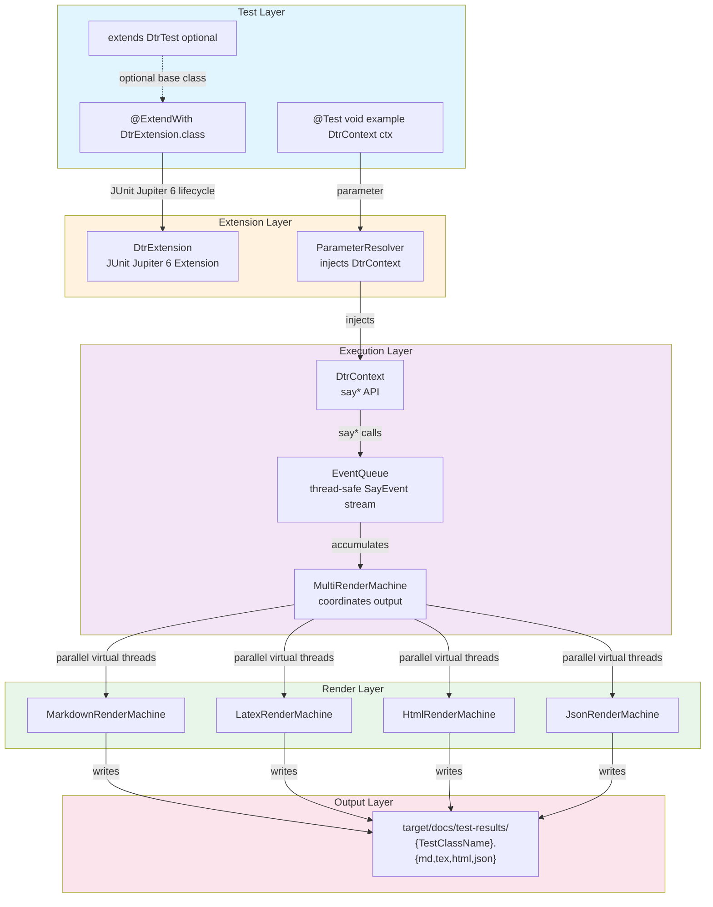

# Explanation: How DTR Works

This document describes the lifecycle of a DTR documentation run — from test startup through multi-format file output. Understanding this helps you predict what will appear in the generated documentation and reason about unexpected behavior.

> **Note**: DTR was previously called "Doctester". References to the old name have been updated throughout the codebase.

---

## The Fundamental Model

DTR is a JUnit Jupiter 6 extension. When a test class annotated with `@ExtendWith(DtrExtension.class)` runs, DTR intercepts the JUnit lifecycle, injects a `DtrContext` parameter into each test method, captures every `say*()` call as a typed `SayEvent`, and then — when all test methods have run — flushes those events through a `MultiRenderMachine` that writes Markdown, LaTeX, HTML, and JSON output in parallel.

The key insight is that **DTR decouples documentation capture from documentation rendering**. `say*()` calls do not immediately write anything. They create `SayEvent` records and queue them. Rendering happens once, at the end, using virtual threads.

### Architecture Overview



### Basic Usage Example

```java
@ExtendWith(DtrExtension.class)
class MyTest extends DtrTest {
    @Test
    void example(DtrContext ctx) {
        ctx.say("Documentation generated during test execution");
        ctx.sayCode("int x = 42;", "java");
        ctx.sayTable(new String[][]{
            {"Feature", "Status"},
            {"REST API", "✓ Implemented"}
        });
    }
}
```

**Note**: `DtrTest` is an optional base class that provides convenience methods. The only required annotation is `@ExtendWith(DtrExtension.class)`.

---

## Why Events, Not Direct Writes

A test method does not know which output formats it is writing for. A call to `ctx.sayCode("...", "java")` might ultimately produce a fenced Markdown block, a LaTeX `lstlisting` environment, an HTML `<pre><code>` block, and a JSON node — all from the same method call.

If `sayCode` wrote to a file directly, it would have to know about every output format. Instead, it emits a `SayEvent.Code` record — an immutable value object containing the code string and the language — and enqueues it. The render machines handle format-specific rendering, each in its own virtual thread.

This is why `SayEvent` is a sealed interface. Each render machine must handle every event type. Sealed + pattern matching turns a missing `case` into a compile-time error, not a silent blank in the rendered output.

---

## Step-by-Step: From Test to Output

### Step 1: JUnit discovers the test class

JUnit Jupiter 6 finds the class annotated with `@ExtendWith(DtrExtension.class)` and instantiates `DtrExtension`. This extension implements `BeforeAllCallback`, `AfterAllCallback`, `BeforeEachCallback`, `AfterEachCallback`, and `ParameterResolver`.

### Step 2: `beforeAll` — render machine setup

Before any test method runs, `DtrExtension.beforeAll()` creates a `MultiRenderMachine` configured for all output targets (Markdown, LaTeX, HTML, JSON). This is the class-level render machine that will accumulate all documentation from all test methods in the class.

### Step 3: `beforeEach` — context injection

Before each `@Test` method, `DtrExtension.beforeEach()` creates a fresh `DtrContext` bound to the class-level `MultiRenderMachine`. `DtrContext` is injected into the test method as a parameter, resolved by the `ParameterResolver` implementation.

### Step 4: Test method runs

As the test executes, each `ctx.say*()` call:

1. Creates a `SayEvent` record (immutable, specific type)
2. Posts it to the per-class event queue (thread-safe)

For introspection methods (`sayRecordComponents`, `sayClassHierarchy`, etc.), the method does the reflection work at call time and creates a structured `SayEvent` containing the results. The render machines receive already-resolved data, not `Class<?>` references.

For benchmark methods (`sayBenchmark`), the lambda runs immediately, fully, with warmup iterations on virtual thread batches. The resulting statistics are packaged into a `SayEvent.Benchmark` record.

For `sayCallSite()`, the Code Reflection API (JEP 516) captures the caller's source location — file, line number, method name — without a stack walk.

### Step 5: `afterEach` — open block cleanup

After each test method, `DtrExtension.afterEach()` closes any open section markers or unterminated blocks.

### Step 6: `afterAll` — flush and render

After all test methods complete, `DtrExtension.afterAll()` calls `finishAndWriteOut()` on the `MultiRenderMachine`. This triggers the parallel rendering pass:

```mermaid
graph TD
    Start[finishAndWriteOut]-->VT[Create virtual thread per render machine]

    VT-->RM1[MarkdownRenderMachine]
    VT-->RM2[LatexRenderMachine]
    VT-->RM3[HtmlRenderMachine]
    VT-->RM4[JsonRenderMachine]

    RM1-->PM[Pattern match on each event]
    RM2-->PM
    RM3-->PM
    RM4-->PM

    PM-->Output[target/docs/test-results/<br/>{TestClassName}.{ext}]

    style RM1 fill:#e8f5e9
    style RM2 fill:#e8f5e9
    style RM3 fill:#e8f5e9
    style RM4 fill:#e8f5e9
    style Output fill:#fce4ec
```

Because `SayEvent` records are immutable, sharing them across virtual threads requires no synchronization.

---

## How Introspection Caching Works

Five methods derive documentation from JVM reflection:

- `sayRecordComponents(Class<?>)`
- `sayClassHierarchy(Class<?>)`
- `sayAnnotationProfile(Class<?>)`
- `sayStringProfile(Class<?>)`
- `sayReflectiveDiff(Object, Object)`

Reflection on a class costs roughly 150µs on first access. If these methods are called in multiple tests against the same class, that cost would accumulate. DTR's `reflectiontoolkit` module caches results in a `ConcurrentHashMap<Class<?>, Object>`. Subsequent calls cost approximately 50ns — a 3000x reduction.

The cache is per-JVM-process, not per-test. If you run 100 tests that each call `sayRecordComponents(MyRecord.class)`, reflection runs once. The cache is populated on first call and read on all subsequent calls, with no synchronization needed beyond what `ConcurrentHashMap` provides.

---

## How MultiRenderMachine Uses Virtual Threads

`MultiRenderMachine` holds a list of `RenderMachine` implementations. When `finishAndWriteOut()` is called, it opens a `Executors.newVirtualThreadPerTaskExecutor()` and submits one task per render machine. Each task drains the event queue through that render machine's pattern-match handler.

The result: disk I/O in the Markdown writer does not delay the LaTeX writer. All four output files are written concurrently. On a four-format configuration, parallel rendering is effectively free — the bottleneck is the slowest format, not the sum of all formats.

---

## Why `--enable-preview` Is Required

DTR requires Java 26 with `--enable-preview`. This is not optional, and it is not a cosmetic requirement about syntax.

DTR uses the Code Reflection API (JEP 516, Project Babylon), a preview feature in Java 26, for `sayCallSite()`. This API allows DTR to capture the exact source location of a documentation call — the file, line number, and method name — at compile time, without a runtime stack walk.

A stack walk (`Thread.currentThread().getStackTrace()`) would work but costs microseconds and allocates. The Code Reflection API is designed specifically for this kind of source-location capture and has lower runtime cost. It is in preview because Project Babylon is evolving. DTR will update to the stable API when it graduates from preview.

The flag is set in `.mvn/maven.config` and propagates automatically to compile, test, and runtime phases.

> **For complete architecture details**: See [ARCHITECTURE.md](../ARCHITECTURE.md) for full component diagrams, module structure, and design patterns.

---

## Per-Class vs. Per-Method Scope

Understanding scope prevents common mistakes:

| Component | Scope | Implication |
|---|---|---|
| `MultiRenderMachine` | Per test class | All `@Test` methods in a class write to the same output files |
| `DtrContext` | Per test method | Fresh context per method; context does not carry over |
| Event queue | Per test class | Events from all methods in the class accumulate and flush together |
| Reflection cache | Per JVM process | Shared across all tests in a test run |

The most important consequence: a test class produces one set of output files, not one per test method. If `PhDThesisDocTest` has five `@Test` methods, they all contribute to `PhDThesisDocTest.md`. Use multiple test classes for logically separate documentation sections.

---

## The Output File Naming Convention

Output files are named after the test class:

```
target/docs/test-results/{TestClassName}.{ext}
```

For `PhDThesisDocTest`, this produces:

```
target/docs/test-results/PhDThesisDocTest.md
target/docs/test-results/PhDThesisDocTest.tex
target/docs/test-results/PhDThesisDocTest.html
target/docs/test-results/PhDThesisDocTest.json
```

If you re-run the tests, the files are overwritten. DTR does not version or append — each run produces the complete, current documentation.
