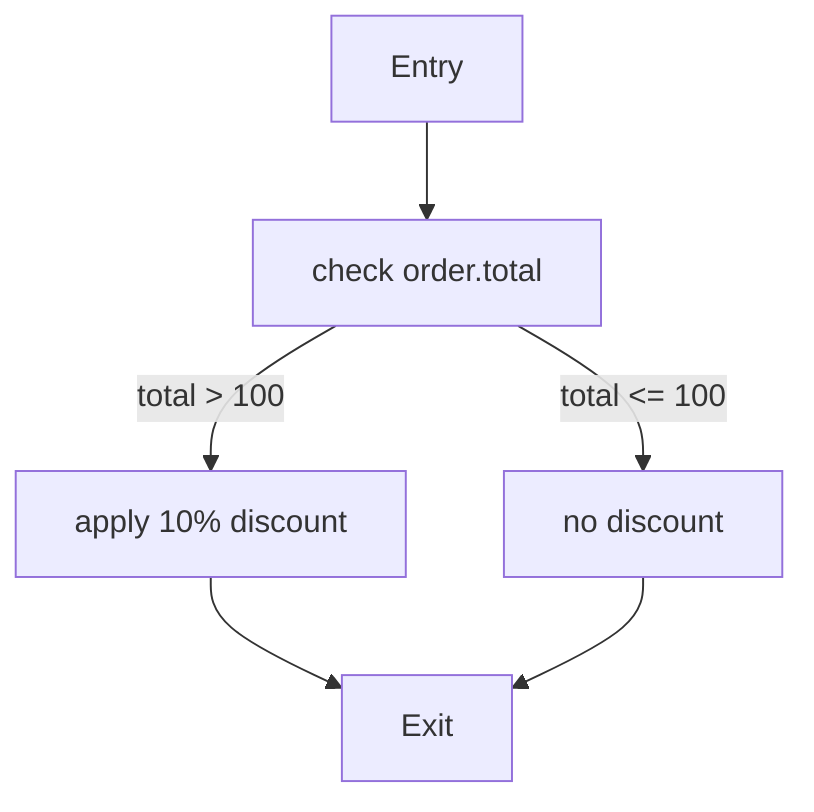
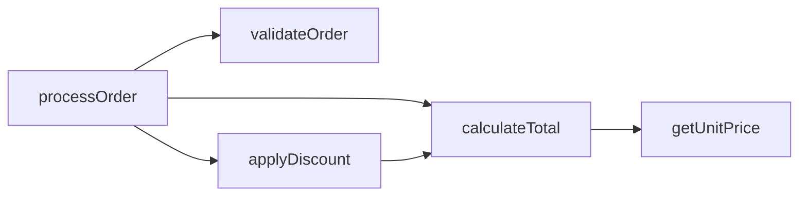

# Reference: Code Reflection API Reference

**Package:** `io.github.seanchatmangpt.dtr.core`
**Version:** 2.3.0+ (stable in 2.6.0)

DTR integrates with JEP 516 Code Reflection (available in Java 26 with `--enable-preview`) to expose JVM-level code models. These five methods let you document the internal structure of methods and classes: code model, control flow, call graphs, and opcode profiles.

All Code Reflection methods require `--enable-preview` (already set in `.mvn/maven.config`).

---

## sayCodeModel(Class<?>)

```java
ctx.sayCodeModel(Class<?> clazz)
```

Generates the JVM code model for every public method in the class using JEP 516 and renders each model as a structured code block.

**Parameters:**

| Parameter | Type | Description |
|-----------|------|-------------|
| `clazz` | `Class<?>` | The class to analyze |

**Output:** One code block per public method, showing the structured code model in a human-readable intermediate representation.

**Example:**

```java
@Test
void documentUserServiceCodeModel(DtrContext ctx) {
    ctx.sayNextSection("UserService Code Model");
    ctx.say("JEP 516 code model for all public methods:");
    ctx.sayCodeModel(UserService.class);
}
```

---

## sayCodeModel(Method)

```java
ctx.sayCodeModel(Method method)
```

Generates the JVM code model for a single method.

**Parameters:**

| Parameter | Type | Description |
|-----------|------|-------------|
| `method` | `java.lang.reflect.Method` | The method to analyze |

**Example:**

```java
import java.lang.reflect.Method;

@Test
void documentProcessOrder(DtrContext ctx) {
    ctx.sayNextSection("processOrder Code Model");

    Method m = OrderService.class.getMethod("processOrder", Order.class);
    ctx.sayCodeModel(m);
}
```

---

## sayControlFlowGraph

```java
ctx.sayControlFlowGraph(Method method)
```

Generates the control flow graph (CFG) of the given method using JEP 516 Code Reflection and renders it as a Mermaid `flowchart TD` diagram.

**Parameters:**

| Parameter | Type | Description |
|-----------|------|-------------|
| `method` | `java.lang.reflect.Method` | The method to analyze |

**Output:** A Mermaid `flowchart TD` with:
- Nodes for each basic block (entry, branch targets, loop headers, exit)
- Labeled edges for conditional branches (`true` / `false`)
- Loop back-edges shown with dashed lines

**Example:**

```java
@Test
void documentDiscountLogicCFG(DtrContext ctx) {
    ctx.sayNextSection("applyDiscount Control Flow");
    ctx.say("Control flow graph generated from JVM bytecode via JEP 516:");

    Method m = PricingService.class.getMethod("applyDiscount", Order.class, double.class);
    ctx.sayControlFlowGraph(m);
}
```

**Example output (simplified):**



---

## sayCallGraph

```java
ctx.sayCallGraph(Class<?> clazz)
```

Generates the intra-class call graph for all methods in the class using JEP 516 and renders it as a Mermaid `graph LR` diagram.

**Parameters:**

| Parameter | Type | Description |
|-----------|------|-------------|
| `clazz` | `Class<?>` | The class to analyze |

**Output:** A Mermaid `graph LR` where each node is a method name and each directed edge represents a direct call from one method to another within the class.

**Example:**

```java
@Test
void documentOrderProcessorCallGraph(DtrContext ctx) {
    ctx.sayNextSection("OrderProcessor Internal Call Graph");
    ctx.sayCallGraph(OrderProcessor.class);
}
```

**Example output:**



Calls to methods outside the class (external calls) are shown as terminal nodes with a different shape.

---

## sayOpProfile

```java
ctx.sayOpProfile(Method method)
```

Profiles the JVM operations in the given method using JEP 516 and renders a table with opcode category counts.

**Parameters:**

| Parameter | Type | Description |
|-----------|------|-------------|
| `method` | `java.lang.reflect.Method` | The method to profile |

**Output:** A table with columns: Category, Opcodes Included, Count.

**Example:**

```java
@Test
void documentPaymentServiceOps(DtrContext ctx) {
    ctx.sayNextSection("PaymentService.charge Opcode Profile");

    Method charge = PaymentService.class.getMethod("charge", java.math.BigDecimal.class);
    ctx.sayOpProfile(charge);
}
```

**Example output:**

| Category | Opcodes | Count |
|----------|---------|-------|
| Load / Store | `iload`, `aload`, `istore`, `astore`, ... | 18 |
| Arithmetic | `iadd`, `imul`, `dmul`, ... | 4 |
| Invocation | `invokevirtual`, `invokespecial`, `invokestatic` | 7 |
| Branching | `ifeq`, `ifge`, `goto`, ... | 3 |
| Object creation | `new`, `newarray`, `anewarray` | 2 |
| Return | `ireturn`, `areturn`, `return` | 1 |

Use this to identify methods with unusually high invocation or branching counts that may benefit from refactoring.

---

## Prerequisites

All Code Reflection methods require:

1. `--enable-preview` flag (already in `.mvn/maven.config` for this project)
2. Java 26 or later
3. The analyzed class must be on the test classpath

```bash
# Verify configuration
cat .mvn/maven.config   # should contain --enable-preview
java -version           # should be 25+
```

---

## Combining Code Reflection methods

```java
@Test
void fullCodeReflectionAudit(DtrContext ctx) {
    ctx.sayNextSection("OrderProcessor Code Audit");

    // 1. Full class code model
    ctx.sayCodeModel(OrderProcessor.class);

    // 2. Call graph
    ctx.sayNextSection("Internal Call Graph");
    ctx.sayCallGraph(OrderProcessor.class);

    // 3. CFG for the main entry method
    ctx.sayNextSection("processOrder Control Flow");
    Method main = OrderProcessor.class.getMethod("processOrder", Order.class);
    ctx.sayControlFlowGraph(main);

    // 4. Opcode profile for the hot path
    ctx.sayNextSection("processOrder Opcode Profile");
    ctx.sayOpProfile(main);
}
```

---

## See also

- [say* Core API Reference](request-api.md) — all 37 method signatures
- [JVM Introspection API Reference](realtime-protocols-reference.md) — reflection-based introspection
- [Mermaid Diagram API Reference](http-constants.md) — Mermaid rendering in all output formats
- [Java 26 Features Reference](java25-features-reference.md) — JEP 516 overview
