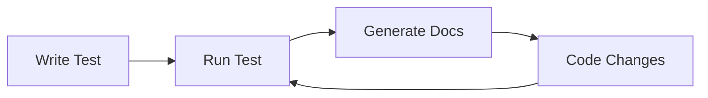

# Tutorial 1: Hello DTR

**Welcome to DTR** — the Documentation Testing Runtime that transforms your Java tests into living, breathing documentation.

**Version:** DTR 2026.4.1
**Time:** 15 minutes
**Prerequisites:** Java 26 installed, Maven/mvnd installed, basic JUnit Jupiter 6 knowledge

---

## What You'll Learn

In this tutorial, you will:

- **Understand the core mental model** — how DTR turns tests into documentation
- **Write your first DTR test** — complete working example from scratch
- **Run and examine output** — see the generated documentation in action
- **Learn common patterns** — practical examples you can use immediately
- **Practice with an exercise** — solidify your understanding

---

## The Core Mental Model

DTR operates on a simple but powerful principle: **tests that generate documentation**.



**The key insight:** Every time your tests run, they regenerate fresh documentation from live code behavior. This means your documentation is **always up-to-date** because it's **executed against real code**.

### How It Works

1. **Write a test** that exercises real code
2. **Add `say*` calls** to document what's happening
3. **Run the test** with JUnit Jupiter 6
4. **DTR generates documentation** in multiple formats (Markdown, HTML, LaTeX, JSON)

### The Benefits

- **No stale documentation** — regenerated on every test run
- **Verified examples** — code examples actually run and pass
- **Single source of truth** — tests are the documentation
- **Multiple outputs** — one test generates docs, slides, blogs, and more

---

## Prerequisites

Before starting, ensure you have:

### Java 26 Installed

```bash
java -version
# Should show: openjdk version "26.ea" or similar
```

### Maven or mvnd Installed

```bash
mvnd --version
# Or: mvn --version
# Should show Maven 4.0.0-rc-3 or later
```

### Basic JUnit Jupiter 6 Knowledge

You should be comfortable with:
- `@Test` annotations
- Test methods and assertions
- Basic Maven project structure

---

## Your First DTR Test

Let's create a complete working example. We'll build a simple documentation test that demonstrates the core concepts.

### Step 1: Create the Test Class

Create a new file `src/test/java/com/example/HelloDtrTest.java`:

```java
package com.example;

import io.github.seanchatmangpt.dtr.DtrContext;
import io.github.seanchatmangpt.dtr.DocSection;
import io.github.seanchatmangpt.dtr.DtrExtension;
import io.github.seanchatmangpt.dtr.DtrTest;
import io.github.seanchatmangpt.dtr.DtrContextField;
import org.junit.jupiter.api.Test;
import org.junit.jupiter.api.extension.ExtendWith;

import java.util.List;
import java.util.Map;

import static org.hamcrest.MatcherAssert.assertThat;
import static org.hamcrest.Matchers.equalTo;

@ExtendWith(DtrExtension.class)
@DtrTest
class HelloDtrTest {

    @DtrContextField
    private DtrContext dtr;

    @Test
    @DocSection("Getting Started")
    void gettingStarted() {
        dtr.say("DTR transforms tests into living documentation.");
        dtr.sayNextSection("Core Concept");
        dtr.say("Every test run regenerates documentation from live behavior.");
    }

    @Test
    @DocSection("Using say Methods")
    void usingSayMethods() {
        dtr.say("The `say` method renders paragraphs in your documentation.");

        dtr.sayNextSection("Code Examples");
        dtr.sayCode("int x = 42;", "java");

        dtr.sayNextSection("Structured Data");
        dtr.sayTable(new String[][]{
            {"Method", "Description", "Example"},
            {"say()", "Paragraphs", "Text blocks"},
            {"sayCode()", "Code blocks", "Syntax highlighted"},
            {"sayTable()", "Tables", "2D arrays"}
        });
    }

    @Test
    @DocSection("Assertions and Documentation")
    void assertionsAndDocumentation() {
        dtr.say("DTR combines assertions with documentation generation.");

        int result = 2 + 2;
        assertThat("Addition works", result, equalTo(4));

        dtr.sayAssertions(Map.of(
            "2 + 2", "4",
            "Calculation", "✓ PASS"
        ));
    }

    @Test
    @DocSection("Lists and Formatting")
    void listsAndFormatting() {
        dtr.say("DTR supports various formatting options:");

        dtr.sayUnorderedList(List.of(
            "Bullet points for unordered lists",
            "Numbered lists for sequences",
            "Code blocks with syntax highlighting"
        ));

        dtr.sayNextSection("Numbered Steps");
        dtr.sayOrderedList(List.of(
            "Write your test",
            "Add say* methods",
            "Run with mvnd test",
            "Check target/docs/"
        ));
    }
}
```

### What's Happening Here?

- **`@ExtendWith(DtrExtension.class)`** — Registers DTR with JUnit Jupiter 6
- **`@DtrTest`** — Marks the class as a DTR documentation test
- **`@DtrContextField`** — **Required:** Injects a `DtrContext` instance for accessing `say*` methods
- **`private DtrContext dtr`** — **Required:** Field that provides access to all documentation methods
- **`@DocSection("...")`** — Creates section headings in documentation
- **`dtr.say(...)`** — Adds paragraph text
- **`dtr.sayNextSection(...)`** — Creates major section breaks
- **`dtr.sayCode(...)`** — Renders syntax-highlighted code blocks
- **`dtr.sayTable(...)`** — Formats tables from 2D arrays
- **`dtr.sayAssertions(...)`** — Documents test results

### Legacy Pattern: Inheritance

⚠️ **DEPRECATED:** The inheritance pattern is maintained for backwards compatibility but is not recommended for new projects.

```java
@ExtendWith(DtrExtension.class)
class HelloDtrTest extends DtrTest {
    @Test
    void gettingStarted() {
        say("Direct access to say* methods without 'dtr.' prefix");
    }
}
```

**Migration:** All new projects should use field injection (see below). Inheritance will be removed in a future version.

### Primary Pattern: Field Injection

DTR recommends **field injection** for all new projects. This approach is more flexible and integrates better with modern Java testing practices:

```java
@ExtendWith(DtrExtension.class)
@DtrTest
class HelloDtrTest {

    @DtrContextField
    private DtrContext dtr;

    @Test
    void gettingStarted() {
        dtr.say("Access to say* methods through injected DtrContext");
    }
}
```

**Why field injection is preferred:**
- ✅ **Modern Java practices** - Uses dependency injection instead of inheritance
- ✅ **Flexibility** - Works with multiple test base classes
- ✅ **Testability** - Easier to mock DtrContext in unit tests
- ✅ **IntelliSense** - IDE auto-completion works reliably with field access
- ✅ **No conflicts** - Avoids issues with test framework inheritance chains

---

## Running the Test

Execute your DTR test with Maven:

```bash
mvnd test -Dtest=HelloDtrTest
```

Or with traditional Maven:

```bash
mvn test -Dtest=HelloDtrTest
```

### Expected Output

You'll see standard JUnit Jupiter 6 output:

```
[INFO] -------------------------------------------------------
[INFO]  T E S T S
[INFO] -------------------------------------------------------
[INFO] Running com.example.HelloDtrTest
[INFO] Tests run: 4, Failures: 0, Errors: 0, Skipped: 0
[INFO]
[INFO] Results:
[INFO]
[INFO] Tests run: 4, Failures: 0, Errors: 0, Skipped: 0
[INFO]
[INFO] BUILD SUCCESS
```

---

## Understanding the Output

After the test completes, check the generated documentation:

```bash
ls -la target/docs/test-results/
```

You should see multiple output formats:

```
HelloDtrTest.md      # Markdown documentation
HelloDtrTest.html    # HTML documentation
HelloDtrTest.tex     # LaTeX source
HelloDtrTest.json    # JSON metadata
```

### View the Markdown Output

```bash
cat target/docs/test-results/HelloDtrTest.md
```

You'll see structured documentation with:

- **Section headings** from `@DocSection` annotations
- **Paragraphs** from `say()` calls
- **Code blocks** with syntax highlighting from `sayCode()`
- **Tables** formatted from `sayTable()` calls
- **Assertion results** from `sayAssertions()`

---

## Adding More Documentation

Let's progressively add complexity to understand DTR's capabilities.

### Adding Notes and Warnings

Add a new test method:

```java
@Test
@DocSection("Important Notes")
void notesAndWarnings() {
    sayNote("DTR tests are regular JUnit Jupiter 6 tests — they run in your CI pipeline.");
    sayWarning("Don't commit generated docs to version control — regenerate from tests!");
}
```

### Adding Environment Information

```java
@Test
@DocSection("Environment Profile")
void environmentProfile() {
    say("DTR captures the build environment for reproducibility:");
    sayEnvProfile();
}
```

### Adding Call Site Information

```java
@Test
@DocSection("Call Site Information")
void callSiteInfo() {
    say("DTR can document where documentation is generated:");
    sayCallSite();
}
```

---

## Common Patterns

Here are practical patterns you'll use frequently, all using the modern **field injection** approach:

### Pattern 1: Documenting a Feature

```java
@ExtendWith(DtrExtension.class)
@DtrTest
class FeatureDocumentation {

    // Step 1: Add the required field injection
    @DtrContextField
    private DtrContext dtr;

    @Test
    @DocSection("Feature: User Registration")
    void documentUserRegistration() {
        // Step 2: Use the injected dtr field to generate documentation
        dtr.say("User registration requires email and password:");

        dtr.sayNextSection("Code Examples");
        dtr.sayCode("""
            User user = new User("alice@example.com", "securePass123");
            userService.register(user);
            """, "java");

        // Step 3: Test the functionality and document results
        User user = new User("alice@example.com", "securePass123");
        boolean registered = userService.register(user);

        assertThat("Registration succeeds", registered, equalTo(true));
        dtr.sayAssertions(Map.of("User registered", "✓ PASS"));
    }
}
```

### Pattern 1: Documenting a Feature

```java
@ExtendWith(DtrExtension.class)
@DtrTest
class FeatureDocumentation {

    @DtrContextField
    private DtrContext dtr;

    @Test
    @DocSection("Feature: User Registration")
    void documentUserRegistration() {
        dtr.say("User registration requires email and password:");

        dtr.sayCode("""
            User user = new User("alice@example.com", "securePass123");
            userService.register(user);
            """, "java");

        User user = new User("alice@example.com", "securePass123");
        boolean registered = userService.register(user);

        assertThat("Registration succeeds", registered, equalTo(true));
        dtr.sayAssertions(Map.of("User registered", "✓ PASS"));
    }
}
```

### Pattern 2: Documenting API Responses

```java
@ExtendWith(DtrExtension.class)
@DtrTest
class ApiDocumentation {

    // Always add this field injection for documentation capabilities
    @DtrContextField
    private DtrContext dtr;

    @Test
    @DocSection("API Response Format")
    void documentApiResponse() {
        dtr.say("API endpoints return JSON with this structure:");

        // Step 1: Create sample data
        Map<String, Object> response = Map.of(
            "status", 200,
            "message", "Success",
            "data", List.of("item1", "item2")
        );

        // Step 2: Document the structure with syntax highlighting
        dtr.sayCode("""
            {
              "status": 200,
              "message": "Success",
              "data": ["item1", "item2"]
            }
            """, "json");

        // Step 3: Show actual JSON output
        dtr.sayJson(response);
    }
}
```

### Pattern 3: Documenting Configuration

```java
@ExtendWith(DtrExtension.class)
@DtrTest
class ConfigurationDocumentation {

    // Required field injection for all DTR tests
    @DtrContextField
    private DtrContext dtr;

    @Test
    @DocSection("Configuration Options")
    void documentConfiguration() {
        dtr.say("DTR supports these configuration options:");

        // Step 1: Document configuration in a table format
        dtr.sayTable(new String[][]{
            {"Property", "Value", "Description"},
            {"output.format", "markdown, html, latex, json", "Supported output formats"},
            {"output.directory", "target/docs/test-results/", "Where docs are generated"},
            {"filename.strategy", "class-based", "How to name output files"}
        });

        // Step 2: Show key-value pairs for quick reference
        dtr.sayKeyValue(Map.of(
            "Default format", "markdown",
            "Minimum Java", "26",
            "JUnit Jupiter", "6+"
        ));
    }
}
```

### Pattern 4: Progressive Documentation

```java
@ExtendWith(DtrExtension.class)
@DtrTest
class ProgressiveDocumentation {

    // Always add this field injection for documentation capabilities
    @DtrContextField
    private DtrContext dtr;

    @Test
    @DocSection("Building a Complex Example")
    void buildComplexExample() {
        // Step 1: Start with the basics
        dtr.say("Let's build a complete example step by step:");
        dtr.sayCode("int base = 10;", "java");

        // Step 2: Add complexity and explain the change
        dtr.sayNextSection("Add Multiplier");
        dtr.say("Now let's add a multiplier to demonstrate progressive concepts:");
        dtr.sayCode("""
            int base = 10;
            int multiplier = 5;
            int result = base * multiplier;
            """, "java");

        // Step 3: Show the final result with validation
        dtr.sayNextSection("Final Implementation");
        dtr.say("Here's the complete working example:");

        int base = 10;
        int multiplier = 5;
        int result = base * multiplier;

        // Step 4: Test and document the result
        assertThat("Calculation correct", result, equalTo(50));
        dtr.sayAssertions(Map.of(
            "Base value", "10",
            "Multiplier", "5",
            "Result", "50",
            "Status", "✓ PASS"
        ));
    }
}
```

---

## Migration Guide: From Inheritance to Field Injection

If you have existing DTR tests using the inheritance pattern, here's how to migrate to the modern field injection approach:

### Before: Inheritance Pattern (Legacy)

```java
@ExtendWith(DtrExtension.class)
class LegacyCalculatorTest extends DtrTest {

    @Test
    @DocSection("Basic Operations")
    void basicOperations() {
        // Direct method access without 'dtr.' prefix
        say("This test documents basic calculator operations:");
        sayCode("int result = 2 + 2;", "java");
        sayAssertions(Map.of("2 + 2", "4"));
    }
}
```

### After: Field Injection (Recommended)

```java
@ExtendWith(DtrExtension.class)
@DtrTest  // Required annotation for field injection
class ModernCalculatorTest {

    // Step 1: Add the field injection
    @DtrContextField
    private DtrContext dtr;

    @Test
    @DocSection("Basic Operations")
    void basicOperations() {
        // Step 2: Use 'dtr.' prefix for all documentation methods
        dtr.say("This test documents basic calculator operations:");
        dtr.sayCode("int result = 2 + 2;", "java");

        // Step 3: Add actual testing logic
        int result = 2 + 2;
        assertThat("Addition works", result, equalTo(4));
        dtr.sayAssertions(Map.of("2 + 2", "4", "Status", "✓ PASS"));
    }
}
```

### Migration Steps

1. **Add `@DtrTest` annotation** to your test class
2. **Remove `extends DtrTest`**
3. **Add field injection:**
   ```java
   @DtrContextField
   private DtrContext dtr;
   ```
4. **Prefix all `say*` methods** with `dtr.` (e.g., `say()` → `dtr.say()`)
5. **Add actual test logic** to verify functionality (optional but recommended)

### Migration Benefits

✅ **More flexible** - Works with other test frameworks and base classes
✅ **Better IDE support** - Reliable auto-completion and refactoring
✅ **Easier testing** - Can mock DtrContext in unit tests
✅ **Modern practices** - Uses dependency injection over inheritance
✅ **Future-proof** - Inheritance will be removed in future versions

---

## Exercise: Practice Your Skills

Now it's your turn! Create a DTR test that documents a simple feature.

### Task: Document a Calculator

Create a test class `CalculatorDocTest.java` that:

1. **Documents basic operations** — addition, subtraction, multiplication, division
2. **Shows code examples** — using `sayCode()`
3. **Includes assertions** — verify calculations work
4. **Adds a table** — show operation results
5. **Lists edge cases** — using `sayUnorderedList()`

### Starter Code

```java
@ExtendWith(DtrExtension.class)
@DtrTest
class CalculatorDocTest {

    @DtrContextField
    private DtrContext dtr;

    @Test
    @DocSection("Calculator Operations")
    void basicOperations() {
        dtr.say("The calculator supports basic arithmetic operations:");

        // TODO: Document addition with code example and assertion

        dtr.sayNextSection("Operation Results");
        // TODO: Add a table showing results

        dtr.sayNextSection("Edge Cases");
        // TODO: List edge cases to consider
    }
}
```

### Solution Hint

You'll need:
- `dtr.sayCode()` for examples
- `assertThat()` for assertions
- `dtr.sayTable()` for results
- `dtr.sayUnorderedList()` for edge cases

---

## Summary

In this tutorial, you learned:

- **The DTR mental model** — tests generate documentation automatically
- **Modern DTR test structure** — `@ExtendWith(DtrExtension.class)` + `@DtrTest` + `@DtrContextField`
- **Core `say*` methods** — `dtr.say()`, `dtr.sayCode()`, `dtr.sayTable()`, `dtr.sayNextSection()`, etc.
- **Running tests** — `mvnd test -Dtest=YourTest`
- **Output location** — `target/docs/test-results/`
- **Common patterns** — practical field injection examples for everyday use
- **Migration guide** — how to convert legacy inheritance patterns to field injection

### Key Takeaways

- **Field injection is primary** — Use `@DtrContextField` for all new projects
- **Tests are documentation** — No separate docs to maintain
- **Always up-to-date** — Regenerated on every test run
- **Verified examples** — Code samples actually run and pass
- **Multiple formats** — One test generates Markdown, HTML, LaTeX, JSON
- **Inheritance is legacy** — Migrate existing code to field injection

---

## Next Tutorial

**Tutorial 2: Testing a REST API with DTR**

Build on your foundation by documenting a real REST API. You'll learn:

- Making HTTP requests with `java.net.http.HttpClient`
- Documenting request/response cycles
- Showing JSON payloads
- Testing error handling
- Generating API documentation from tests

Ready to continue? [Go to Tutorial 2](./testing-a-rest-api.md)

---

## Additional Resources

- [DTR API Reference](../reference/doctester-base-class.md) — Complete `say*` method documentation
- [80/20 Essentials](../how-to/80-20-essentials.md) — Most-used DTR patterns
- [FAQ and Troubleshooting](../reference/FAQ_AND_TROUBLESHOOTING.md) — Common issues and solutions

---

**Version:** DTR 2026.4.1 | **Last Updated:** March 2026 | **Java:** 26+
