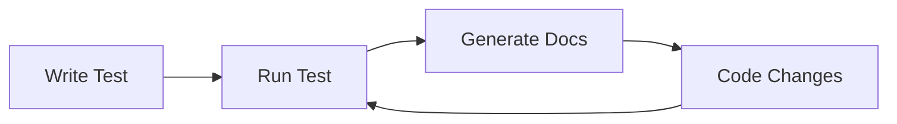

# Tutorial 1: Hello DTR

**Welcome to DTR** — the Documentation Testing Runtime that transforms your Java tests into living, breathing documentation.

**Time:** 15 minutes
**Prerequisites:** Java 26 installed, Maven/mvnd installed, basic JUnit Jupiter 6 knowledge

---

## What You'll Learn

In this tutorial, you will:

- **Understand the core mental model** — how DTR turns tests into documentation
- **Write your first DTR test** — complete working example from scratch
- **Run and examine output** — see the generated documentation in action
- **Learn common patterns** — practical examples you can use immediately
- **Practice with an exercise** — solidify your understanding

---

## The Core Mental Model

DTR operates on a simple but powerful principle: **tests that generate documentation**.



**The key insight:** Every time your tests run, they regenerate fresh documentation from live code behavior. This means your documentation is **always up-to-date** because it's **executed against real code**.

### How It Works

1. **Write a test** that exercises real code
2. **Add `say*` calls** to document what's happening
3. **Run the test** with JUnit Jupiter 6
4. **DTR generates documentation** in multiple formats (Markdown, HTML, LaTeX, JSON)

### The Benefits

- **No stale documentation** — regenerated on every test run
- **Verified examples** — code examples actually run and pass
- **Single source of truth** — tests are the documentation
- **Multiple outputs** — one test generates docs, slides, blogs, and more

---

## Prerequisites

Before starting, ensure you have:

### Java 26 Installed

```bash
java -version
# Should show: openjdk version "26.ea" or similar
```

### Maven or mvnd Installed

```bash
mvnd --version
# Or: mvn --version
# Should show Maven 4.0.0-rc-3 or later
```

### Basic JUnit Jupiter 6 Knowledge

You should be comfortable with:
- `@Test` annotations
- Test methods and assertions
- Basic Maven project structure

---

## Your First DTR Test

Let's create a complete working example. We'll build a simple documentation test that demonstrates the core concepts.

### Step 1: Create the Test Class

Create a new file `src/test/java/com/example/HelloDtrTest.java`:

```java
package com.example;

import io.github.seanchatmangpt.dtr.DtrTest;
import io.github.seanchatmangpt.dtr.DocSection;
import io.github.seanchatmangpt.dtr.DtrExtension;
import org.junit.jupiter.api.Test;
import org.junit.jupiter.api.extension.ExtendWith;

import java.util.List;
import java.util.Map;

import static org.hamcrest.MatcherAssert.assertThat;
import static org.hamcrest.Matchers.equalTo;

@ExtendWith(DtrExtension.class)
class HelloDtrTest extends DtrTest {

    @Test
    @DocSection("Getting Started")
    void gettingStarted() {
        say("DTR transforms tests into living documentation.");
        sayNextSection("Core Concept");
        say("Every test run regenerates documentation from live behavior.");
    }

    @Test
    @DocSection("Using say Methods")
    void usingSayMethods() {
        say("The `say` method renders paragraphs in your documentation.");

        sayNextSection("Code Examples");
        sayCode("int x = 42;", "java");

        sayNextSection("Structured Data");
        sayTable(new String[][]{
            {"Method", "Description", "Example"},
            {"say()", "Paragraphs", "Text blocks"},
            {"sayCode()", "Code blocks", "Syntax highlighted"},
            {"sayTable()", "Tables", "2D arrays"}
        });
    }

    @Test
    @DocSection("Assertions and Documentation")
    void assertionsAndDocumentation() {
        say("DTR combines assertions with documentation generation.");

        int result = 2 + 2;
        assertThat("Addition works", result, equalTo(4));

        sayAssertions(Map.of(
            "2 + 2", "4",
            "Calculation", "✓ PASS"
        ));
    }

    @Test
    @DocSection("Lists and Formatting")
    void listsAndFormatting() {
        say("DTR supports various formatting options:");

        sayUnorderedList(List.of(
            "Bullet points for unordered lists",
            "Numbered lists for sequences",
            "Code blocks with syntax highlighting"
        ));

        sayNextSection("Numbered Steps");
        sayOrderedList(List.of(
            "Write your test",
            "Add say* methods",
            "Run with mvnd test",
            "Check target/docs/"
        ));
    }
}
```

### What's Happening Here?

- **`@ExtendWith(DtrExtension.class)`** — Registers DTR with JUnit Jupiter 6
- **`extends DtrTest`** — Provides access to all `say*` methods
- **`@DocSection("...")`** — Creates section headings in documentation
- **`say(...)`** — Adds paragraph text
- **`sayNextSection(...)`** — Creates major section breaks
- **`sayCode(...)`** — Renders syntax-highlighted code blocks
- **`sayTable(...)`** — Formats tables from 2D arrays
- **`sayAssertions(...)`** — Documents test results

---

## Running the Test

Execute your DTR test with Maven:

```bash
mvnd test -Dtest=HelloDtrTest
```

Or with traditional Maven:

```bash
mvn test -Dtest=HelloDtrTest
```

### Expected Output

You'll see standard JUnit Jupiter 6 output:

```
[INFO] -------------------------------------------------------
[INFO]  T E S T S
[INFO] -------------------------------------------------------
[INFO] Running com.example.HelloDtrTest
[INFO] Tests run: 4, Failures: 0, Errors: 0, Skipped: 0
[INFO]
[INFO] Results:
[INFO]
[INFO] Tests run: 4, Failures: 0, Errors: 0, Skipped: 0
[INFO]
[INFO] BUILD SUCCESS
```

---

## Understanding the Output

After the test completes, check the generated documentation:

```bash
ls -la target/docs/test-results/
```

You should see multiple output formats:

```
HelloDtrTest.md      # Markdown documentation
HelloDtrTest.html    # HTML documentation
HelloDtrTest.tex     # LaTeX source
HelloDtrTest.json    # JSON metadata
```

### View the Markdown Output

```bash
cat target/docs/test-results/HelloDtrTest.md
```

You'll see structured documentation with:

- **Section headings** from `@DocSection` annotations
- **Paragraphs** from `say()` calls
- **Code blocks** with syntax highlighting from `sayCode()`
- **Tables** formatted from `sayTable()` calls
- **Assertion results** from `sayAssertions()`

---

## Adding More Documentation

Let's progressively add complexity to understand DTR's capabilities.

### Adding Notes and Warnings

Add a new test method:

```java
@Test
@DocSection("Important Notes")
void notesAndWarnings() {
    sayNote("DTR tests are regular JUnit Jupiter 6 tests — they run in your CI pipeline.");
    sayWarning("Don't commit generated docs to version control — regenerate from tests!");
}
```

### Adding Environment Information

```java
@Test
@DocSection("Environment Profile")
void environmentProfile() {
    say("DTR captures the build environment for reproducibility:");
    sayEnvProfile();
}
```

### Adding Call Site Information

```java
@Test
@DocSection("Call Site Information")
void callSiteInfo() {
    say("DTR can document where documentation is generated:");
    sayCallSite();
}
```

---

## Common Patterns

Here are practical patterns you'll use frequently:

### Pattern 1: Documenting a Feature

```java
@Test
@DocSection("Feature: User Registration")
void documentUserRegistration() {
    say("User registration requires email and password:");

    sayCode("""
        User user = new User("alice@example.com", "securePass123");
        userService.register(user);
        """, "java");

    User user = new User("alice@example.com", "securePass123");
    boolean registered = userService.register(user);

    assertThat("Registration succeeds", registered, equalTo(true));
    sayAssertions(Map.of("User registered", "✓ PASS"));
}
```

### Pattern 2: Documenting API Responses

```java
@Test
@DocSection("API Response Format")
void documentApiResponse() {
    say("API endpoints return JSON with this structure:");

    Map<String, Object> response = Map.of(
        "status", 200,
        "message", "Success",
        "data", List.of("item1", "item2")
    );

    sayJson(response);
}
```

### Pattern 3: Documenting Configuration

```java
@Test
@DocSection("Configuration Options")
void documentConfiguration() {
    say("DTR supports these configuration options:");

    sayKeyValue(Map.of(
        "output.format", "markdown, html, latex, json",
        "output.directory", "target/docs/test-results/",
        "filename.strategy", "class-based"
    ));
}
```

### Pattern 4: Progressive Documentation

```java
@Test
@DocSection("Building a Complex Example")
void buildComplexExample() {
    say("Start with the basics...");
    sayCode("int base = 10;", "java");

    sayNextSection("Add Complexity");
    say("Layer on additional concepts:");
    sayCode("""
        int base = 10;
        int multiplier = 5;
        int result = base * multiplier;
        """, "java");

    sayNextSection("Final Result");
    int base = 10;
    int multiplier = 5;
    int result = base * multiplier;

    assertThat("Calculation correct", result, equalTo(50));
    sayAssertions(Map.of("10 * 5", "50"));
}
```

---

## Exercise: Practice Your Skills

Now it's your turn! Create a DTR test that documents a simple feature.

### Task: Document a Calculator

Create a test class `CalculatorDocTest.java` that:

1. **Documents basic operations** — addition, subtraction, multiplication, division
2. **Shows code examples** — using `sayCode()`
3. **Includes assertions** — verify calculations work
4. **Adds a table** — show operation results
5. **Lists edge cases** — using `sayUnorderedList()`

### Starter Code

```java
@ExtendWith(DtrExtension.class)
class CalculatorDocTest extends DtrTest {

    @Test
    @DocSection("Calculator Operations")
    void basicOperations() {
        say("The calculator supports basic arithmetic operations:");

        // TODO: Document addition with code example and assertion

        sayNextSection("Operation Results");
        // TODO: Add a table showing results

        sayNextSection("Edge Cases");
        // TODO: List edge cases to consider
    }
}
```

### Solution Hint

You'll need:
- `sayCode()` for examples
- `assertThat()` for assertions
- `sayTable()` for results
- `sayUnorderedList()` for edge cases

---

## Summary

In this tutorial, you learned:

- **The DTR mental model** — tests generate documentation automatically
- **How to write a DTR test** — `@ExtendWith(DtrExtension.class)` + `extends DtrTest`
- **Core `say*` methods** — `say()`, `sayCode()`, `sayTable()`, `sayNextSection()`, etc.
- **Running tests** — `mvnd test -Dtest=YourTest`
- **Output location** — `target/docs/test-results/`
- **Common patterns** — practical examples for everyday use

### Key Takeaways

- **Tests are documentation** — No separate docs to maintain
- **Always up-to-date** — Regenerated on every test run
- **Verified examples** — Code samples actually run and pass
- **Multiple formats** — One test generates Markdown, HTML, LaTeX, JSON

---

## Next Tutorial

**Tutorial 2: Testing a REST API with DTR**

Build on your foundation by documenting a real REST API. You'll learn:

- Making HTTP requests with `java.net.http.HttpClient`
- Documenting request/response cycles
- Showing JSON payloads
- Testing error handling
- Generating API documentation from tests

Ready to continue? [Go to Tutorial 2](./testing-a-rest-api.md)

---

## Additional Resources

- [DTR API Reference](../reference/doctester-base-class.md) — Complete `say*` method documentation
- [80/20 Essentials](../how-to/80-20-essentials.md) — Most-used DTR patterns
- [FAQ and Troubleshooting](../reference/FAQ_AND_TROUBLESHOOTING.md) — Common issues and solutions

---

**Version:** DTR 2.6.0 | **Last Updated:** March 2026 | **Java:** 26+
