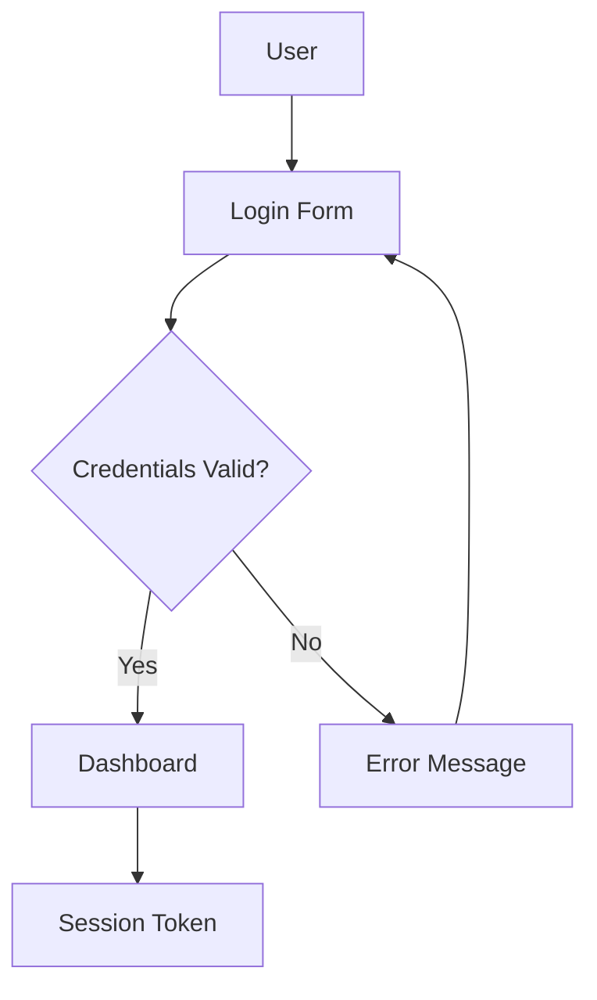
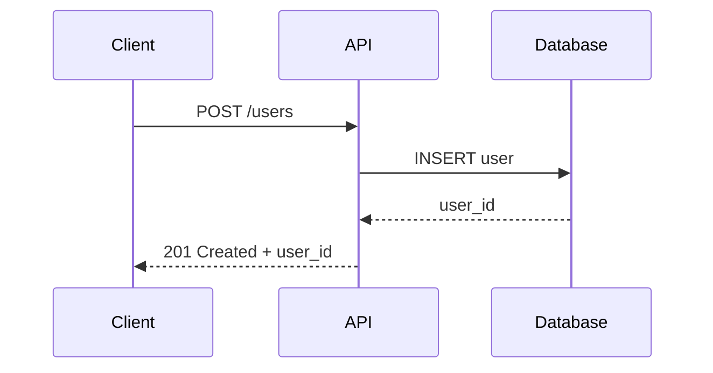

# Tutorial 5: Mermaid Diagrams

**Duration**: 20 minutes | **Prerequisites**: Completed Tutorial 4

---

## What You'll Learn

By the end of this tutorial, you will:

- ✓ Create manual Mermaid diagrams with `sayMermaid()`
- ✓ Auto-generate class diagrams from reflection
- ✓ Visualize control flow graphs (Java 26)
- ✓ Generate call graphs between methods
- ✓ Understand where Mermaid diagrams render

---

## Why Diagrams?

**Visual communication beats paragraphs** for:

- **Architecture** - System structure and component relationships
- **Flows** - Decision trees, authentication, request routing
- **Sequences** - Time-ordered interactions between services
- **Hierarchy** - Class inheritance, package organization

**DTR advantage**: Diagrams live alongside tests, staying synchronized with code changes.

---

## Where Mermaid Renders

Mermaid is natively supported in:

- **GitHub** - Markdown files, README.md, Wikis
- **GitLab** - Issues, merge requests, wikis
- **Obsidian** - Note-taking with graph view
- **VS Code** - With Mermaid preview extensions
- **MkDocs** - Via `mermaid2` plugin
- **Notion** - Native Mermaid blocks

**No build step** - diagrams render directly from markdown in browsers and IDEs.

---

## Raw Mermaid DSL

### Flowchart Example

```java
@Test
void documentAuthenticationFlow() {
    sayNextSection("Authentication Flow");

    say("User authentication follows a decision tree with validation at each step:");

    sayMermaid("""
        flowchart TD
            A[User] --> B[Login Form]
            B --> C{Credentials Valid?}
            C -->|Yes| D[Dashboard]
            C -->|No| E[Error Message]
            D --> F[Session Token]
            E --> B
    """);
}
```

**Renders as**:


### Sequence Diagram Example

```java
@Test
void documentApiCallSequence() {
    sayNextSection("API Call Sequence");

    say("Creating a new user involves coordination between client, API, and database:");

    sayMermaid("""
        sequenceDiagram
            participant Client
            participant API
            participant Database

            Client->>API: POST /users
            API->>Database: INSERT user
            Database-->>API: user_id
            API-->>Client: 201 Created + user_id
    """);
}
```

**Renders as**:


---

## Auto-Generated Class Diagrams

### `sayClassDiagram()` - From Reflection

**Auto-generates** class diagrams using Java reflection:

- Classes, interfaces, records
- Inheritance relationships (extends, implements)
- Field types and method signatures
- Access modifiers (public, protected, private)

```java
@Test
void documentUserManagementClasses() {
    sayNextSection("User Management Classes");

    say("The user management subsystem consists of three core classes with clear separation of concerns:");

    sayClassDiagram(User.class, UserService.class, UserRepository.class);
}
```

**Auto-generates diagram** showing:
- `User` - Record with username, email fields
- `UserService` - Class with `create()`, `findById()` methods
- `UserRepository` - Interface with database methods
- Relationships: `UserService` depends on `UserRepository`

### Custom Example

```java
@Test
void documentShapeHierarchy() {
    sayNextSection("Shape Hierarchy");

    say("The geometry module uses sealed hierarchies for type-safe shape operations:");

    sayClassDiagram(Shape.class, Circle.class, Rectangle.class);
}
```

**Sealed hierarchy diagram** shows:
- `Shape` as sealed interface
- `Circle`, `Rectangle` as permitted subclasses
- Method signatures across hierarchy

---

## Control Flow Graphs (Java 26)

### `sayControlFlowGraph()` - Decision Trees

**Requires Java 26** with `@CodeReflection` annotation:

```java
@CodeReflection
public static int calculateDiscount(int orderTotal, boolean isPremiumMember) {
    if (isPremiumMember) {
        if (orderTotal > 1000) {
            return 15; // 15% discount
        } else {
            return 10; // 10% discount
        }
    } else {
        if (orderTotal > 500) {
            return 5; // 5% discount
        } else {
            return 0; // No discount
        }
    }
}

@Test
void documentDiscountCalculationFlow() {
    sayNextSection("Discount Calculation Logic");

    say("Discount calculation uses nested conditionals based on membership status and order total:");

    sayCode("""
        if (isPremiumMember) {
            if (orderTotal > 1000) return 15;
            else return 10;
        } else {
            if (orderTotal > 500) return 5;
            else return 0;
        }
    """, "java");

    try {
        Method method = DiscountCalculator.class.getMethod("calculateDiscount", int.class, boolean.class);
        sayControlFlowGraph(method);
    } catch (NoSuchMethodException e) {
        sayWarning("Code reflection requires Java 26 with @CodeReflection annotation");
    }
}
```

**Renders Mermaid flowchart** showing:
- Decision diamonds for each `if` statement
- Branches labeled with conditions
- Terminal nodes for return values

---

## Call Graphs (Java 26)

### `sayCallGraph()` - Method Interconnections

**Visualizes** which methods call which within a class:

```java
public class OrderProcessor {

    public OrderResult process(Order order) {
        validate(order);
        return fulfill(order);
    }

    private void validate(Order order) {
        checkInventory(order);
        checkAddress(order.getShippingAddress());
    }

    private OrderResult fulfill(Order order) {
        return ship(order);
    }

    private void checkInventory(Order order) { /* ... */ }
    private void checkAddress(Address address) { /* ... */ }
    private OrderResult ship(Order order) { /* ... */ }
}

@Test
void documentOrderProcessingCalls() {
    sayNextSection("Order Processing Call Graph");

    say("The order processor orchestrates validation and fulfillment through helper methods:");

    sayCallGraph(OrderProcessor.class);
}
```

**Renders Mermaid graph** showing:
- `process()` → calls `validate()` and `fulfill()`
- `validate()` → calls `checkInventory()` and `checkAddress()`
- `fulfill()` → calls `ship()`

**Use cases**:
- **Onboarding** - Understand code flow quickly
- **Refactoring** - Identify coupling and dependencies
- **Debugging** - Trace execution paths

---

## Complete Example

```java
public class PaymentSystemDocTest extends DtrTest {

    @Test
    void documentPaymentFlow() {
        sayNextSection("Payment Processing");

        say("Payments flow through validation, processing, and confirmation stages:");

        // Manual sequence diagram
        sayMermaid("""
            sequenceDiagram
                participant User
                participant PaymentAPI
                participant Gateway
                participant Bank

                User->>PaymentAPI: POST /pay
                PaymentAPI->>Gateway: Charge $50
                Gateway->>Bank: Authorization
                Bank-->>Gateway: Approved
                Gateway-->>PaymentAPI: Success
                PaymentAPI-->>User: 200 OK
        """);
    }

    @Test
    void documentPaymentClasses() {
        sayNextSection("Payment System Classes");

        say("Core payment processing components:");

        // Auto-generated from reflection
        sayClassDiagram(
            PaymentService.class,
            PaymentGateway.class,
            PaymentResult.class
        );
    }

    @CodeReflection
    public static boolean isValidAmount(BigDecimal amount) {
        if (amount == null) return false;
        if (amount.compareTo(BigDecimal.ZERO) <= 0) return false;
        return amount.compareTo(new BigDecimal("10000")) <= 0;
    }

    @Test
    void documentAmountValidation() {
        sayNextSection("Amount Validation Logic");

        say("Amount validation checks for null, positive values, and maximum limits:");

        try {
            Method method = PaymentSystemDocTest.class
                .getMethod("isValidAmount", BigDecimal.class);
            sayControlFlowGraph(method);
        } catch (NoSuchMethodException e) {
            sayWarning("Code reflection unavailable");
        }
    }
}
```

---

## Exercise

**Task**: Document a `ShoppingCart` checkout flow

**Requirements**:

1. Create a sequence diagram showing:
   - User → Cart → Inventory → Payment → Confirmation
   - Include error paths (out of stock, payment declined)

2. Auto-generate class diagram for:
   - `ShoppingCart`
   - `CartItem`
   - `CheckoutService`

3. Add control flow graph for discount logic (if you have Java 26)

**Template**:

```java
public class ShoppingCartDocTest extends DtrTest {

    @Test
    void documentCheckoutFlow() {
        sayNextSection("Checkout Flow");

        // TODO: Add sequence diagram with sayMermaid()

        say("The checkout process validates inventory, processes payment, and confirms orders:");
    }

    @Test
    void documentShoppingCartClasses() {
        sayNextSection("Shopping Cart Components");

        // TODO: Auto-generate with sayClassDiagram()

        say("Shopping cart consists of cart items, inventory validation, and checkout services:");
    }

    @Test
    void documentDiscountLogic() {
        sayNextSection("Discount Calculation");

        // TODO: Add control flow graph if using Java 26

        say("Discounts apply based on cart total and customer tier:");
    }
}
```

**Verify**:
- ✓ Sequence diagram shows all participants
- ✓ Class diagram includes fields and methods
- ✓ Control flow (if added) shows decision branches

---

## Next Tutorial

**Tutorial 6: Cross-References & Citations**
- Link between documentation sections with `sayRef()`
- Add academic citations with `sayCite()`
- Create navigable documentation networks

---

## Quick Reference

| Method | Use Case | Diagram Type |
|--------|----------|--------------|
| `sayMermaid()` | Manual diagrams | Any Mermaid DSL |
| `sayClassDiagram()` | Class structure | Auto from reflection |
| `sayControlFlowGraph()` | Method logic | Flowchart (Java 26) |
| `sayCallGraph()` | Method calls | Call graph (Java 26) |

**Supported Mermaid types**: flowchart, sequenceDiagram, classDiagram, stateDiagram, erDiagram, gantt, pie, mindmap
