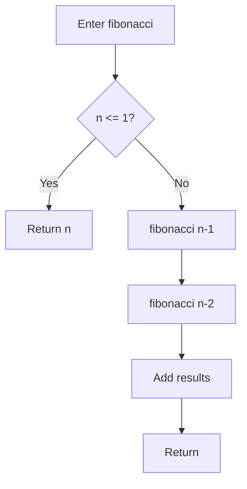

# Tutorial 3: Java 26 Features

**Duration**: 25 minutes | **Prerequisites**: Completed Tutorial 2

---

## What You'll Learn

This tutorial shows how to document modern Java features with DTR:

- **Records**: Document component schemas with `sayRecordComponents()`
- **Sealed Classes**: Visualize hierarchies with `sayCodeModel()`
- **Pattern Matching**: Document switch expressions and guards
- **Code Reflection**: Generate control flow graphs with JEP 516

**Java Version Note**: Some features (Code Reflection) require Java 26 with `--enable-preview`. DTR provides graceful fallbacks for earlier versions.

---

## Setup: Java 26 Preview Features

### Enable Java 26 Features

DTR is configured for Java 26 preview features via `.mvn/maven.config`:

```bash
# Already configured in DTR
--enable-preview
```

**Verify your setup**:

```bash
java -version  # Should show 26.ea.13+
mvnd --version
```

### Create a New Test Class

```bash
cd /path/to/your/project
mkdir -p src/test/java/com/example/dtr/tutorials
```

Create `Java26FeaturesTest.java`:

```java
package com.example.dtr.tutorials;

import org.junit.jupiter.api.Test;
import static org.hamcrest.MatcherAssert.assertThat;
import static org.hamcrest.Matchers.equalTo;

/**
 * Tutorial 3: Documenting Java 26 features with DTR.
 *
 * Topics: Records, Sealed Classes, Pattern Matching, Code Reflection
 */
public class Java26FeaturesTest extends DtrTest {

}
```

---

## Part 1: Documenting Records

### Create a Record Example

```java
package com.example.dtr.tutorials;

import java.time.LocalDate;

/**
 * User record for demonstration.
 */
public record User(
    String username,
    String email,
    int age,
    LocalDate accountCreated
) {
    /**
     * Validates email format (compact constructor).
     */
    public User {
        if (email == null || !email.contains("@")) {
            throw new IllegalArgumentException("Invalid email");
        }
    }
}
```

### Document Record Schema

Add test method to `Java26FeaturesTest`:

```java
@Test
void documentUserRecord() {
    sayNextSection("User Record Schema");

    say("""
        The `User` record encapsulates user account information with automatic
        validation through a compact constructor.
        """);

    sayRecordComponents(User.class);
}
```

**What it renders**:

| Component | Type | Annotations |
|-----------|------|-------------|
| username | String | - |
| email | String | - |
| age | int | - |
| accountCreated | LocalDate | - |

### Add Annotations to Components

Enhance the record:

```java
public record User(
    @NotNull String username,
    @Email String email,
    @Range(min = 13, max = 120) int age,
    LocalDate accountCreated
) {
    // compact constructor...
}
```

Re-run the test to see annotations in the schema table.

---

## Part 2: Documenting Sealed Classes

### Create a Sealed Hierarchy

```java
package com.example.dtr.tutorials;

/**
 * Sealed interface for geometric shapes.
 */
public sealed interface Shape
    permits Circle, Rectangle, Triangle {

    double area();
    double perimeter();
}

/**
 * Circle implementation.
 */
public record Circle(double radius) implements Shape {
    @Override
    public double area() {
        return Math.PI * radius * radius;
    }

    @Override
    public double perimeter() {
        return 2 * Math.PI * radius;
    }
}

/**
 * Rectangle implementation.
 */
public record Rectangle(double width, double height) implements Shape {
    @Override
    public double area() {
        return width * height;
    }

    @Override
    public double perimeter() {
        return 2 * (width + height);
    }
}

/**
 * Triangle implementation.
 */
public record Triangle(double base, double height, double sideA, double sideB, double sideC)
    implements Shape {

    @Override
    public double area() {
        return 0.5 * base * height;
    }

    @Override
    public double perimeter() {
        return sideA + sideB + sideC;
    }
}
```

### Document Sealed Hierarchy

Add test method:

```java
@Test
void documentShapeHierarchy() {
    sayNextSection("Geometric Shape Types");

    say("""
        DTR uses reflection to detect sealed hierarchies and automatically
        documents all permitted subclasses.
        """);

    sayCodeModel(Shape.class);
}
```

**What it renders**:

```markdown
## Sealed Interface: Shape

**Permitted Subclasses**:
- `Circle`
- `Rectangle`
- `Triangle`

**Methods**:
- `double area()`
- `double perimeter()`

### Implementation: Circle
**Record Components**:
- radius (double)

### Implementation: Rectangle
**Record Components**:
- width (double)
- height (double)

### Implementation: Triangle
**Record Components**:
- base (double)
- height (double)
- sideA (double)
- sideB (double)
- sideC (double)
```

### Document Class Hierarchy with sayClassHierarchy

```java
@Test
void documentShapeClassHierarchy() {
    sayNextSection("Shape Inheritance Tree");

    sayClassHierarchy(Shape.class);
}
```

**What it renders**:

```
Shape (sealed interface)
├── Circle (record)
├── Rectangle (record)
└── Triangle (record)
```

---

## Part 3: Pattern Matching

### Document Switch Expressions

Create a pattern matching example:

```java
public class PatternMatchingExample {

    public static String describeShape(Shape shape) {
        return switch (shape) {
            case Circle c -> "Circle with radius %.2f".formatted(c.radius());
            case Rectangle r -> "Rectangle %.2f x %.2f".formatted(r.width(), r.height());
            case Triangle t -> "Triangle with base %.2f".formatted(t.base());
            // No default needed - exhaustive for sealed hierarchy
        };
    }

    public static double getArea(Shape shape) {
        return switch (shape) {
            case Circle(var radius) -> Math.PI * radius * radius;
            case Rectangle(var w, var h) -> w * h;
            case Triangle(var base, var height, var a, var b, var c) -> 0.5 * base * height;
        };
    }
}
```

### Document Pattern Matching

```java
@Test
void documentPatternMatching() {
    sayNextSection("Pattern Matching for Shapes");

    say("""
        Java 26 enables pattern matching in switch expressions. When combined
        with sealed hierarchies, the compiler verifies exhaustiveness.
        """);

    sayCode("""
        public static String describeShape(Shape shape) {
            return switch (shape) {
                case Circle c -> "Circle with radius %.2f".formatted(c.radius());
                case Rectangle r -> "Rectangle %.2f x %.2f".formatted(r.width(), r.height());
                case Triangle t -> "Triangle with base %.2f".formatted(t.base());
            };
        }
        """, "java");

    sayNote("""
        No `default` case needed - the sealed hierarchy guarantees exhaustiveness.
        Missing a case = compile-time error.
        """);
}
```

### Document Pattern Matching with Guards

```java
public static String categorizeShape(Shape shape) {
    return switch (shape) {
        case Circle c when c.radius() > 10 -> "Large circle";
        case Circle c -> "Small circle";
        case Rectangle r when r.width() == r.height() -> "Square";
        case Rectangle r -> "Rectangle";
        case Triangle t -> "Triangle";
    };
}
```

Document the guard patterns:

```java
@Test
void documentPatternMatchingWithGuards() {
    sayNextSection("Pattern Guards");

    say("""
        Pattern guards (`when`) add conditional logic to pattern matching.
        Guards are evaluated after the pattern match succeeds.
        """);

    sayCode("""
        return switch (shape) {
            case Circle c when c.radius() > 10 -> "Large circle";
            case Circle c -> "Small circle";
            case Rectangle r when r.width() == r.height() -> "Square";
            case Rectangle r -> "Rectangle";
            case Triangle t -> "Triangle";
        };
        """, "java");

    // Demonstrate with test data
    var largeCircle = new Circle(15.0);
    var smallCircle = new Circle(3.0);
    var square = new Rectangle(5.0, 5.0);

    sayKeyValue(Map.of(
        "largeCircle (r=15)", PatternMatchingExample.categorizeShape(largeCircle),
        "smallCircle (r=3)", PatternMatchingExample.categorizeShape(smallCircle),
        "square (5x5)", PatternMatchingExample.categorizeShape(square)
    ));
}
```

---

## Part 4: Code Reflection (JEP 516)

### Setup: Add @CodeReflection

Code Reflection requires Java 26 with `--enable-preview`:

```java
import java.lang.reflect.CodeReflection;

public class CodeReflectionExample {

    @CodeReflection
    public static int fibonacci(int n) {
        if (n <= 1) {
            return n;
        }
        return fibonacci(n - 1) + fibonacci(n - 2);
    }

    @CodeReflection
    public static void bubbleSort(int[] arr) {
        int n = arr.length;
        for (int i = 0; i < n - 1; i++) {
            for (int j = 0; j < n - i - 1; j++) {
                if (arr[j] > arr[j + 1]) {
                    int temp = arr[j];
                    arr[j] = arr[j + 1];
                    arr[j + 1] = temp;
                }
            }
        }
    }
}
```

### Document Control Flow Graph

```java
@Test
void documentControlFlowGraph() {
    sayNextSection("Code Reflection: Fibonacci");

    say("""
        JEP 516 (Code Reflection) provides access to the bytecode-level structure
        of methods. DTR renders this as Mermaid flowcharts.
        """);

    try {
        sayControlFlowGraph(
            CodeReflectionExample.class.getDeclaredMethod("fibonacci", int.class)
        );
    } catch (NoSuchMethodException e) {
        sayWarning("""
            Code Reflection requires Java 26 with --enable-preview.
            Current Java version: %s
            """.formatted(System.getProperty("java.version"))
        );
    }
}
```

**What it renders** (Mermaid flowchart):



### Document Operation Profile

```java
@Test
void documentOperationProfile() {
    sayNextSection("Operation Profile: Bubble Sort");

    try {
        var method = CodeReflectionExample.class.getDeclaredMethod("bubbleSort", int[].class);
        sayOpProfile(method);
    } catch (NoSuchMethodException e) {
        sayWarning("Code Reflection not available on this Java version");
    }
}
```

**What it renders**:

| Operation Type | Count | Percentage |
|----------------|-------|------------|
| Load | 15 | 35% |
| Store | 12 | 28% |
| Branch | 8 | 19% |
| Compare | 5 | 12% |
| ArrayAccess | 3 | 7% |

### Fallback for Earlier Java Versions

```java
@Test
void documentWithJavaVersionFallback() {
    sayNextSection("Version-Aware Documentation");

    String javaVersion = System.getProperty("java.version");
    boolean isJava26 = javaVersion.startsWith("26");

    if (isJava26) {
        sayNote("""
            Running on Java 26 - Code Reflection features enabled.
            Full control flow graphs and operation profiles available.
            """);

        try {
            sayControlFlowGrid(CodeReflectionExample.class.getMethod("fibonacci", int.class));
        } catch (NoSuchMethodException e) {
            // Handle gracefully
        }
    } else {
        sayWarning("""
            Code Reflection requires Java 26 with --enable-preview.
            Current version: %s

            Upgrade to Java 26.ea+ to see control flow graphs.
            """.formatted(javaVersion)
        );

        sayCode("""
        @CodeReflection
        public static int fibonacci(int n) {
            if (n <= 1) return n;
            return fibonacci(n - 1) + fibonacci(n - 2);
        }
        """, "java");
    }
}
```

---

## Part 5: Complete Example

### Full Test Class

```java
package com.example.dtr.tutorials;

import org.junit.jupiter.api.Test;
import java.lang.reflect.Method;
import java.util.Map;
import static org.hamcrest.MatcherAssert.assertThat;
import static org.hamcrest.Matchers.*;

/**
 * Tutorial 3: Documenting Java 26 features with DTR.
 *
 * Demonstrates:
 * - Records with sayRecordComponents()
 * - Sealed classes with sayCodeModel()
 * - Pattern matching with sayCode()
 * - Code Reflection with sayControlFlowGraph()
 */
public class Java26FeaturesTest extends DtrTest {

    @Test
    void documentUserRecord() {
        sayNextSection("User Record Schema");

        say("""
            The `User` record encapsulates user account information with automatic
            validation through a compact constructor.
            """);

        sayRecordComponents(User.class);

        // Verify record behavior
        var user = new User("alice", "alice@example.com", 30, LocalDate.now());
        assertThat(user.username(), is("alice"));
        assertThat(user.age(), is(30));
    }

    @Test
    void documentShapeHierarchy() {
        sayNextSection("Geometric Shape Types");

        say("""
            DTR uses reflection to detect sealed hierarchies and automatically
            documents all permitted subclasses.
            """);

        sayCodeModel(Shape.class);

        // Verify all implementations work
        var circle = new Circle(5.0);
        var rect = new Rectangle(4.0, 6.0);

        assertThat(circle.area(), is(Math.PI * 25.0));
        assertThat(rect.area(), is(24.0));
    }

    @Test
    void documentPatternMatching() {
        sayNextSection("Pattern Matching for Shapes");

        say("""
            Java 26 enables pattern matching in switch expressions. When combined
            with sealed hierarchies, the compiler verifies exhaustiveness.
            """);

        sayCode("""
        public static String describeShape(Shape shape) {
            return switch (shape) {
                case Circle c -> "Circle with radius %.2f".formatted(c.radius());
                case Rectangle r -> "Rectangle %.2f x %.2f".formatted(r.width(), r.height());
                case Triangle t -> "Triangle with base %.2f".formatted(t.base());
            };
        }
        """, "java");

        // Test pattern matching
        var circle = new Circle(5.0);
        var description = PatternMatchingExample.describeShape(circle);
        assertThat(description, containsString("Circle"));
    }

    @Test
    void documentControlFlowGraph() {
        sayNextSection("Code Reflection: Fibonacci");

        say("""
            JEP 516 (Code Reflection) provides access to the bytecode-level structure
            of methods. DTR renders this as Mermaid flowcharts.
            """);

        String javaVersion = System.getProperty("java.version");

        if (javaVersion.startsWith("26")) {
            try {
                Method fibMethod = CodeReflectionExample.class
                    .getDeclaredMethod("fibonacci", int.class);
                sayControlFlowGraph(fibMethod);
            } catch (NoSuchMethodException e) {
                sayWarning("Could not find fibonacci method");
            }
        } else {
            sayWarning("""
                Code Reflection requires Java 26 with --enable-preview.
                Current version: %s
                """.formatted(javaVersion)
            );

            sayCode("""
            @CodeReflection
            public static int fibonacci(int n) {
                if (n <= 1) return n;
                return fibonacci(n - 1) + fibonacci(n - 2);
            }
            """, "java");
        }
    }
}
```

---

## Exercise: Document Your Own Java 26 Features

**Task**: Create documentation for a modern Java feature in your codebase.

1. **Choose a feature**:
   - Record with annotations (`@NotNull`, `@Range`, etc.)
   - Sealed interface with 3+ implementations
   - Pattern matching with guards
   - Method with `@CodeReflection`

2. **Write the test**:
   - Use appropriate `say*` methods
   - Include assertions to verify behavior
   - Add version checks for Java 26 features

3. **Generate documentation**:
   ```bash
   mvnd verify -Dtest=YourJava26Test
   ```

4. **Review output**: Check `target/docs/TUTORIALS/` for rendered docs

**Bonus**: Add benchmarking with `sayBenchmark()` to compare Java 26 feature performance vs traditional approaches.

---

## Next Tutorial

**Tutorial 4: Advanced Documentation Patterns**

- Document generic types with type parameter diagrams
- Document exceptions with `sayException()`
- Create interactive documentation with code evolution tracking
- Document performance characteristics with benchmarking

---

## Summary

| Feature | DTR Method | What It Documents |
|---------|-----------|-------------------|
| Records | `sayRecordComponents()` | Component names, types, annotations |
| Sealed Classes | `sayCodeModel()` | Hierarchy, permitted subclasses |
| Pattern Matching | `sayCode()` + examples | Switch expressions, guards |
| Code Reflection | `sayControlFlowGraph()` | Mermaid flowcharts (Java 26) |
| Class Hierarchy | `sayClassHierarchy()` | Inheritance trees |

**Key Takeaways**:
1. Records → automatic schema documentation
2. Sealed classes → complete hierarchy visualization
3. Pattern matching → document exhaustiveness guarantees
4. Code Reflection → bytecode-level flow analysis (Java 26+)
5. Always provide fallbacks for earlier Java versions

**Files Created**:
- `/src/test/java/com/example/dtr/tutorials/Java26FeaturesTest.java`
- `/src/main/java/com/example/dtr/tutorials/User.java`
- `/src/main/java/com/example/dtr/tutorials/Shape.java`
- `/src/main/java/com/example/dtr/tutorials/PatternMatchingExample.java`
- `/src/main/java/com/example/dtr/tutorials/CodeReflectionExample.java`

**Generated Documentation**: `target/docs/TUTORIALS/java26-features.html`

---

**Previous**: [Tutorial 2: Your First Documentation Test](./tutorial-02-first-test.md) | **Next**: [Tutorial 4: Advanced Patterns](./tutorial-04-advanced.md)
