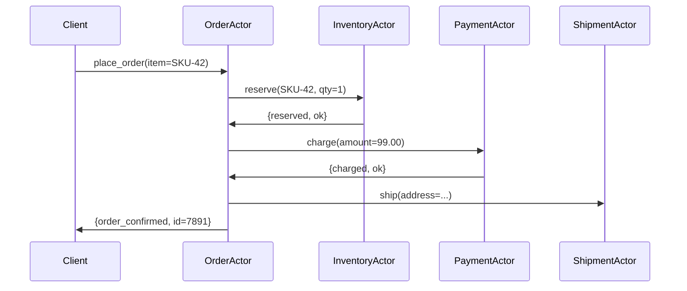
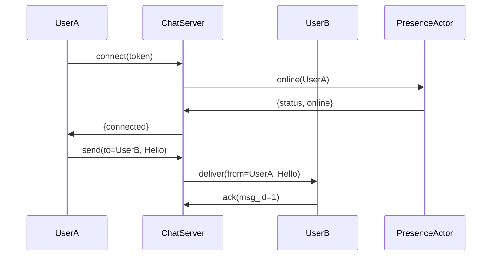
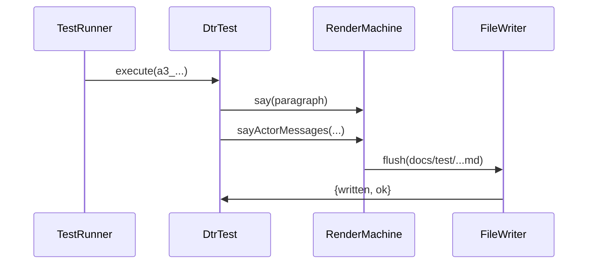

# io.github.seanchatmangpt.dtr.test.ActorMessagesDocTest

## Table of Contents

- [sayActorMessages — E-Commerce Order Processing](#sayactormessagesecommerceorderprocessing)
- [sayActorMessages — Real-Time Chat System](#sayactormessagesrealtimechatsystem)
- [sayActorMessages — DTR Rendering Pipeline](#sayactormessagesdtrrenderingpipeline)


## sayActorMessages — E-Commerce Order Processing

Joe Armstrong observed that most concurrency bugs are not bugs in the concurrency machinery itself — they are bugs in the shared mutable state that concurrent threads compete over. His remedy was radical: ban sharing entirely. Actors own their state exclusively. When one actor needs information from another, it sends a message and waits for a reply. There are no locks, no monitors, no volatile fields, no race windows.

The e-commerce order pipeline below is the textbook demonstration of this principle. Client sends a single {@code place_order} message. OrderActor coordinates the reservation, payment, and shipment sub-systems through discrete messages and collects their replies before reporting back to Client. If PaymentActor crashes mid-charge, its supervisor restarts it with no corrupted shared state to clean up — because there was none.

```java
// Declare actors and messages, then render.
List<String> actors = List.of(
    "Client", "OrderActor", "InventoryActor", "PaymentActor", "ShipmentActor"
);

List<String[]> messages = List.of(
    new String[]{"Client",        "OrderActor",     "place_order(item=SKU-42)"},
    new String[]{"OrderActor",    "InventoryActor", "reserve(SKU-42, qty=1)"},
    new String[]{"InventoryActor","OrderActor",     "{reserved, ok}"},
    new String[]{"OrderActor",    "PaymentActor",   "charge(amount=99.00)"},
    new String[]{"PaymentActor",  "OrderActor",     "{charged, ok}"},
    new String[]{"OrderActor",    "ShipmentActor",  "ship(address=...)"},
    new String[]{"OrderActor",    "Client",         "{order_confirmed, id=7891}"}
);

sayActorMessages("E-Commerce Order Processing", actors, messages);
```

Each message in the list is a {@code String[3]}: sender, receiver, and message text. The render machine declares every actor as a Mermaid {@code participant}, then emits one arrow per message. The result is a verifiable specification: the test cannot pass if the actor list or message list is structurally incorrect.

> [!NOTE]
> The reply from OrderActor to Client — {@code {order_confirmed, id=7891}} — uses Erlang tuple syntax deliberately. Armstrong's insight was that tagged tuples make protocol errors impossible to ignore at the call site. A message that is never pattern-matched causes a function-clause exception rather than silent corruption.

### Actor Messages: E-Commerce Order Processing



| Metric | Value |
| --- | --- |
| Actors | `5` |
| Messages | `7` |

| Actor | Role | Messages sent | Messages received |
| --- | --- | --- | --- |
| Client | External request originator | 1 | 1 |
| OrderActor | Saga coordinator | 3 | 3 |
| InventoryActor | Stock reservation service | 1 | 1 |
| PaymentActor | Charge processing service | 1 | 1 |
| ShipmentActor | Dispatch and logistics | 0 | 1 |

| Key | Value |
| --- | --- |
| `Actor count` | `5` |
| `sayActorMessages render time` | `2348289 ns` |
| `Java version` | `25.0.2` |
| `Message count` | `7` |
| `Pattern` | `Request-reply saga with synchronous sub-steps` |

> [!WARNING]
> ShipmentActor receives a {@code ship} message but never replies in this trace. In a production actor system that omission is intentional: shipment is fire-and-forget from the order saga's perspective. Delivery confirmation arrives asynchronously, hours later, via a separate {@code delivery_confirmed} message routed directly to Client. Documenting the asynchronous follow-up requires a second {@code sayActorMessages} call covering that interaction.

## sayActorMessages — Real-Time Chat System

Location transparency is one of the most powerful properties of the actor model. From UserA's perspective, sending a chat message to UserB is identical whether UserB is running on the same JVM, a different server in the same data centre, or a handset on the other side of the planet. The message is addressed to a process identifier — the PID or actor reference — and the runtime routes it. The sending actor never needs to know where the receiving actor lives.

The chat session below models a four-actor system: UserA and UserB are client-side actors representing connected sessions; ChatServer is the message broker; PresenceActor tracks online/offline status. The sequence covers connection establishment, presence notification, message delivery, and delivery acknowledgement — the complete happy-path protocol for one message in a real-time chat system.

```java
List<String> chatActors = List.of(
    "UserA", "ChatServer", "UserB", "PresenceActor"
);

List<String[]> chatMessages = List.of(
    new String[]{"UserA",         "ChatServer",    "connect(token)"},
    new String[]{"ChatServer",     "PresenceActor", "online(UserA)"},
    new String[]{"PresenceActor",  "ChatServer",    "{status, online}"},
    new String[]{"ChatServer",     "UserA",         "{connected}"},
    new String[]{"UserA",          "ChatServer",    "send(to=UserB, Hello)"},
    new String[]{"ChatServer",     "UserB",         "deliver(from=UserA, Hello)"},
    new String[]{"UserB",          "ChatServer",    "ack(msg_id=1)"}
);

sayActorMessages("Real-Time Chat System", chatActors, chatMessages);
```

Two sub-protocols are interleaved in this trace. The connection protocol occupies the first four messages: UserA authenticates, ChatServer notifies PresenceActor, PresenceActor confirms, ChatServer acknowledges. The messaging protocol occupies the last three: send, deliver, acknowledge. Both sub-protocols are stateless from the outside — any actor can be restarted between messages without corrupting the protocol, because all state is encoded in the messages themselves.

> [!NOTE]
> The {@code ack(msg_id=1)} from UserB back to ChatServer enables at-least-once delivery. If ChatServer crashes before receiving the ack, it restarts with the message still in its mailbox and retransmits. If UserB crashes before sending the ack, ChatServer retransmits on reconnection. In neither case is there shared mutable state to repair — only a retransmission.

### Actor Messages: Real-Time Chat System



| Metric | Value |
| --- | --- |
| Actors | `4` |
| Messages | `7` |

| Actor | Role | Messages sent | Messages received |
| --- | --- | --- | --- |
| UserA | Connecting client session | 2 | 1 |
| ChatServer | Central message broker | 3 | 3 |
| UserB | Receiving client session | 1 | 1 |
| PresenceActor | Online/offline status tracker | 1 | 1 |

| Key | Value |
| --- | --- |
| `Delivery guarantee` | `At-least-once via ack(msg_id)` |
| `Actor count` | `4` |
| `sayActorMessages render time` | `420258 ns` |
| `Java version` | `25.0.2` |
| `Message count` | `7` |

> [!WARNING]
> PresenceActor is a shared service — both UserA and UserB sessions route through it. In an Erlang system this would be a named registered process, not a unique PID per session. Scaling PresenceActor beyond a single node requires a distributed registry (Mnesia, etcd, or equivalent). The actor model does not eliminate distribution complexity — it isolates it inside PresenceActor rather than scattering it across the codebase.

## sayActorMessages — DTR Rendering Pipeline

Every DTR test run is itself an actor system. TestRunner (JUnit 5) dispatches test methods to DtrTest instances. Each {@code say*} call is a message from DtrTest to RenderMachine. RenderMachine accumulates rendered content and delegates final I/O to FileWriter, which flushes each output format to disk. No component reaches into another's state: DtrTest does not touch FileWriter's buffer, and RenderMachine does not know which test class invoked it.

Documenting DTR's own pipeline with {@code sayActorMessages} is self-referential in the best sense: the primitive designed to make actor-model communication legible is itself used to make its own communication legible. The sequence diagram below is the exact protocol that produced this document. Readers can trace every arrow back to a method call in the DTR source.

```java
List<String> pipelineActors = List.of(
    "TestRunner", "DtrTest", "RenderMachine", "FileWriter"
);

List<String[]> pipelineMessages = List.of(
    new String[]{"TestRunner",    "DtrTest",       "execute(a3_...)"},
    new String[]{"DtrTest",       "RenderMachine", "say(paragraph)"},
    new String[]{"DtrTest",       "RenderMachine", "sayActorMessages(...)"},
    new String[]{"RenderMachine", "FileWriter",    "flush(docs/test/...md)"},
    new String[]{"FileWriter",    "DtrTest",       "{written, ok}"}
);

sayActorMessages("DTR Rendering Pipeline", pipelineActors, pipelineMessages);
```

The message {@code sayActorMessages(...)} in this trace is the call that produced the diagram you are viewing. It is both a message in the sequence diagram and the Java statement that rendered that diagram. This is not a coincidence — it is the consequence of DTR's design principle that documentation is produced by running the code, not by describing it separately.

The final message — {@code {written, ok}} from FileWriter back to DtrTest — completes the round trip. In the actual DTR implementation this reply is implicit: {@code finishAndWriteOut()} in the {@code @AfterAll} hook returns normally on success. Making it explicit in the actor diagram clarifies the ownership boundary: DtrTest is responsible for triggering the flush, but FileWriter is responsible for confirming it succeeded.

### Actor Messages: DTR Rendering Pipeline



| Metric | Value |
| --- | --- |
| Actors | `4` |
| Messages | `5` |

| Actor | DTR Class / Component | Messages sent | Messages received |
| --- | --- | --- | --- |
| TestRunner | JUnit 5 engine | 1 | 0 |
| DtrTest | DtrTest (abstract base class) | 2 | 1 |
| RenderMachine | RenderMachineImpl | 1 | 2 |
| FileWriter | RenderMachine I/O layer | 1 | 1 |

| Key | Value |
| --- | --- |
| `Actor count` | `4` |
| `sayActorMessages render time` | `231240 ns` |
| `Java version` | `25.0.2` |
| `Message count` | `5` |
| `Output formats` | `Markdown, LaTeX, HTML, JSON` |

> [!NOTE]
> The two messages from DtrTest to RenderMachine — {@code say(paragraph)} and {@code sayActorMessages(...)} — represent the full narrative of this test method compressed to two entries. In reality this method makes several more {@code say*} calls that are omitted from the actor trace for clarity. The actor diagram documents the protocol structure, not every individual invocation.

> [!WARNING]
> RenderMachine is not a pure actor in the strict Erlang sense — it is a plain Java object that accumulates rendered content in an in-memory list and flushes it synchronously at {@code @AfterAll}. The actor metaphor is appropriate for reasoning about ownership and message boundaries, but DTR does not use an actual actor runtime (Akka, Vert.x, or similar). If concurrent documentation generation becomes a requirement, replacing RenderMachine with a virtual-thread-per-test-class actor would require no changes to the {@code say*} API contract.

---
*Generated by [DTR](http://www.dtr.org)*
