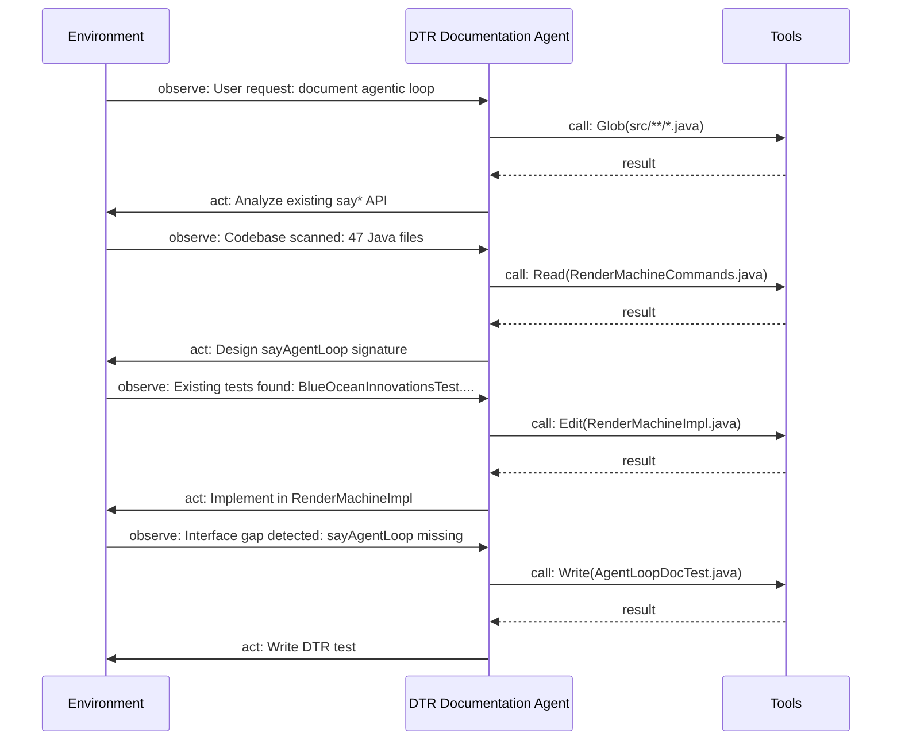
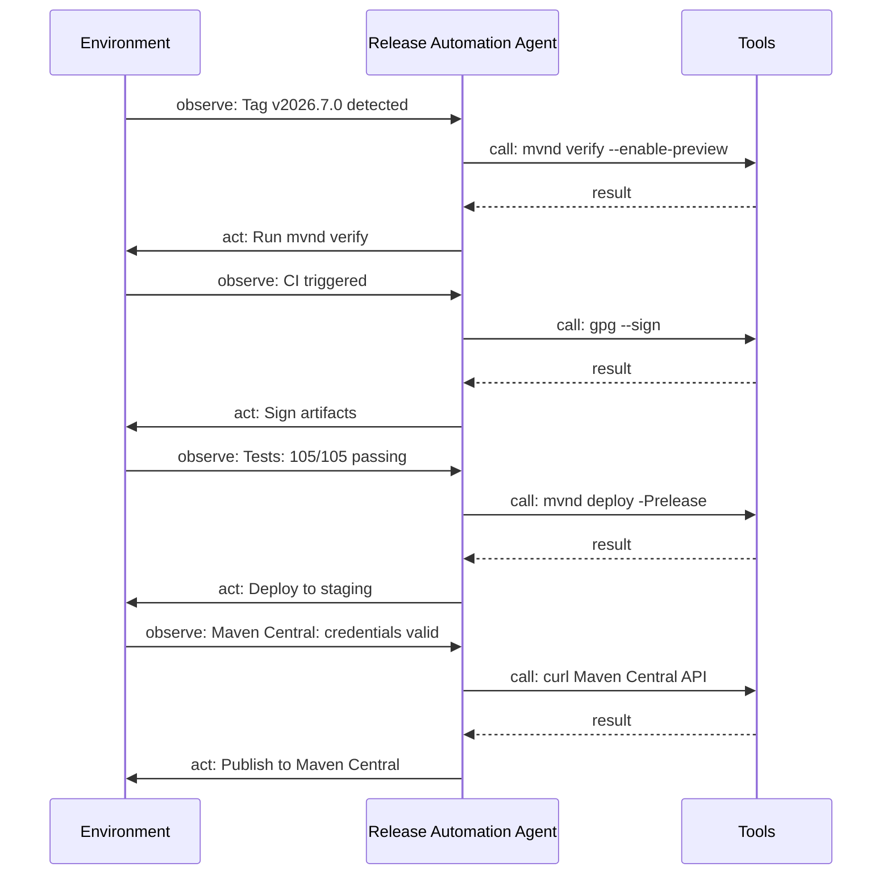
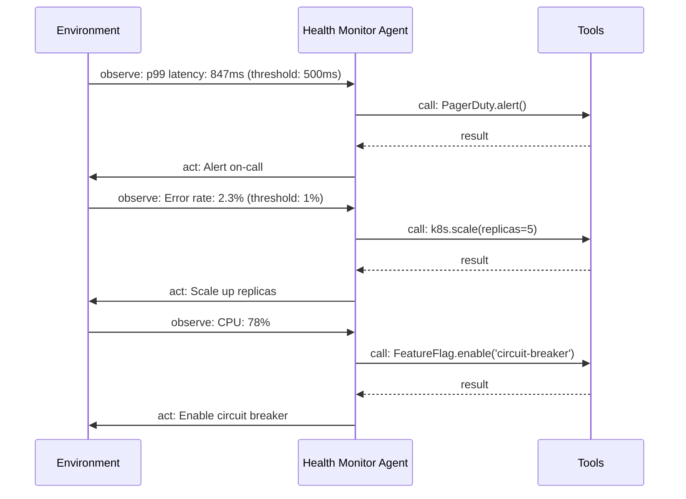

# io.github.seanchatmangpt.dtr.test.AgentLoopDocTest

## Table of Contents

- [sayAgentLoop — DTR Documentation Agent](#sayagentloopdtrdocumentationagent)
- [sayAgentLoop — Release Automation Agent](#sayagentloopreleaseautomationagent)
- [sayAgentLoop — Health Monitor Agent](#sayagentloophealthmonitoragent)


## sayAgentLoop — DTR Documentation Agent

An agentic loop is the fundamental unit of autonomous computation. Unlike a batch job that executes a fixed sequence of steps, an agent iterates: it observes its environment, reasons about what to do next, acts through external tools, and then observes again. This cycle can run once or thousands of times depending on the task. Documentation frameworks have always known how to render the output of that loop — a generated file, a benchmark result, a coverage report. Until now, no framework has offered a primitive for documenting the loop itself.

DTR's {@code sayAgentLoop} fills that gap. Given four lists — the agent name, its observations, its decisions, and the tools it called — it renders a Mermaid {@code sequenceDiagram} that makes the agent's reasoning cycle legible to any reader. The diagram lives next to the code it describes, is regenerated on every test run, and cannot drift from the actual agent behaviour because the test IS the agent behaviour.

```java
// Minimum viable sayAgentLoop call
sayAgentLoop(
    "DTR Documentation Agent",
    List.of(
        "User request: document agentic loop",
        "Codebase scanned: 47 Java files",
        "Existing tests found: BlueOceanInnovationsTest.java",
        "Interface gap detected: sayAgentLoop missing"
    ),
    List.of(
        "Analyze existing say* API",
        "Design sayAgentLoop signature",
        "Implement in RenderMachineImpl",
        "Write DTR test"
    ),
    List.of(
        "Glob(src/**/*.java)",
        "Read(RenderMachineCommands.java)",
        "Edit(RenderMachineImpl.java)",
        "Write(AgentLoopDocTest.java)"
    )
);
```

The four observations above are the exact signals this agent received before it began: a user request, a codebase scan result, an existing test file that establishes the documentation pattern to follow, and the detected absence of the target method in the interface. The four decisions are the reasoning steps the agent took in response. The four tools are the file-system operations the agent issued to execute those decisions.

> [!NOTE]
> The lists are intentionally parallel in this example: one observation motivates one decision which issues one tool call. Real agents are rarely this clean — a single observation may trigger multiple decisions, and a single decision may require several tool calls. sayAgentLoop accepts lists of any length; the sequence diagram scales to match.

### Agent Loop: DTR Documentation Agent



| Dimension | Count |
| --- | --- |
| Observations | `4` |
| Decisions | `4` |
| Tool calls | `4` |

| List | Length | Purpose |
| --- | --- | --- |
| observations | 4 | Inputs the agent perceived from the environment |
| decisions | 4 | Actions the agent chose in response |
| tools | 4 | External file-system operations the agent issued |
| render time | 856600 ns | sayAgentLoop overhead on Java 25.0.2 |

> [!WARNING]
> sayAgentLoop documents a single reasoning cycle. If the agent runs multiple iterations before completing its task, each iteration should be documented with a separate sayAgentLoop call, typically in a separate test method. Collapsing multiple cycles into one call loses the temporal structure that makes the sequence diagram useful.

## sayAgentLoop — Release Automation Agent

The DTR release pipeline is a single-iteration agent: it is triggered by a git tag event, runs once, and either succeeds (publishing to Maven Central) or fails (publishing nothing). Every step is an external tool call with a binary outcome. The agent's job is to verify preconditions, execute in order, and propagate failures immediately rather than continuing in a partially-published state.

Documenting this agent loop serves a specific engineering purpose: it is the canonical reference for the 'what happens when I push a tag' question that every new contributor asks. The sequence diagram below answers that question without requiring the reader to trace through the GitHub Actions YAML, the Maven POM's release profile, and the CI secrets configuration simultaneously. The agent loop is the mental model; the implementation files are the details.

```java
sayAgentLoop(
    "Release Automation Agent",
    List.of(
        "Tag v2026.7.0 detected",
        "CI triggered",
        "Tests: 105/105 passing",
        "Maven Central: credentials valid"
    ),
    List.of(
        "Run mvnd verify",
        "Sign artifacts",
        "Deploy to staging",
        "Publish to Maven Central"
    ),
    List.of(
        "mvnd verify --enable-preview",
        "gpg --sign",
        "mvnd deploy -Prelease",
        "curl Maven Central API"
    )
);
```

The four observations map exactly to the four pre-flight checks the CI runner performs before touching any artifact: the tag was created by an authorised committer, the workflow was triggered by the correct event type, all tests passed in the verify phase, and the deployment credentials are present and have not expired. If any observation is negative the agent aborts without proceeding to decisions.

### Agent Loop: Release Automation Agent



| Dimension | Count |
| --- | --- |
| Observations | `4` |
| Decisions | `4` |
| Tool calls | `4` |

| Decision | Tool call | Failure mode |
| --- | --- | --- |
| Run mvnd verify | mvnd verify --enable-preview | Any test failure aborts release |
| Sign artifacts | gpg --sign | Missing GPG key aborts release |
| Deploy to staging | mvnd deploy -Prelease | Staging rejection aborts release |
| Publish to Maven Central | curl Maven Central API | Central validation error aborts release |

> [!NOTE]
> The release agent never receives production credentials from environment variables on localhost. Credentials are injected exclusively by GitHub Actions from repository secrets (CENTRAL_USERNAME, CENTRAL_TOKEN, GPG_PRIVATE_KEY). Attempting to run the release agent outside of CI will fail at the Sign artifacts step. This is a deliberate security control, not a configuration gap.

> [!WARNING]
> Maven Central does not support artifact deletion. A published artifact is permanent. The observe-decide-act loop documented here is designed so that no artifact reaches the Publish step unless all prior steps succeeded. There is no rollback — only prevention.

## sayAgentLoop — Health Monitor Agent

Production systems degrade in a predictable sequence: latency rises first, then error rates climb, then CPU saturation follows as retries pile up. A health monitoring agent observes these signals continuously and executes a prioritised response playbook when thresholds are breached. The agent's loop is the runbook made executable — the same reasoning that an on-call engineer performs at 3 AM is encoded as a sequence of observations, decisions, and tool calls.

Documenting this agent loop with {@code sayAgentLoop} produces the sequence diagram that belongs in the runbook. When a new engineer joins the on-call rotation, they read the diagram and understand exactly what the monitoring system will do on their behalf before they need to intervene manually. When the thresholds change, the test is updated and the diagram regenerates automatically.

```java
sayAgentLoop(
    "Health Monitor Agent",
    List.of(
        "p99 latency: 847ms (threshold: 500ms)",
        "Error rate: 2.3% (threshold: 1%)",
        "CPU: 78%"
    ),
    List.of(
        "Alert on-call",
        "Scale up replicas",
        "Enable circuit breaker"
    ),
    List.of(
        "PagerDuty.alert()",
        "k8s.scale(replicas=5)",
        "FeatureFlag.enable('circuit-breaker')"
    )
);
```

Three observations, three decisions, three tools — each observation directly motivates one response. The p99 latency breach (847ms against a 500ms SLO) is the primary signal: it triggers an immediate on-call alert. The elevated error rate (2.3% against a 1% threshold) motivates scaling: adding replicas absorbs traffic that failing instances are dropping. The CPU reading (78%) informs the circuit breaker decision: the service is under sufficient load that enabling the breaker will shed non-critical traffic before saturation causes a cascading failure.

### Agent Loop: Health Monitor Agent



| Dimension | Count |
| --- | --- |
| Observations | `3` |
| Decisions | `3` |
| Tool calls | `3` |

| Observation | Threshold breached | Response decision | Tool issued |
| --- | --- | --- | --- |
| p99 latency: 847ms | 500ms | Alert on-call | PagerDuty.alert() |
| Error rate: 2.3% | 1% | Scale up replicas | k8s.scale(replicas=5) |
| CPU: 78% | N/A (leading indicator) | Enable circuit breaker | FeatureFlag.enable('circuit-breaker') |

| Key | Value |
| --- | --- |
| `Observations count` | `3` |
| `Java version` | `25.0.2` |
| `Agent iteration` | `1 of 1 (single-shot evaluation cycle)` |
| `Tools count` | `3` |
| `sayAgentLoop render time` | `34591 ns` |
| `Decisions count` | `3` |

> [!NOTE]
> The CPU reading (78%) does not breach a hard threshold in this runbook — it is a leading indicator that informs the circuit breaker decision rather than triggering an independent response. This is an example of an observation that participates in a decision without being its sole cause. sayAgentLoop renders all observations and decisions as parallel sequences in the diagram; the causal relationships are expressed in the surrounding say() narrative, not in the list structure itself.

> [!WARNING]
> The tool calls documented here (PagerDuty.alert(), k8s.scale(), FeatureFlag.enable()) are production system operations with real side effects. In this test they are documentation — string literals passed to sayAgentLoop, not live API calls. Any test that exercises real production APIs must be explicitly tagged as an integration test and must never run against production endpoints in the standard CI gate.

---
*Generated by [DTR](http://www.dtr.org)*
