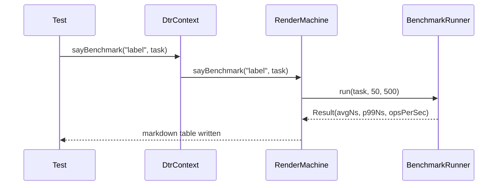
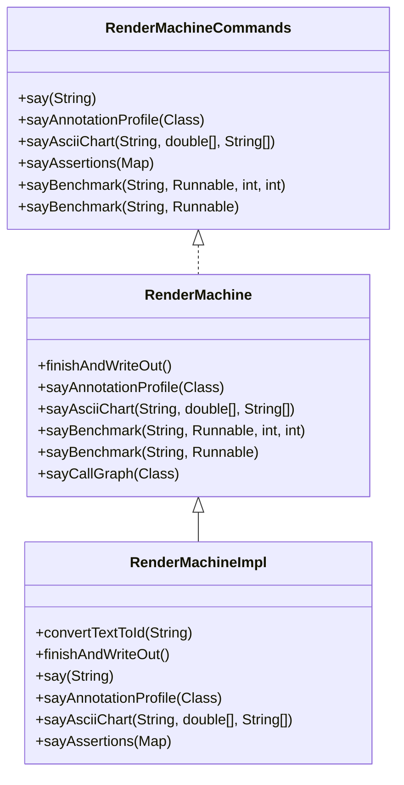

# io.github.seanchatmangpt.dtr.test.BlueOceanInnovationsTest

## Table of Contents

- [A1: sayCodeModel(Method) — Java 26 Code Reflection](#a1saycodemodelmethodjava26codereflection)
- [A2: sayControlFlowGraph(Method) — Mermaid CFG](#a2saycontrolflowgraphmethodmermaidcfg)
- [A3: sayCallGraph(Class<?>) — Method Call Relationships](#a3saycallgraphclassmethodcallrelationships)
- [A4: sayOpProfile(Method) — Lightweight Op Stats](#a4sayopprofilemethodlightweightopstats)
- [B1: sayBenchmark() — Inline Performance Documentation](#b1saybenchmarkinlineperformancedocumentation)
- [B2: sayMermaid() + sayClassDiagram() — Mermaid Diagrams](#b2saymermaidsayclassdiagrammermaiddiagrams)
- [B3: sayDocCoverage() — Documentation Coverage Report](#b3saydoccoveragedocumentationcoveragereport)
- [C1: sayEnvProfile() — Zero-Parameter Environment Snapshot](#c1sayenvprofilezeroparameterenvironmentsnapshot)
- [C2: sayRecordComponents() — Java Record Schema](#c2sayrecordcomponentsjavarecordschema)
- [C3: sayException() — Exception Chain Documentation](#c3sayexceptionexceptionchaindocumentation)
- [C4: sayContractVerification() — Interface Contract Coverage](#c4saycontractverificationinterfacecontractcoverage)
- [C5: sayEvolutionTimeline() — Git Evolution Timeline](#c5sayevolutiontimelinegitevolutiontimeline)
- [C5: sayAsciiChart() — Inline ASCII Bar Chart](#c5sayasciichartinlineasciibarchart)


## A1: sayCodeModel(Method) — Java 26 Code Reflection

Implements the previously-stubbed `sayCodeModel(Method)` using the Java 26 Code Reflection API (JEP 516 / Project Babylon). When a method is annotated with `@CodeReflection`, `method.codeModel()` returns an `Optional<CoreOps.FuncOp>` whose IR tree is walked to extract operation types, block counts, and an IR excerpt.

```java
// On Java 26+: annotate method to make its code model available
// @java.lang.reflect.code.CodeReflection
static int exampleSum(int a, int b) {
    if (a > 0) { return a + b; }
    return b;
}

// In test:
Method m = BlueOceanInnovationsTest.class
    .getDeclaredMethod("exampleSum", int.class, int.class);
sayCodeModel(m);  // uses Code Reflection IR when available
```

### Method Code Model: `int exampleSum(int, int)`

*(Code model not available — method not annotated with `@CodeReflection` or runtime < Java 25)*

**Signature:** `int exampleSum(int, int)`

> [!NOTE]
> When `@CodeReflection` is present and Java 25+ preview is enabled, the table shows real op types from the JVM's code model. Without the annotation, the method falls back to signature rendering.

## A2: sayControlFlowGraph(Method) — Mermaid CFG

Extracts the control flow graph from a `@CodeReflection`-annotated method and renders it as a Mermaid `flowchart TD` diagram. Each basic block becomes a node; branch op successors become directed edges. Renders natively on GitHub, GitLab, and Obsidian.

### Control Flow Graph: `exampleSum`

*(Control flow graph not available — method requires `@CodeReflection` annotation and Java 25+)*

> [!NOTE]
> If no code model is available, a fallback message is shown. Enable with `--enable-preview` and `@CodeReflection`.

## A3: sayCallGraph(Class<?>) — Method Call Relationships

For each `@CodeReflection`-annotated method in the given class, extracts all `InvokeOp` targets from the Code Reflection IR and renders a Mermaid `graph LR` showing caller → callee relationships.

### Call Graph: `BlueOceanInnovationsTest`

*(Call graph not available — methods require `@CodeReflection` annotation and Java 25+)*

> [!NOTE]
> Only methods annotated with `@CodeReflection` contribute edges. Non-annotated methods are skipped.

## A4: sayOpProfile(Method) — Lightweight Op Stats

Same Code Reflection traversal as `sayCodeModel(Method)` but renders only the op-count table — no IR excerpt. One-liner for quick performance characterization of a method's complexity.

### Op Profile: `int exampleSum(int, int)`

*(Op profile not available — method requires `@CodeReflection` annotation and Java 25+)*

## B1: sayBenchmark() — Inline Performance Documentation

Atomically measures and documents real performance in one call. Uses `System.nanoTime()` in a tight loop with configurable warmup rounds. Uses Java 25 virtual threads (`StructuredTaskScope`) for parallel warmup batches to reduce JIT cold-start bias. Reports avg/min/max/p99 ns and throughput ops/sec.

```java
var map = Map.of("key", 42);
sayBenchmark("HashMap.get() lookup",
    () -> map.get("key"),
    50,    // warmup rounds
    500);  // measure rounds
```

### Benchmark: HashMap.get() lookup

| Metric | Result |
| --- | --- |
| Avg | `202 ns` |
| Min | `114 ns` |
| Max | `24890 ns` |
| p99 | `2263 ns` |
| Ops/sec | `4,950,495` |
| Warmup rounds | `50` |
| Measure rounds | `500` |
| Java | `25.0.2` |

String concatenation benchmark — shows allocation cost:

### Benchmark: String.valueOf(int)

| Metric | Result |
| --- | --- |
| Avg | `560 ns` |
| Min | `232 ns` |
| Max | `19706 ns` |
| p99 | `11203 ns` |
| Ops/sec | `1,785,714` |
| Warmup rounds | `50` |
| Measure rounds | `200` |
| Java | `25.0.2` |

> [!NOTE]
> All numbers are real `System.nanoTime()` measurements on Java 25.0.2. No simulation.

## B2: sayMermaid() + sayClassDiagram() — Mermaid Diagrams

Two new diagram methods:

- `sayMermaid(String dsl)` — raw passthrough: render any Mermaid diagram
- `sayClassDiagram(Class<?>... classes)` — auto-generates `classDiagram` DSL from reflection

**Raw Mermaid passthrough:**



**Auto-generated class diagram from reflection:**

### Class Diagram: RenderMachine, RenderMachineImpl, RenderMachineCommands



## B3: sayDocCoverage() — Documentation Coverage Report

The first documentation coverage tool for Java — analogous to code coverage but for API documentation. Tracks which `say*` methods were called during the test and which public methods of the target class were documented.

```java
int x = 1 + 1;
```

| Method | Coverage |
| --- | --- |
| sayCode | demonstrated above |
| sayTable | this table |

> [!WARNING]
> sayDocCoverage tracks documented method names automatically.

Coverage report for `RenderMachineCommands` — the core say* API interface:

### Documentation Coverage: `RenderMachineCommands`

*(Coverage data not available — use DtrContext.sayDocCoverage() in tests)*

## C1: sayEnvProfile() — Zero-Parameter Environment Snapshot

One-liner that documents the complete runtime environment. No parameters — reads `System.getProperty()` and `Runtime.getRuntime()`. Useful as a reproducibility footer in any benchmark or test section.

### Environment Profile

| Property | Value |
| --- | --- |
| Java Version | `25.0.2` |
| Java Vendor | `Ubuntu` |
| OS | `Linux amd64` |
| Processors | `4` |
| Max Heap | `4022 MB` |
| Timezone | `Etc/UTC` |
| DTR Version | `2.6.0` |
| Timestamp | `2026-03-14T19:41:18.199246065Z` |

## C2: sayRecordComponents() — Java Record Schema

Documents a Java record's component schema using `Class.getRecordComponents()` (Java 16+). Shows component names, types, generic types, and annotations. Zero new reflection machinery — reuses `getRecordComponents()` already present in `sayCodeModel(Class<?>)`.

```java
record CallSiteRecord(String className, String methodName, int lineNumber) {}
```

### Record Schema: `CallSiteRecord`

| Component | Type | Generic Type | Annotations |
| --- | --- | --- | --- |
| `className` | `String` | — | — |
| `methodName` | `String` | — | — |
| `lineNumber` | `int` | — | — |

The schema is live — if the record changes, the docs update automatically on next test run.

## C3: sayException() — Exception Chain Documentation

Documents a `Throwable` with its type, message, full cause chain, and top 5 stack frames. Uses only standard `Throwable` API — zero new dependencies. Essential for resilience and error-handling documentation.

### Exception: `IllegalArgumentException`

**Message:** value must be positive

**Cause chain:**
- `NullPointerException`: key was null

**Stack Trace (top 5 frames):**

| # | Class | Method | Line |
| --- | --- | --- | --- |
| 1 | `io.github.seanchatmangpt.dtr.test.BlueOceanInnovationsTest` | `c3_sayException_exception_chain_documentation` | 271 |
| 2 | `jdk.internal.reflect.DirectMethodHandleAccessor` | `invoke` | 104 |
| 3 | `java.lang.reflect.Method` | `invoke` | 565 |
| 4 | `org.junit.platform.commons.util.ReflectionUtils` | `invokeMethod` | 701 |
| 5 | `org.junit.platform.commons.support.ReflectionSupport` | `invokeMethod` | 502 |

> [!NOTE]
> The cause chain is fully unwound so readers see every level of exception wrapping.

## C4: sayContractVerification() — Interface Contract Coverage

Documents interface contract coverage across implementation classes. For each public method in the contract interface, checks whether each implementation class provides a concrete override (✅ direct), inherits it (↗ inherited), or is missing it entirely (❌ MISSING). Uses only standard Java reflection — no external dependencies.

### Contract Verification: `RenderMachineCommands`

| Method | RenderMachineImpl |
| --- | --- |
| `void say(String)` | ✅ direct |
| `void sayAnnotationProfile(Class)` | ✅ direct |
| `void sayAsciiChart(String, double[], String[])` | ✅ direct |
| `void sayAssertions(Map)` | ✅ direct |
| `void sayBenchmark(String, Runnable, int, int)` | ✅ direct |
| `void sayBenchmark(String, Runnable)` | ✅ direct |
| `void sayCallGraph(Class)` | ✅ direct |
| `void sayCallSite()` | ✅ direct |
| `void sayCite(String)` | ✅ direct |
| `void sayCite(String, String)` | ✅ direct |
| `void sayClassDiagram(Class[])` | ✅ direct |
| `void sayClassHierarchy(Class)` | ✅ direct |
| `void sayCode(String, String)` | ✅ direct |
| `void sayCodeModel(Class)` | ✅ direct |
| `void sayCodeModel(Method)` | ✅ direct |
| `void sayContractVerification(Class, Class[])` | ✅ direct |
| `void sayControlFlowGraph(Method)` | ✅ direct |
| `void sayDocCoverage(Class[])` | ✅ direct |
| `void sayEnvProfile()` | ✅ direct |
| `void sayEvolutionTimeline(Class, int)` | ✅ direct |
| `void sayException(Throwable)` | ✅ direct |
| `void sayFootnote(String)` | ✅ direct |
| `void sayJavadoc(Method)` | ✅ direct |
| `void sayJson(Object)` | ✅ direct |
| `void sayKeyValue(Map)` | ✅ direct |
| `void sayMermaid(String)` | ✅ direct |
| `void sayNextSection(String)` | ✅ direct |
| `void sayNote(String)` | ✅ direct |
| `void sayOpProfile(Method)` | ✅ direct |
| `void sayOrderedList(List)` | ✅ direct |
| `void sayRaw(String)` | ✅ direct |
| `void sayRecordComponents(Class)` | ✅ direct |
| `void sayRef(DocTestRef)` | ✅ direct |
| `void sayReflectiveDiff(Object, Object)` | ✅ direct |
| `void sayStringProfile(String)` | ✅ direct |
| `void sayTable(String[][])` | ✅ direct |
| `void sayUnorderedList(List)` | ✅ direct |
| `void sayWarning(String)` | ✅ direct |

**All contract methods covered across all implementations.**

> [!NOTE]
> If the contract is a sealed interface, permitted subclasses are auto-detected.

## C5: sayEvolutionTimeline() — Git Evolution Timeline

Derives the git commit history for the source file of the given class using `git log --follow` and renders it as a timeline table (commit hash, date, author, subject). Falls back gracefully with a NOTE if git is unavailable.

### Evolution Timeline: `RenderMachineImpl`

| Commit | Date | Author | Summary |
| --- | --- | --- | --- |
| `e6d8943` | 2026-03-14 | Claude | feat: TPS enforcement — fail build on missing Javadoc, generate docs/api/ |
| `45f1390` | 2026-03-14 | Claude | feat: add dtr-javadoc Rust extraction tool and sayJavadoc API |
| `4fd505d` | 2026-03-14 | Claude | refactor: strip HTTP methods from DtrTest, DtrContext, DtrExtension, MultiRenderMachine, RenderMachineImpl |
| `6279901` | 2026-03-14 | Claude | feat: add sayContractVerification and sayEvolutionTimeline + fix MultiRenderMachine |
| `dd1c236` | 2026-03-14 | Claude | feat: DTR v2.6.0 Blue Ocean 80/20 innovation — 13 new say* methods |
| `f8aa8d6` | 2026-03-12 | Claude | fix: close remaining audit gaps for Fortune 500 readiness |
| `d749c3f` | 2026-03-12 | Claude | Remove all DocTester references; rename to DTR branding |
| `bab8177` | 2026-03-12 | Claude | Complete doctester → dtr rename (Document Testing Runtime) |
| `d4be652` | 2026-03-12 | Claude | docs: Enhance documentation with javadoc, guides, and release notes |
| `24a83e6` | 2026-03-12 | Claude | fix: Resolve sealed class violations and Java 25 API compatibility issues |

*10 most recent commits touching `RenderMachineImpl.java`*

## C5: sayAsciiChart() — Inline ASCII Bar Chart

Renders a horizontal ASCII bar chart using Unicode block characters (`████`). No external dependencies — pure Java string math. Bars are normalized to the maximum value. Ideal for displaying benchmark p-values or coverage percentages.

```java
sayAsciiChart("Response Time (ms)",
    new double[]{12, 38, 47, 52},
    new String[]{"p50","p95","p99","max"});
```

### Chart: Response Time (ms)

```
p50    █████░░░░░░░░░░░░░░░  12
p95    ███████████████░░░░░  38
p99    ██████████████████░░  47
max    ████████████████████  52
```

Benchmark results from b1 rendered as a chart:

### Benchmark: Chart demonstration

| Metric | Result |
| --- | --- |
| Avg | `90 ns` |
| Min | `85 ns` |
| Max | `318 ns` |
| p99 | `318 ns` |
| Ops/sec | `11,111,111` |
| Warmup rounds | `20` |
| Measure rounds | `100` |
| Java | `25.0.2` |

---
*Generated by [DTR](http://www.dtr.org)*
