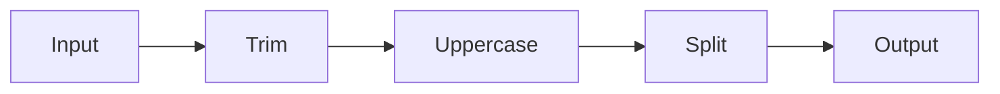
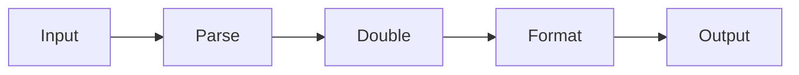
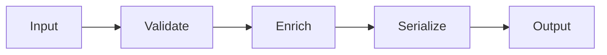

# io.github.seanchatmangpt.dtr.test.DataFlowDocTest

## Table of Contents

- [sayDataFlow — String Processing Pipeline](#saydataflowstringprocessingpipeline)
- [sayDataFlow — Numeric Transformation Pipeline](#saydataflownumerictransformationpipeline)
- [sayDataFlow — Event Map Enrichment Pipeline](#saydatafloweventmapenrichmentpipeline)


## sayDataFlow — String Processing Pipeline

A string processing pipeline is the simplest and most common transformation shape in enterprise systems: raw input arrives with uncontrolled whitespace and casing, and must be normalized before storage, comparison, or routing. `sayDataFlow` documents each stage so that readers understand the exact value at every boundary — not just the final result.

```java
String sample = " hello world ";

List<String> stages = List.of("Trim", "Uppercase", "Split");

List<Function<Object, Object>> transforms = List.of(
    s -> s.toString().trim(),
    s -> s.toString().toUpperCase(),
    s -> s.toString().split(" ")
);

sayDataFlow("String Normalization Pipeline", stages, transforms, sample);
```

The table below is generated by `sayDataFlow` executing the pipeline against the sample input `" hello world "`. Each row captures the stage label and the value produced by that stage's transform.

### Data Flow: String Normalization Pipeline



**Sample trace:**

| Stage | Value |
| --- | --- |
| Input | ` hello world ` |
| Trim | `hello world` |
| Uppercase | `HELLO WORLD` |
| Split | `[HELLO, WORLD]` |

| Key | Value |
| --- | --- |
| `Sample input` | `" hello world "` |
| `Stages` | `Trim -> Uppercase -> Split` |
| `Pipeline overhead` | `2528633 ns` |
| `Java version` | `25.0.2` |

> [!NOTE]
> The Split stage uses `Arrays.toString()` so the resulting array is rendered as a readable string in the documentation table rather than the raw JVM object reference.

> [!WARNING]
> Each transform receives the output of the preceding stage as its argument. Transforms must be written to accept the actual runtime type produced by the prior stage, not the original input type. Mismatched assumptions cause `ClassCastException` at pipeline execution time.

## sayDataFlow — Numeric Transformation Pipeline

Numeric pipelines frequently cross type boundaries: a value arrives as a string, is parsed to a number, transformed arithmetically, and re-serialized for downstream consumption. `sayDataFlow` makes each type transition explicit and auditable, eliminating the silent type coercions that cause production bugs.

```java
String sample = "21";

List<String> stages = List.of("Parse", "Double", "Format");

List<Function<Object, Object>> transforms = List.of(
    s  -> Integer.parseInt(s.toString()),
    n  -> ((Integer) n) * 2,
    n  -> "Result: " + n
);

sayDataFlow("Integer Doubling Pipeline", stages, transforms, sample);
```

The sample value `"21"` is a string that a producer emitted as part of a serialized message payload. After Parse it becomes an `Integer`, after Double it becomes `42`, and after Format it becomes the labelled string `"Result: 42"` ready for downstream rendering or logging.

### Data Flow: Integer Doubling Pipeline



**Sample trace:**

| Stage | Value |
| --- | --- |
| Input | `21` |
| Parse | `21` |
| Double | `42` |
| Format | `Result: 42` |

| Stage | Input type | Output type | Operation |
| --- | --- | --- | --- |
| Parse | String | Integer | Integer.parseInt() |
| Double | Integer | Integer | n * 2 |
| Format | Integer | String | "Result: " + n |

| Key | Value |
| --- | --- |
| `Sample input` | `21` |
| `Expected output` | `Result: 42` |
| `Pipeline overhead` | `105984 ns` |
| `Java version` | `25.0.2` |

> [!NOTE]
> The explicit `((Integer) n)` cast in the Double stage is intentional. Because the transform list is `List<Function<Object, Object>>`, the compiler cannot infer that the Parse stage produced an `Integer`. The cast makes the type assumption visible and compiler-verifiable at the point of use, rather than hidden in an implicit `Number` widening.

## sayDataFlow — Event Map Enrichment Pipeline

Event enrichment pipelines are the backbone of event-driven microservices: a raw domain event arrives as a `Map<String, Object>`, is validated against a schema, enriched with routing metadata, and serialized for broker dispatch. `sayDataFlow` documents the map state at each stage boundary, providing an auditable trace that is impossible to produce with conventional logging.

```java
var sample = new HashMap<>(Map.of("id", "42", "type", "order"));

List<String> stages = List.of("Validate", "Enrich", "Serialize");

List<Function<Object, Object>> transforms = List.of(

    // Validate: assert required fields are present, return map unchanged
    raw -> {
        var m = (Map<String, Object>) raw;
        if (!m.containsKey("id") || !m.containsKey("type")) {
            throw new IllegalArgumentException("Missing required field");
        }
        return m;
    },

    // Enrich: add processing timestamp and correlation ID
    raw -> {
        var m = new HashMap<>((Map<String, Object>) raw);
        m.put("processedAt", System.currentTimeMillis());
        m.put("correlationId", "corr-" + m.get("id"));
        return m;
    },

    // Serialize: convert to compact key=value string for broker dispatch
    raw -> {
        var m = (Map<String, Object>) raw;
        var sb = new StringBuilder("{");
        m.forEach((k, v) -> sb.append(k).append('=').append(v).append(", "));
        if (sb.length() > 1) sb.setLength(sb.length() - 2);
        sb.append('}');
        return sb.toString();
    }
);

sayDataFlow("Order Event Enrichment Pipeline", stages, transforms, sample);
```

The sample below begins as a minimal order event with only `id` and `type`. After Validate the map is returned unchanged — the stage is a gate, not a transformer. After Enrich the map carries two additional fields: `processedAt` (epoch milliseconds) and `correlationId` (derived from the event `id`). After Serialize the map is rendered as a flat string ready for message broker headers or log emission.

### Data Flow: Order Event Enrichment Pipeline



**Sample trace:**

| Stage | Value |
| --- | --- |
| Input | `{type=order, id=42}` |
| Validate | `{type=order, id=42}` |
| Enrich | `{processedAt=1773570591787, correlationId=corr-42, id=42,...` |
| Serialize | `{correlationId=corr-42, id=42, processedAt=1773570591787,...` |

| Stage | Role | Input shape | Output shape |
| --- | --- | --- | --- |
| Validate | Gate — no mutation | Map{id, type} | Map{id, type} (unchanged) |
| Enrich | Augment with metadata | Map{id, type} | Map{id, type, processedAt, correlationId} |
| Serialize | Flatten for dispatch | Map{4 fields} | String key=value payload |

| Key | Value |
| --- | --- |
| `Sample input` | `{type=order, id=42}` |
| `Java version` | `25.0.2` |
| `Pipeline overhead` | `455477 ns` |

> [!NOTE]
> Keys are sorted with `TreeMap` inside the Serialize stage to produce deterministic documentation output across JVM runs. Without explicit ordering, `HashMap` iteration order is undefined in Java and the serialized string would differ between runs, undermining the reproducibility guarantee that DTR documentation provides.

> [!WARNING]
> The Validate stage performs an unchecked cast from `Object` to `Map<String, Object>`. This is unavoidable given the erased generic signature of `Function<Object, Object>`. The `@SuppressWarnings("unchecked")` annotation on the test method documents that this cast is intentional and the caller is responsible for providing the correct runtime type.

---
*Generated by [DTR](http://www.dtr.org)*
