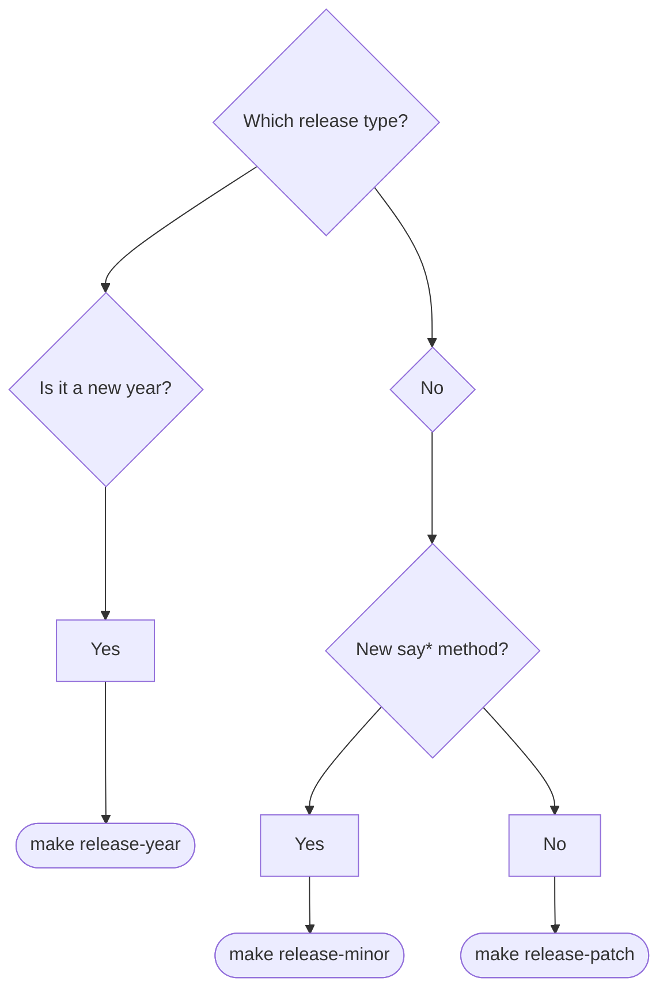
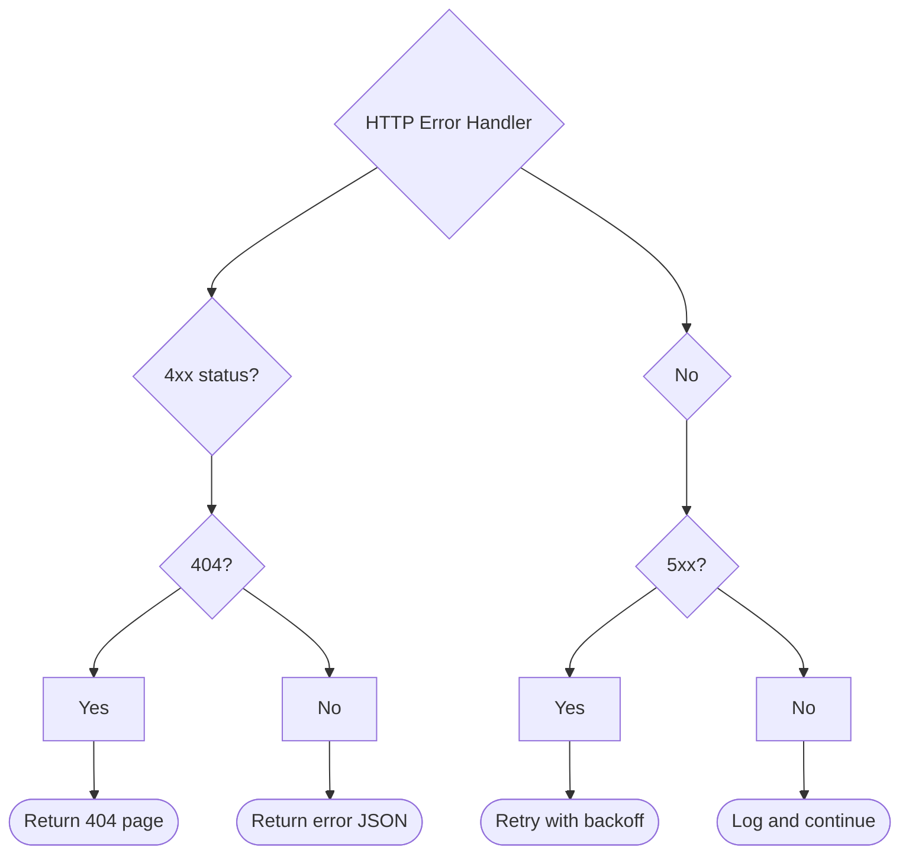
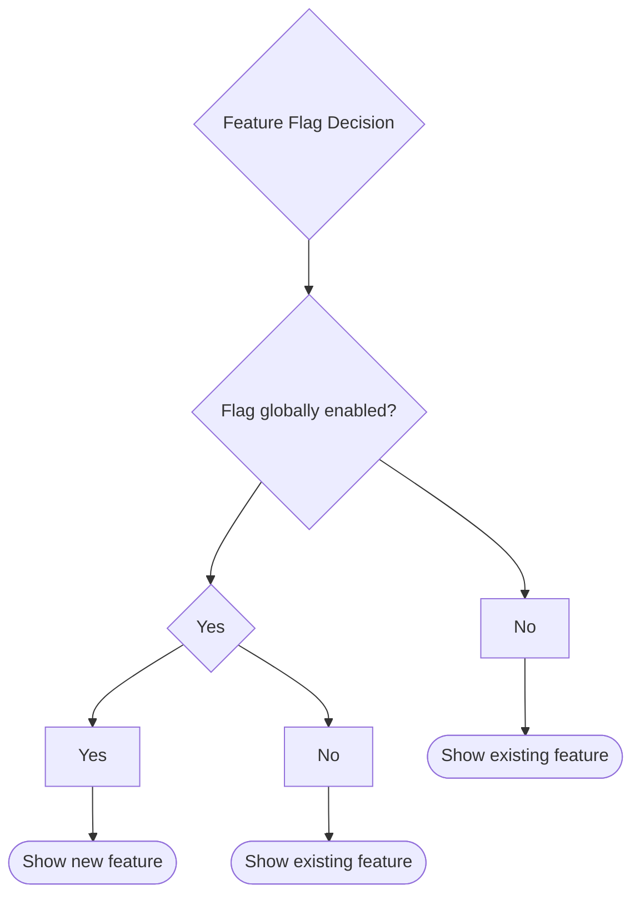

# io.github.seanchatmangpt.dtr.test.DecisionTreeDocTest

## Table of Contents

- [sayDecisionTree — DTR CalVer Release Type Selector](#saydecisiontreedtrcalverreleasetypeselector)
- [sayDecisionTree — HTTP Error Handler](#saydecisiontreehttperrorhandler)
- [sayDecisionTree — Feature Flag Evaluation](#saydecisiontreefeatureflagevaluation)


## sayDecisionTree — DTR CalVer Release Type Selector

DTR uses Calendar Versioning (CalVer) with the scheme YYYY.MINOR.PATCH. The year component is owned by the calendar — it advances automatically on 1 January, not by human decision. The minor and patch components are owned by the type of change being released. Every contributor must answer two questions before issuing a release command: has the year rolled over, and is this change a new capability or a correction?

The three release commands map to exactly three outcomes. No other version numbers are valid. The script computes the arithmetic; the human supplies only the semantic classification. Documenting this decision as a flowchart eliminates the ambiguity that prose descriptions of versioning policies inevitably produce.

```java
// Build the release type decision tree using LinkedHashMap to
// preserve the top-to-bottom visual order of the branches.
var newYearBranch = new LinkedHashMap<String, Object>();
newYearBranch.put("Yes", "make release-year");

var methodBranch = new LinkedHashMap<String, Object>();
methodBranch.put("Yes", "make release-minor");
methodBranch.put("No",  "make release-patch");

var noBranch = new LinkedHashMap<String, Object>();
noBranch.put("New say* method?", methodBranch);

var branches = new LinkedHashMap<String, Object>();
branches.put("Is it a new year?", newYearBranch);
branches.put("No",                noBranch);

sayDecisionTree("Which release type?", branches);
```

| Command | Semantic meaning | Version change |
| --- | --- | --- |
| make release-year | January 1 year boundary crossed | YYYY+1.1.0 |
| make release-minor | New say* method or capability | YYYY.(N+1).0 |
| make release-patch | Bug fix or dependency update | YYYY.MINOR.(N+1) |

> [!WARNING]
> The human picks the release type; the script computes the version number. Never type a version manually. Running `make release-minor` when the change is actually a bug fix is not wrong in itself, but it signals a new feature to downstream consumers who parse MINOR increments as API additions. Semantic accuracy matters for automated dependency management tools.

### Decision Tree: Which release type?



> [!NOTE]
> The `Is it a new year?` node appears first in the flowchart because it is inserted first into the LinkedHashMap. Using Map.of() here would produce a non-deterministic branch order that changes between JVM invocations, making the rendered diagram unreliable in version-controlled documentation.

## sayDecisionTree — HTTP Error Handler

HTTP error handling is one of the most common sources of silent failure in distributed systems. A client that treats all non-200 responses identically will retry 404s indefinitely, swallow rate-limit signals, and surface 5xx errors to the end user with no recovery attempt. The correct strategy depends on the status code family: 4xx errors indicate a client-side problem that retrying will not fix, whereas 5xx errors indicate a server-side transient that exponential backoff can recover from.

Documenting this logic as a `sayDecisionTree` flowchart rather than as inline comments serves two purposes. First, the diagram is rendered in every pull request review, making the error handling contract visible to reviewers who do not read Java. Second, any change to the branching logic requires a corresponding change to the DTR test, making silent regressions impossible.

```java
var notFoundBranch = new LinkedHashMap<String, Object>();
notFoundBranch.put("Yes", "Return 404 page");
notFoundBranch.put("No",  "Return error JSON");

var fourXxBranch = new LinkedHashMap<String, Object>();
fourXxBranch.put("404?", notFoundBranch);

var retryBranch = new LinkedHashMap<String, Object>();
retryBranch.put("Yes", "Retry with backoff");
retryBranch.put("No",  "Log and continue");

var fiveXxBranch = new LinkedHashMap<String, Object>();
fiveXxBranch.put("5xx?", retryBranch);

var branches = new LinkedHashMap<String, Object>();
branches.put("4xx status?", fourXxBranch);
branches.put("No",          fiveXxBranch);

sayDecisionTree("HTTP Error Handler", branches);
```

| Status range | Specific check | Strategy | Rationale |
| --- | --- | --- | --- |
| 4xx | 404 | Return 404 page | Resource does not exist; user-facing error page |
| 4xx | Other 4xx | Return error JSON | Client bug; structured body for programmatic handling |
| 5xx | Yes | Retry with backoff | Transient server fault; exponential backoff recovers |
| 5xx | No (non-5xx) | Log and continue | Unexpected code; record and degrade gracefully |

### Decision Tree: HTTP Error Handler



> [!WARNING]
> Never retry 4xx responses. A 429 Too Many Requests is the only 4xx that benefits from a delay-and-retry, and it must use the Retry-After header value rather than a fixed backoff interval. Retrying a 401 or 403 without refreshing credentials will exhaust the retry budget and still fail.

## sayDecisionTree — Feature Flag Evaluation

Feature flags are the standard mechanism for decoupling code deployment from feature activation. A two-level evaluation gate is the most common real-world shape: an outer global kill-switch that can disable the feature for all users instantly, and an inner cohort check that restricts the active feature to a pilot group during the gradual rollout window. Capturing this logic as a `sayDecisionTree` turns the flag evaluation contract into a first-class documentation artefact that is verified on every CI run.

The diagram below encodes the exact evaluation order. Global enablement is checked first because it is the cheapest operation — a single boolean config read requires no database or RPC call. The pilot cohort check is deferred until the global gate passes, avoiding unnecessary identity lookups for the common case where the flag is disabled in production.

```java
var pilotBranch = new LinkedHashMap<String, Object>();
pilotBranch.put("Yes", "Show new feature");
pilotBranch.put("No",  "Show existing feature");

var branches = new LinkedHashMap<String, Object>();
branches.put("Flag globally enabled?", Map.of(
    "Yes", pilotBranch,
    "No",  "Show existing feature"
));

sayDecisionTree("Feature Flag Decision", branches);
```

> [!NOTE]
> In the code example above, `Map.of(...)` is used for the inner node to illustrate the contrast: because the two branches of that inner node — "Yes" and "No" — have no prescribed visual order, Map.of is acceptable there. The outer map still uses LinkedHashMap so that "Flag globally enabled?" always appears as the root branch in the rendered flowchart.

### Decision Tree: Feature Flag Decision



| Global flag | Pilot cohort | Outcome | Rationale |
| --- | --- | --- | --- |
| disabled | any | Show existing feature | Kill-switch active; zero cohort check cost |
| enabled | yes | Show new feature | Pilot user; new experience activated |
| enabled | no | Show existing feature | Non-pilot user; gradual rollout boundary |

> [!WARNING]
> Feature flags that are never cleaned up become permanent conditional branches and accumulate as technical debt. Every flag introduced should have a documented removal ticket. Once the rollout reaches 100% and the flag is removed, delete the corresponding DTR test section to keep the documentation set reflecting the current system, not its history.

---
*Generated by [DTR](http://www.dtr.org)*
