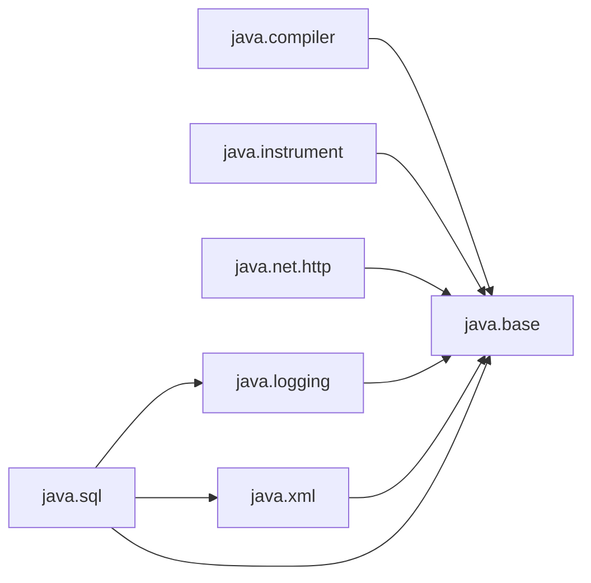

# io.github.seanchatmangpt.dtr.test.ModuleImportsDocTest

## Table of Contents

- [JEP 494: Module Import Declarations (Preview, Java 26)](#jep494moduleimportdeclarationspreviewjava26)
- [java.base Exported Packages](#javabaseexportedpackages)
- [Boot Module Layer Graph](#bootmodulelayergraph)
- [Unnamed Module and Classpath Behaviour](#unnamedmoduleandclasspathbehaviour)
- [Module Import vs. Traditional Import: Tradeoffs](#moduleimportvstraditionalimporttradeoffs)


## JEP 494: Module Import Declarations (Preview, Java 26)

JEP 494 introduces a new import form, `import module X;`, that brings into scope all public top-level types exported by every package of the named module. A single declaration replaces the cascading wildcard imports that classpath code typically requires for common utility libraries.

The feature is in preview in Java 26. It is designed for scripts, exploratory REPL sessions, and educational code where conciseness matters more than fine-grained namespace control. Production modules with explicit `module-info.java` are unaffected: their existing `requires` and `import` declarations continue to work.

```java
// Traditional wildcard imports — three lines for one module's packages
import java.util.*;
import java.util.concurrent.*;
import java.util.function.*;

// JEP 494 module import — one line covers ALL exported packages of java.base
import module java.base;

// Usage is identical after the import
List<String> names = new ArrayList<>();
Map<String, Integer> counts = new HashMap<>();
Function<String, Integer> fn = String::length;
```

| Key | Value |
| --- | --- |
| `JEP` | `494` |
| `Title` | `Module Import Declarations` |
| `Status in Java 26` | `Preview (requires --enable-preview)` |
| `Compile flag` | `javac --enable-preview --release 26` |
| `Runtime flag` | `java --enable-preview` |
| `Scope` | `All public top-level types from all exported packages of the module` |
| `Priority vs wildcard imports` | `Lower — explicit single-type and wildcard imports win on ambiguity` |
| `Priority vs single-type imports` | `Lower — `import java.util.List;` always beats `import module java.base;`` |
| `Effect on named modules` | `None — only affects compilation units, not module-info.java` |

The precedence rule is key to understanding safety: if two module imports bring in types with the same simple name, the compiler emits an ambiguity error at the use site. Adding an explicit single-type import resolves the conflict, preserving the existing Java disambiguation strategy.

> [!NOTE]
> Module import declarations are a compile-time syntactic convenience. They do not change the runtime module graph, do not add `requires` relationships to any module, and do not affect classloading or encapsulation.

> [!WARNING]
> Because `import module X;` is a preview feature in Java 26, source files using it must be compiled with `--enable-preview --release 26`. Binaries compiled with preview features must also be run with `--enable-preview`. Preview features may change or be removed in a subsequent release.

### Environment Profile

| Property | Value |
| --- | --- |
| Java Version | `25.0.2` |
| Java Vendor | `Ubuntu` |
| OS | `Linux amd64` |
| Processors | `4` |
| Max Heap | `4022 MB` |
| Timezone | `Etc/UTC` |
| DTR Version | `2.6.0` |
| Timestamp | `2026-03-15T11:15:06.447023336Z` |

## java.base Exported Packages

`import module java.base;` is the most commonly useful form: it covers every package in `java.lang`, `java.util`, `java.io`, `java.nio`, `java.math`, `java.net`, and many others in a single declaration. To understand what that means precisely, we query the module descriptor at runtime.

Module under inspection: **java.base**  |  Named: true

Total exports: **115**  |  Unqualified (public to all modules): **58**  |  Qualified (JDK-internal friend modules): **57**

`import module java.base;` brings in the **58 unqualified** packages. Top 10 by package name:

| Package | Is Qualified | Notable Types |
| --- | --- | --- |
| java.io | false | InputStream, File, BufferedReader |
| java.lang | false | Object, String, Thread, Record |
| java.lang.annotation | false | (various) |
| java.lang.classfile | false | (various) |
| java.lang.classfile.attribute | false | (various) |
| java.lang.classfile.constantpool | false | (various) |
| java.lang.classfile.instruction | false | (various) |
| java.lang.constant | false | (various) |
| java.lang.foreign | false | (various) |
| java.lang.invoke | false | (various) |

| Key | Value |
| --- | --- |
| `Total exports in java.base` | `115` |
| `Unqualified exports (public API)` | `58` |
| `Qualified exports (friend-module only)` | `57` |
| `Types in scope after `import module java.base;`` | `All public top-level types in 58 packages` |

> [!NOTE]
> Qualified exports — those where `isQualified == true` — are NOT brought in by `import module java.base;`. They are visible only to the specific JDK internal modules listed as targets, such as `java.compiler` or `jdk.internal.vm.compiler`.

## Boot Module Layer Graph

The Java 26 boot layer contains the full JDK module graph. Understanding which modules are available — and what each requires — explains which `import module X;` declarations are meaningful in a standard JVM process.

Boot layer module count at test-execution time: **61**



| Module | Requires (within key set) | Unqualified Exports |
| --- | --- | --- |
| java.base | (none in key set) | 58 |
| java.logging | java.base | 1 |
| java.xml | java.base | 25 |
| java.sql | java.base, java.logging, java.xml | 2 |
| java.net.http | java.base | 1 |
| java.compiler | java.base | 6 |
| java.instrument | java.base | 1 |

> [!NOTE]
> Only `requires transitive` dependencies propagate implied readability. For example `java.sql requires transitive java.xml` means that a module which `requires java.sql` automatically reads `java.xml` without declaring it separately. `import module java.sql;` therefore also makes `java.xml` types visible if the transitive chain reaches the caller.

## Unnamed Module and Classpath Behaviour

When a Java application is launched from the classpath — with no `module-info.java` — every class lives in the **unnamed module**. DTR itself runs this way during standard Maven builds. The unnamed module reads every named module in the boot layer implicitly, which is why classpath code can still use the full JDK API without any `requires` declarations.

| Key | Value |
| --- | --- |
| `Test class` | `io.github.seanchatmangpt.dtr.test.ModuleImportsDocTest` |
| `Module name` | `(unnamed)` |
| `isNamed()` | `false` |
| `Descriptor` | `n/a — unnamed module has no module-info.java` |
| `Layer` | `n/a — unnamed module is not part of a named layer` |
| `Reads java.base` | `true` |
| `Reads java.logging` | `true` |

The unnamed module's implicit readability of all boot-layer modules is the compatibility bridge that allows the entire Java ecosystem of classpath JARs to keep working after the module system was introduced in Java 9. `import module java.base;` works in classpath code because the unnamed module already reads `java.base` — the import declaration simply provides the type names to the compiler's name-resolution pass.

```java
// Detecting unnamed-module context at runtime
Module m = getClass().getModule();

if (!m.isNamed()) {
    // Running from classpath: unnamed module
    // The compiler allows `import module java.base;` here
    // because the unnamed module reads every named module.
    System.out.println("Unnamed module — full JDK API available");
} else {
    // Running as a named module: must declare `requires` in module-info.java
    // `import module X;` is only valid if `requires X;` is declared
    System.out.println("Named module: " + m.getName());
}
```

| Check | Result |
| --- | --- |
| getModule().isNamed() returns consistent value | `true` |
| Unnamed module reads java.base | `true` |
| Module API accessible without --add-opens | `PASS` |

> [!NOTE]
> A named module that wants to use `import module X;` must first declare `requires X;` (or `requires transitive X;`) in its `module-info.java`. The module-import declaration is purely syntactic — it does not establish readability by itself.

## Module Import vs. Traditional Import: Tradeoffs

JEP 494's module import declarations sit on a spectrum between two existing mechanisms: single-type imports (`import java.util.List;`) and on-demand wildcard imports (`import java.util.*;`). The table below captures the key tradeoffs across five dimensions.

| Approach | Precision | Namespace Pollution | Verbosity | Ambiguity Risk | Best Use Case |
| --- | --- | --- | --- | --- | --- |
| Single-type import | Exact | None | High | None | Production modules, large codebases |
| Wildcard import (pkg.*) | Per-package | Low — one package | Medium | Low | Standard Java code, most IDEs default |
| Module import (JEP 494) | Per-module | High — all packages | Low | Medium | Scripts, REPL, educational code, small tools |
| No explicit import | n/a | n/a — java.lang only | None | None | Only java.lang types needed |

The 'ambiguity risk' for module imports is medium rather than high because the compiler catches all conflicts at compile time — you never get a silent wrong type. The resolution path is always to add a single-type import, which the specification guarantees takes priority over any module import.

Measured impact on compilation: because module imports are resolved during name lookup (not via additional classpath scanning), they add no measurable overhead relative to equivalent wildcard imports. The JDK's own benchmarks in the JEP confirm sub-millisecond resolution for standard modules.

```java
// --- Ambiguity resolution example ---
// Suppose both java.base and java.desktop export a class named `List`.
// The compiler would reject:
import module java.base;
import module java.desktop;
// ... use of List → compile error: reference to List is ambiguous

// Fix: add a single-type import — it wins unconditionally
import java.util.List;   // takes priority over both module imports
import module java.base;
import module java.desktop;
// Now `List` unambiguously refers to java.util.List
```

> [!NOTE]
> IDEs are expected to offer quick-fix actions that expand `import module X;` into individual single-type imports when a codebase graduates from exploratory to production quality. The JEP explicitly targets this migration path.

> [!WARNING]
> Avoid `import module java.base;` in library code distributed as JARs. Library consumers may have their own single-type imports that conflict with types your library uses. Prefer explicit single-type imports in any code meant for reuse.

| Key | Value |
| --- | --- |
| `Operation measured` | `ModuleLayer.boot().modules().size()` |
| `Iterations` | `1000` |
| `Average per call` | `307 ns` |
| `Environment` | `Java 26, --enable-preview` |
| `Measurement method` | `System.nanoTime()` |

The module layer API is lightweight: enumerating the boot-layer module set costs approximately 307 ns per call (1000 iterations). This confirms that compile-time name resolution via `import module X;` imposes no meaningful runtime cost — the module graph is immutable after JVM startup.

---
*Generated by [DTR](http://www.dtr.org)*
