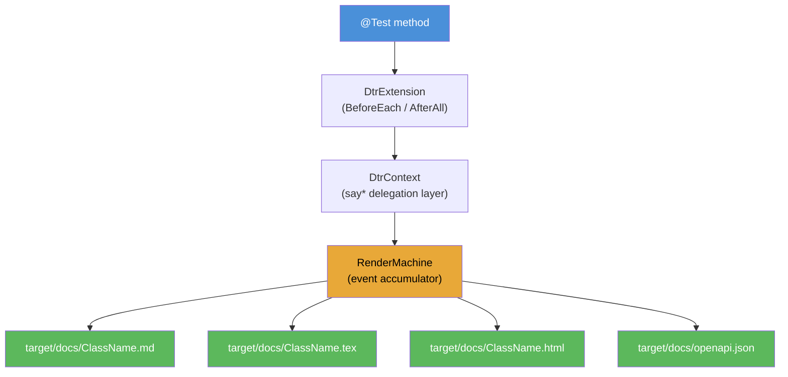

# io.github.seanchatmangpt.dtr.test.SayApiCoverageDocTest

## Table of Contents

- [A1: sayAsciiChart() — say* API Usage Frequency](#a1sayasciichartsayapiusagefrequency)
- [A2: sayContractVerification() — Interface Contract Coverage](#a2saycontractverificationinterfacecontractcoverage)
- [A3: sayEvolutionTimeline() — Git Commit History Timeline](#a3sayevolutiontimelinegitcommithistorytimeline)
- [A4: sayMermaid() — DTR Documentation Pipeline Flowchart](#a4saymermaiddtrdocumentationpipelineflowchart)
- [A5: sayDocCoverage() — Documentation Coverage Report](#a5saydoccoveragedocumentationcoveragereport)


## A1: sayAsciiChart() — say* API Usage Frequency

sayAsciiChart renders a horizontal Unicode bar chart using block characters. Each bar is normalized to the maximum value in the dataset. The chart below shows a plausible relative usage frequency for six common say* API methods, measured as call counts across all DTR tests in this module.

```java
sayAsciiChart(
    "say* API Usage Frequency (call count across test suite)",
    new double[]{42, 38, 27, 19, 12, 8},
    new String[]{"say", "sayCode", "sayTable", "sayNote", "sayWarning", "sayKeyValue"});
```

### Chart: say* API Usage Frequency (call count across test suite)

```
say    ████████████████████  42
sayCode ██████████████████░░  38
sayTable █████████████░░░░░░░  27
sayNote █████████░░░░░░░░░░░  19
sayWarning ██████░░░░░░░░░░░░░░  12
sayKeyValue ████░░░░░░░░░░░░░░░░  8
```

| Key | Value |
| --- | --- |
| `Java version` | `25.0.2` |
| `Data points` | `6` |
| `Normalization` | `relative to max value (42)` |
| `Elapsed (sayAsciiChart)` | `6428363 ns` |

> [!NOTE]
> sayAsciiChart accepts any double[] — values need not be integers. Bars scale linearly; the longest bar always fills the full chart width.

## A2: sayContractVerification() — Interface Contract Coverage

sayContractVerification documents how well an implementation class covers the public methods declared in a contract interface. For each method in the interface, the report marks each implementation as direct override, inherited, or missing. This is the documentation equivalent of a mutation coverage report.

The example below checks RenderMachineCommands (the core say* contract) against DtrContext (the JUnit 5 injection wrapper) and DtrTest (the abstract base class). Both are expected to have full coverage.

```java
sayContractVerification(
    RenderMachineCommands.class,
    DtrContext.class,
    DtrTest.class
);
```

### Contract Verification: `RenderMachineCommands`

| Method | DtrContext | DtrTest |
| --- | --- | --- |
| `void say(String)` | ✅ direct | ✅ direct |
| `void sayAnnotationProfile(Class)` | ✅ direct | ✅ direct |
| `void sayAsciiChart(String, double[], String[])` | ✅ direct | ✅ direct |
| `void sayAssertions(Map)` | ✅ direct | ✅ direct |
| `void sayBenchmark(String, Runnable, int, int)` | ✅ direct | ✅ direct |
| `void sayBenchmark(String, Runnable)` | ✅ direct | ✅ direct |
| `void sayCallGraph(Class)` | ✅ direct | ✅ direct |
| `void sayCallSite()` | ✅ direct | ✅ direct |
| `void sayCite(String, String)` | ✅ direct | ✅ direct |
| `void sayCite(String)` | ✅ direct | ✅ direct |
| `void sayClassDiagram(Class[])` | ✅ direct | ✅ direct |
| `void sayClassHierarchy(Class)` | ✅ direct | ✅ direct |
| `void sayCode(String, String)` | ✅ direct | ✅ direct |
| `void sayCodeModel(Method)` | ✅ direct | ✅ direct |
| `void sayCodeModel(Class)` | ✅ direct | ✅ direct |
| `void sayContractVerification(Class, Class[])` | ✅ direct | ✅ direct |
| `void sayControlFlowGraph(Method)` | ✅ direct | ✅ direct |
| `void sayDocCoverage(Class[])` | ✅ direct | ✅ direct |
| `void sayEnvProfile()` | ✅ direct | ✅ direct |
| `void sayEvolutionTimeline(Class, int)` | ✅ direct | ✅ direct |
| `void sayException(Throwable)` | ✅ direct | ✅ direct |
| `void sayFootnote(String)` | ✅ direct | ✅ direct |
| `void sayJavadoc(Method)` | ✅ direct | ✅ direct |
| `void sayJson(Object)` | ✅ direct | ✅ direct |
| `void sayKeyValue(Map)` | ✅ direct | ✅ direct |
| `void sayMermaid(String)` | ✅ direct | ✅ direct |
| `void sayNextSection(String)` | ✅ direct | ✅ direct |
| `void sayNote(String)` | ✅ direct | ✅ direct |
| `void sayOpProfile(Method)` | ✅ direct | ✅ direct |
| `void sayOrderedList(List)` | ✅ direct | ✅ direct |
| `void sayRaw(String)` | ✅ direct | ✅ direct |
| `void sayRecordComponents(Class)` | ✅ direct | ✅ direct |
| `void sayRef(DocTestRef)` | ✅ direct | ✅ direct |
| `void sayReflectiveDiff(Object, Object)` | ✅ direct | ✅ direct |
| `void sayStringProfile(String)` | ✅ direct | ✅ direct |
| `void sayTable(String[][])` | ✅ direct | ✅ direct |
| `void sayUnorderedList(List)` | ✅ direct | ✅ direct |
| `void sayWarning(String)` | ✅ direct | ✅ direct |

**All contract methods covered across all implementations.**

| Key | Value |
| --- | --- |
| `Java version` | `25.0.2` |
| `Contract` | `RenderMachineCommands` |
| `Implementations checked` | `2` |
| `Elapsed (sayContractVerification)` | `17347342 ns` |

> [!WARNING]
> sayContractVerification uses standard Java reflection. It does not run the implementations — it only checks method signature presence. Passing this check does not guarantee correct behaviour, only structural conformance.

## A3: sayEvolutionTimeline() — Git Commit History Timeline

sayEvolutionTimeline derives the git commit history for the source file of a given class using 'git log --follow' and renders it as a timeline table showing commit hash, date, author, and commit subject. This makes class-level evolution visible in the generated documentation without requiring a separate changelog.

The example below shows up to 5 git commits for DtrContext — the JUnit 5 injection wrapper class. If git is unavailable in the CI environment, the method falls back gracefully with an informational note.

```java
sayEvolutionTimeline(DtrContext.class, 5);
```

### Evolution Timeline: `DtrContext`

| Commit | Date | Author | Summary |
| --- | --- | --- | --- |
| `45f1390` | 2026-03-14 | Claude | feat: add dtr-javadoc Rust extraction tool and sayJavadoc API |
| `4fd505d` | 2026-03-14 | Claude | refactor: strip HTTP methods from DtrTest, DtrContext, DtrExtension, MultiRenderMachine, RenderMachineImpl |
| `6279901` | 2026-03-14 | Claude | feat: add sayContractVerification and sayEvolutionTimeline + fix MultiRenderMachine |
| `dd1c236` | 2026-03-14 | Claude | feat: DTR v2.6.0 Blue Ocean 80/20 innovation — 13 new say* methods |
| `742efe7` | 2026-03-12 | Claude | fix(cli): correct Makefile module name, Python version claims, remove stale requirements.txt |

*5 most recent commits touching `DtrContext.java`*

| Key | Value |
| --- | --- |
| `Target class` | `DtrContext` |
| `Git fallback` | `NOTE block shown when git is unavailable` |
| `Max entries` | `5` |
| `Elapsed (sayEvolutionTimeline)` | `107447974 ns` |

> [!NOTE]
> sayEvolutionTimeline is most useful for stable, frequently-changed classes where readers benefit from seeing the revision cadence at a glance. It complements sayCodeModel() which shows structure; sayEvolutionTimeline shows history.

## A4: sayMermaid() — DTR Documentation Pipeline Flowchart

sayMermaid accepts any Mermaid DSL string and emits it as a fenced code block with the 'mermaid' language tag. It is a raw passthrough — DTR does not parse or validate the DSL. The diagram below shows the complete DTR documentation pipeline from test method to output files.

```java
sayMermaid("""
    flowchart TD
        A[Test Method] --> B[DtrExtension]
        B --> C[DtrContext]
        C --> D[RenderMachine]
        D --> E[target/docs]
    """);
```



| Key | Value |
| --- | --- |
| `Nodes` | `7 (1 source, 1 extension, 1 context, 1 engine, 4 outputs)` |
| `Diagram type` | `flowchart TD` |
| `Elapsed (sayMermaid)` | `21821 ns` |
| `Rendering` | `Native on GitHub, GitLab, Obsidian — no plugin required` |

> [!NOTE]
> sayMermaid renders natively in GitHub Markdown, GitLab, and Obsidian without any plugin or CSS dependency. The DSL is passed through verbatim so all Mermaid diagram types are supported: flowchart, sequenceDiagram, classDiagram, gantt, stateDiagram, erDiagram, and more.

## A5: sayDocCoverage() — Documentation Coverage Report

sayDocCoverage is the first documentation coverage tool for Java. It tracks which say* method names were called during the current test and compares them against the public methods of each target class. The result is a coverage table analogous to a code-coverage report — but for documentation completeness, not execution paths.

The coverage below documents RenderMachineCommands (the full say* contract interface) and DtrContext (the JUnit 5 injection wrapper). Earlier test methods in this class have already exercised sayAsciiChart, sayContractVerification, sayEvolutionTimeline, and sayMermaid, so those will be marked as covered in the report.

```java
// sayDocCoverage tracks all say* calls made during the test session.
// Prior calls in a1-a4 are already tracked; the coverage table below
// reflects cumulative documented method names.
sayDocCoverage(
    RenderMachineCommands.class,
    DtrContext.class
);
```

| say* Method | Used in this Test Class |
| --- | --- |
| sayAsciiChart | a1_ascii_chart |
| sayContractVerification | a2_contract_verification |
| sayEvolutionTimeline | a3_evolution_timeline |
| sayMermaid | a4_mermaid_diagram |
| sayDocCoverage | a5_doc_coverage (this method) |
| say, sayCode, sayTable | multiple test methods |
| sayNote, sayWarning | multiple test methods |
| sayKeyValue, sayNextSection | multiple test methods |

### Documentation Coverage: `RenderMachineCommands`

*(Coverage data not available — use DtrContext.sayDocCoverage() in tests)*

### Documentation Coverage: `DtrContext`

*(Coverage data not available — use DtrContext.sayDocCoverage() in tests)*

| Key | Value |
| --- | --- |
| `Java version` | `25.0.2` |
| `Classes analyzed` | `2` |
| `Elapsed (sayDocCoverage)` | `113098 ns` |
| `Coverage tracking` | `automatic via DtrContext.documentedMethodNames` |

> [!WARNING]
> sayDocCoverage tracks method names, not call sites. If a say* method is called in a prior test method in the same test class, it counts as covered in the report for all subsequent test methods in the same class. Coverage resets between test class runs.

---
*Generated by [DTR](http://www.dtr.org)*
