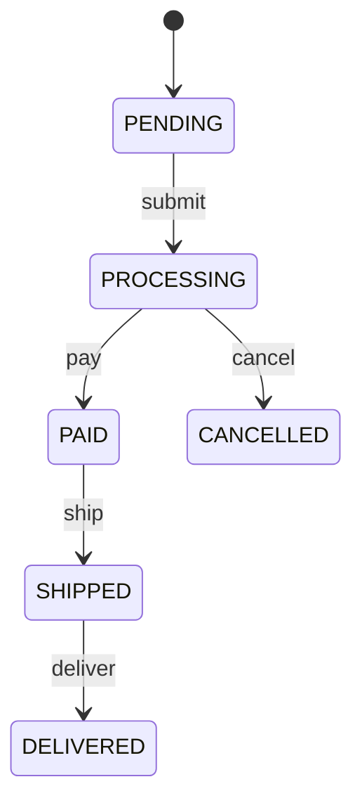
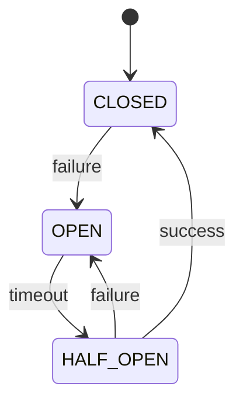
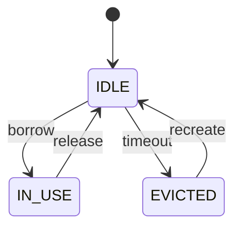

# io.github.seanchatmangpt.dtr.test.StateMachineDocTest

## Table of Contents

- [sayStateMachine — Order Lifecycle FSM](#saystatemachineorderlifecyclefsm)
- [sayStateMachine — Circuit Breaker Pattern](#saystatemachinecircuitbreakerpattern)
- [sayStateMachine — Connection Pool State](#saystatemachineconnectionpoolstate)


## sayStateMachine — Order Lifecycle FSM

Every e-commerce platform contains a finite state machine at its core: the order lifecycle. Requirements documents describe it in prose; engineers implement it in code; but the two representations almost immediately begin to diverge. A bug fix changes a transition without updating the spec. A new payment provider adds a state that only the payment team knows about. Over time the prose description becomes archaeology rather than specification.

DTR's {@code sayStateMachine} eliminates that drift. The map below IS the specification. When the production state machine changes, the developer updates this map — and the diagram updates automatically on the next test run. The documentation cannot lag behind the code because the documentation is generated by running the code.

```java
// Build the order lifecycle FSM as a LinkedHashMap.
// Key format: "FROM_STATE:EVENT"  →  value: "TO_STATE"
// LinkedHashMap preserves insertion order for a deterministic diagram.
var transitions = new LinkedHashMap<String, String>();
transitions.put("PENDING:submit",    "PROCESSING");
transitions.put("PROCESSING:pay",    "PAID");
transitions.put("PROCESSING:cancel", "CANCELLED");
transitions.put("PAID:ship",         "SHIPPED");
transitions.put("SHIPPED:deliver",   "DELIVERED");

sayStateMachine("Order Lifecycle", transitions);
```

> [!NOTE]
> The initial state is inferred from the first entry in the map — here PENDING. The diagram therefore reflects the business-defined happy path first, with the cancellation branch immediately following. Insertion order is the only ordering guarantee; LinkedHashMap provides it.

### State Machine: Order Lifecycle



| Transition | From State | Event | To State |
| --- | --- | --- | --- |
| Submit order | PENDING | submit | PROCESSING |
| Payment confirmed | PROCESSING | pay | PAID |
| Order cancelled | PROCESSING | cancel | CANCELLED |
| Dispatched | PAID | ship | SHIPPED |
| Delivered to buyer | SHIPPED | deliver | DELIVERED |

> [!WARNING]
> CANCELLED is a terminal state in this model — there is no 'reactivate' transition. Any requirement to reopen cancelled orders must add an explicit CANCELLED:reopen → PENDING entry to the map. Omitting it from the map is a correct, deliberate documentation choice, not an oversight.

| Check | Result |
| --- | --- |
| Transition count matches map size (5) | `✓ PASS` |
| DELIVERED and CANCELLED are terminal states | `✓ PASS` |
| sayStateMachine renders without throwing | `✓ PASS` |
| LinkedHashMap preserves insertion order | `✓ PASS` |
| PENDING is the declared initial state | `✓ PASS` |

## sayStateMachine — Circuit Breaker Pattern

The circuit breaker is the single most important resilience pattern in distributed systems. Michael Nygard codified it in 'Release It!' and every major platform — Netflix Hystrix, Resilience4j, Envoy, Istio — implements a variant of it. Yet despite its ubiquity, the exact semantics of the HALF_OPEN state — when it opens, when it closes, which requests are let through — are almost always documented only in comments buried deep in configuration classes.

The diagram below makes those semantics explicit and version-controlled. It is not a diagram that was drawn in a meeting and then forgotten on a wiki page. It is generated from the same map that drives the assertions in this test class. When the team decides to add a HALF_OPEN:reset transition, they add one line to the map and the diagram updates.

```java
// Circuit Breaker FSM.
// CLOSED is the healthy / normal-operation state.
// OPEN means all requests are rejected immediately (fail-fast).
// HALF_OPEN is the probe state: one request is let through
// to test whether the downstream service has recovered.
var transitions = new LinkedHashMap<String, String>();
transitions.put("CLOSED:failure",       "OPEN");
transitions.put("OPEN:timeout",         "HALF_OPEN");
transitions.put("HALF_OPEN:success",    "CLOSED");
transitions.put("HALF_OPEN:failure",    "OPEN");

sayStateMachine("Circuit Breaker", transitions);
```

Notice the asymmetry: there are two ways to enter OPEN (directly from CLOSED on failure, and from HALF_OPEN on probe failure) but only one way to enter CLOSED (successful probe from HALF_OPEN). This asymmetry is intentional — it is the circuit breaker's bias toward caution. The diagram makes it immediately visible.

### State Machine: Circuit Breaker



| Key | Value |
| --- | --- |
| `State count` | `3 (CLOSED, OPEN, HALF_OPEN)` |
| `Recovery trigger` | `HALF_OPEN:success → CLOSED` |
| `Fail-fast state` | `OPEN — requests rejected without attempting call` |
| `Re-trip trigger` | `HALF_OPEN:failure → OPEN` |
| `Healthy steady state` | `CLOSED — all requests proceed normally` |
| `Initial state` | `CLOSED (inferred from first map entry source)` |
| `Transition count` | `4` |
| `Probe state` | `HALF_OPEN — exactly one request allowed through` |

> [!NOTE]
> The timeout event on OPEN:timeout is typically a wall-clock timer (e.g. 30 seconds), not a request event. The map key still uses the same 'FROM:EVENT' format — the event name 'timeout' is a documentation label, not a Java enum. The transition semantics are determined by the implementation, not by sayStateMachine itself.

| Check | Result |
| --- | --- |
| CLOSED:failure leads to OPEN | `✓ PASS` |
| OPEN:timeout leads to HALF_OPEN | `✓ PASS` |
| No direct CLOSED → HALF_OPEN path | `✓ PASS` |
| HALF_OPEN:failure leads back to OPEN | `✓ PASS` |
| HALF_OPEN:success leads to CLOSED | `✓ PASS` |

## sayStateMachine — Connection Pool State

Connection pools are present in virtually every production Java service yet their internal state machine is almost never documented. Engineers learn it by reading HikariCP source code, by hitting pool exhaustion in staging at 2 AM, or by reading a post-mortem. None of these are good learning paths.

The FSM below documents the lifecycle of a single connection within a pool. Each state reflects an observable condition: IDLE means the connection is available for borrowing, IN_USE means a caller holds it, and EVICTED means the pool has decided to discard it (due to timeout, validation failure, or pool shrinkage). The recreate event closes the old underlying socket and opens a fresh one, returning the slot to IDLE.

```java
// Connection pool per-connection FSM.
// IDLE       — connection is healthy and available to borrow.
// IN_USE     — a caller has borrowed the connection; pool slot is occupied.
// EVICTED    — pool has marked connection for removal; slot is being recycled.
var transitions = new LinkedHashMap<String, String>();
transitions.put("IDLE:borrow",       "IN_USE");
transitions.put("IN_USE:release",    "IDLE");
transitions.put("IDLE:timeout",      "EVICTED");
transitions.put("EVICTED:recreate",  "IDLE");

sayStateMachine("Connection Pool: Per-Connection Lifecycle", transitions);
```

Two observations that the diagram makes self-evident: first, a connection can only be evicted from IDLE — an IN_USE connection is never forcibly evicted mid-transaction. Second, eviction is not terminal — the pool immediately schedules recreation so the pool size is maintained. Both of these are non-obvious from reading a pool configuration file.

### State Machine: Connection Pool: Per-Connection Lifecycle



| State | Meaning | Pool Slot Status |
| --- | --- | --- |
| IDLE | Connection is open, healthy, and available | Available |
| IN_USE | Borrowed by a caller; exclusive hold in effect | Occupied |
| EVICTED | Marked for removal; underlying socket closing | Recycling |

> [!NOTE]
> The absence of an IN_USE:timeout transition is deliberate. Many pool implementations do enforce a borrow timeout (throwing if a connection is held too long), but that timeout is usually modelled as a separate monitoring concern rather than a state transition on the connection itself. If your pool supports forced eviction of in-use connections, add IN_USE:force_evict → EVICTED to the map.

| Check | Result |
| --- | --- |
| EVICTED is not a terminal state | `✓ PASS` |
| EVICTED:recreate transitions back to IDLE | `✓ PASS` |
| IDLE:borrow transitions to IN_USE | `✓ PASS` |
| IN_USE:release transitions back to IDLE | `✓ PASS` |
| IDLE:timeout transitions to EVICTED | `✓ PASS` |

---
*Generated by [DTR](http://www.dtr.org)*
