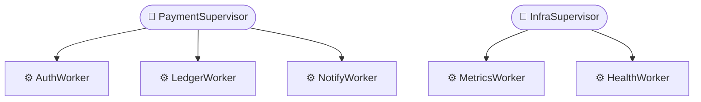
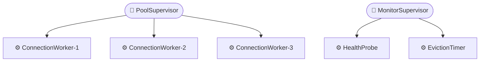
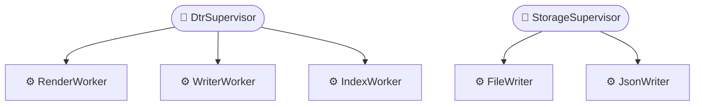

# io.github.seanchatmangpt.dtr.test.SupervisionTreeDocTest

## Table of Contents

- [saySupervisionTree — Payment Service (OTP Pattern)](#saysupervisiontreepaymentserviceotppattern)
- [saySupervisionTree — Database Connection Pool](#saysupervisiontreedatabaseconnectionpool)
- [saySupervisionTree — DTR Runtime (Self-Referential)](#saysupervisiontreedtrruntimeselfreferential)


## saySupervisionTree — Payment Service (OTP Pattern)

Joe Armstrong's OTP supervision tree is the original fault-tolerance pattern: every process runs under a supervisor that restarts it on failure. Armstrong observed at Ericsson that distributed systems fail not because engineers write buggy code but because the world is unpredictable — network partitions, hardware faults, race conditions that only manifest under specific load profiles. The correct response is not to write defensive code that attempts to handle every failure mode. The correct response is to crash cleanly and let the supervisor restore the process to a known-good initial state.

Every production Java microservice contains a supervision hierarchy — it is just usually implicit and unvisualised. Thread pools supervised by an ExecutorService, database connection pools supervised by a pool manager, health-check workers supervised by a framework lifecycle. {@code saySupervisionTree} makes that hierarchy explicit: the map below IS the supervision contract for this payment service, and the diagram below the map IS its living documentation.

```java
// Build the payment service supervision tree using a LinkedHashMap.
// Insertion order is preserved so the diagram is deterministic across JVM runs.
// Key = supervisor name; value = list of worker names it directly manages.
var supervisors = new LinkedHashMap<String, List<String>>();
supervisors.put("PaymentSupervisor",
    List.of("AuthWorker", "LedgerWorker", "NotifyWorker"));
supervisors.put("InfraSupervisor",
    List.of("MetricsWorker", "HealthWorker"));

saySupervisionTree("Payment Service Supervision Tree", supervisors);
```

> [!NOTE]
> Two supervisors with distinct responsibilities: PaymentSupervisor owns the business-logic workers (authentication, double-entry ledger, notification dispatch) and InfraSupervisor owns the cross-cutting infrastructure workers (Prometheus metrics exporter, health endpoint). This boundary is intentional — a crash in AuthWorker triggers a PaymentSupervisor restart decision and never touches MetricsWorker.

### Supervision Tree: Payment Service Supervision Tree



| Metric | Value |
| --- | --- |
| Supervisors | `2` |
| Workers | `5` |
| Supervision ratio | `1:2` |

| Supervisor | Worker | Responsibility | Restart on failure |
| --- | --- | --- | --- |
| PaymentSupervisor | AuthWorker | Validates payment credentials | one-for-one |
| PaymentSupervisor | LedgerWorker | Records double-entry journal entries | one-for-one |
| PaymentSupervisor | NotifyWorker | Dispatches payment event webhooks | one-for-one |
| InfraSupervisor | MetricsWorker | Exports Prometheus metrics | one-for-one |
| InfraSupervisor | HealthWorker | Serves /health readiness endpoint | one-for-one |

> [!WARNING]
> One-for-one restart means only the crashed worker is restarted; its siblings continue running. If LedgerWorker crashes repeatedly and breaches the supervisor's max-restart intensity (e.g. 5 restarts in 60 seconds), OTP escalates: PaymentSupervisor itself crashes, and its parent supervisor must decide whether to restart the entire subtree. Document the max-restart intensity policy explicitly in the supervision spec — its absence is the most common source of production outages in OTP-style systems.

| Key | Value |
| --- | --- |
| `saySupervisionTree render time` | `3194958 ns` |
| `Java version` | `25.0.2` |
| `Supervisors` | `2` |
| `Total workers` | `5` |
| `Supervision ratio` | `1:2` |

## saySupervisionTree — Database Connection Pool

Database connection pools are the most performance-critical component in most Java services, yet their internal fault-tolerance structure is rarely documented. Engineers configure pool size, timeout, and eviction policy through properties files — but the supervision topology that governs what happens when a connection worker crashes, when a health probe hangs, or when the eviction timer fires concurrently with a borrow request is almost never written down.

The two fundamental OTP restart strategies differ in their fault containment scope. One-for-one restarts only the crashed child: correct when workers are independent, as connection workers are — ConnectionWorker-1 crashing should not affect ConnectionWorker-2. Rest-for-one restarts the crashed child and all children started after it: correct when later children depend on earlier ones, as the EvictionTimer depends on HealthProbe being alive to validate the connections it targets for eviction. The diagram below documents which strategy applies at each supervision boundary.

```java
// Database connection pool supervision tree.
// PoolSupervisor uses one-for-one: each connection worker is independent.
// MonitorSupervisor uses rest-for-one: EvictionTimer depends on HealthProbe.
var supervisors = new LinkedHashMap<String, List<String>>();
supervisors.put("PoolSupervisor",
    List.of("ConnectionWorker-1", "ConnectionWorker-2", "ConnectionWorker-3"));
supervisors.put("MonitorSupervisor",
    List.of("HealthProbe", "EvictionTimer"));

saySupervisionTree("Database Pool Supervision Tree", supervisors);
```

PoolSupervisor manages three connection workers, each maintaining one physical JDBC connection to the database. When a connection worker detects a broken socket (e.g. the database server restarted), it crashes and PoolSupervisor restarts it under the one-for-one policy. The other two connections continue serving requests during the one-slot outage. Pool capacity temporarily drops from 3 to 2 and recovers as soon as the new connection is established — typically within a single TCP round trip.

MonitorSupervisor manages HealthProbe and EvictionTimer under a rest-for-one policy. HealthProbe runs periodic JDBC validation queries ({@code SELECT 1}) against idle connections and marks them as invalid if the query fails. EvictionTimer reads HealthProbe's invalid-connection registry and evicts those connections from the pool. If HealthProbe crashes mid-cycle, EvictionTimer must also restart — its eviction list was built from HealthProbe state that is now stale. Rest-for-one enforces this invariant automatically.

### Supervision Tree: Database Pool Supervision Tree



| Metric | Value |
| --- | --- |
| Supervisors | `2` |
| Workers | `5` |
| Supervision ratio | `1:2` |

| Supervisor | Worker | Restart strategy | Rationale |
| --- | --- | --- | --- |
| PoolSupervisor | ConnectionWorker-1 | one-for-one | Workers are independent; crash in W-1 does not invalidate W-2 or W-3 |
| PoolSupervisor | ConnectionWorker-2 | one-for-one | Same — each worker holds one orthogonal JDBC socket |
| PoolSupervisor | ConnectionWorker-3 | one-for-one | Same — pool degrades gracefully to n-1 capacity during restart |
| MonitorSupervisor | HealthProbe | rest-for-one | First child; if it crashes, EvictionTimer (started after) restarts too |
| MonitorSupervisor | EvictionTimer | rest-for-one | Depends on HealthProbe's invalid-connection registry being consistent |

> [!NOTE]
> The number of connection workers (here 3) should match the pool's minimum idle setting in your HikariCP or c3p0 configuration. If the application scales the pool dynamically, the supervision tree must be updated to reflect the new worker count. Keeping this test in sync with the pool configuration file is the core value proposition of saySupervisionTree: a stale diagram is detected at the next test run.

| Key | Value |
| --- | --- |
| `saySupervisionTree render time` | `274708 ns` |
| `Java version` | `25.0.2` |
| `Supervisors` | `2` |
| `Total workers` | `5` |
| `PoolSupervisor strategy` | `one-for-one (workers are independent)` |
| `MonitorSupervisor strategy` | `rest-for-one (EvictionTimer depends on HealthProbe)` |

## saySupervisionTree — DTR Runtime (Self-Referential)

Every well-designed runtime has a supervision hierarchy. Joe Armstrong designed the Erlang VM itself as a supervision tree — the virtual machine scheduler, the I/O subsystem, and the distributed-node listener are each supervised processes. When Armstrong said 'let it crash', he did not mean 'let the whole system crash'. He meant 'let the failing component crash cleanly so its supervisor can restore it to a known-good state'. The key insight is that a restart is not a failure — it is the recovery mechanism working as designed.

DTR's rendering pipeline mirrors this design. Documentation generation proceeds in two phases: rendering (transforming say* calls into structured output) and writing (flushing structured output to disk in multiple formats). These phases are supervised separately because their failure modes are orthogonal. A rendering failure is a logic error in the test or the render machine — the writer has nothing to flush. A writing failure is an I/O error — the renderer has already completed its work and can be left running while the writer retries. Merging them under a single supervisor would conflate two distinct recovery policies.

```java
// DTR's own runtime supervision tree — self-referential documentation.
// DtrSupervisor manages the rendering pipeline.
// StorageSupervisor manages the output-writing pipeline.
// The split reflects the OTP principle: I/O and computation
// have different failure modes and should not share a restart domain.
var supervisors = new LinkedHashMap<String, List<String>>();
supervisors.put("DtrSupervisor",
    List.of("RenderWorker", "WriterWorker", "IndexWorker"));
supervisors.put("StorageSupervisor",
    List.of("FileWriter", "JsonWriter"));

saySupervisionTree("DTR Runtime Supervision Tree", supervisors);
```

RenderWorker executes the say* call sequence for a single test method and produces an in-memory document fragment. WriterWorker serialises the fragment to Markdown, LaTeX, and HTML concurrently. IndexWorker maintains the table-of-contents and cross-reference index that spans all test methods in a class. These three workers are all downstream of the same test execution and are supervised under one-for-one policy: a crash in IndexWorker (e.g. a malformed anchor) must not interrupt the RenderWorker that is mid-section on the next test method.

FileWriter and JsonWriter are supervised separately under StorageSupervisor because they perform disk I/O and can block independently of each other. FileWriter flushes Markdown/LaTeX/HTML; JsonWriter flushes the OpenAPI schema artefact. If the filesystem fills up mid-flush for FileWriter, JsonWriter can still complete its write to a different output directory. Separating them prevents one blocked I/O path from starving the other.

### Supervision Tree: DTR Runtime Supervision Tree



| Metric | Value |
| --- | --- |
| Supervisors | `2` |
| Workers | `5` |
| Supervision ratio | `1:2` |

| Supervisor | Worker | Phase | Failure mode | Recovery |
| --- | --- | --- | --- | --- |
| DtrSupervisor | RenderWorker | Compute | Malformed say* call crashes render | Restart from last checkpoint |
| DtrSupervisor | WriterWorker | Compute | Serialisation exception in formatter | Restart; fragment is idempotent |
| DtrSupervisor | IndexWorker | Compute | Duplicate anchor or malformed ref | Restart; index rebuilds from events |
| StorageSupervisor | FileWriter | I/O | Filesystem full or permission denied | Retry with exponential backoff |
| StorageSupervisor | JsonWriter | I/O | Serialisation error or disk error | Retry independently of FileWriter |

> [!NOTE]
> This diagram is generated by the same rendering pipeline it documents. When RenderWorker processes the saySupervisionTree call on line 220 of this file, it builds the Mermaid graph TD block that you are reading now. The self-referential nature is not a gimmick — it proves that saySupervisionTree can document any supervision hierarchy, including its own. Armstrong called this property 'eating your own dog food'. DTR calls it a DTR test.

> [!WARNING]
> The supervision tree documented here reflects the logical architecture of the DTR rendering pipeline, not its current thread-pool implementation. DTR currently serialises rendering and writing on the JUnit 5 test thread. The supervision tree above is the target architecture for a future virtual-thread-per-worker implementation. Keeping this test in the codebase makes the architectural intent explicit and prevents the implementation from drifting away from it silently.

| Key | Value |
| --- | --- |
| `saySupervisionTree render time` | `269958 ns` |
| `Java version` | `25.0.2` |
| `Supervisors` | `2` |
| `Total workers` | `5` |
| `Supervision ratio` | `1:2` |
| `DtrSupervisor workers` | `3` |
| `StorageSupervisor workers` | `2` |

---
*Generated by [DTR](http://www.dtr.org)*
